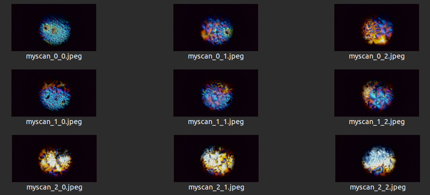
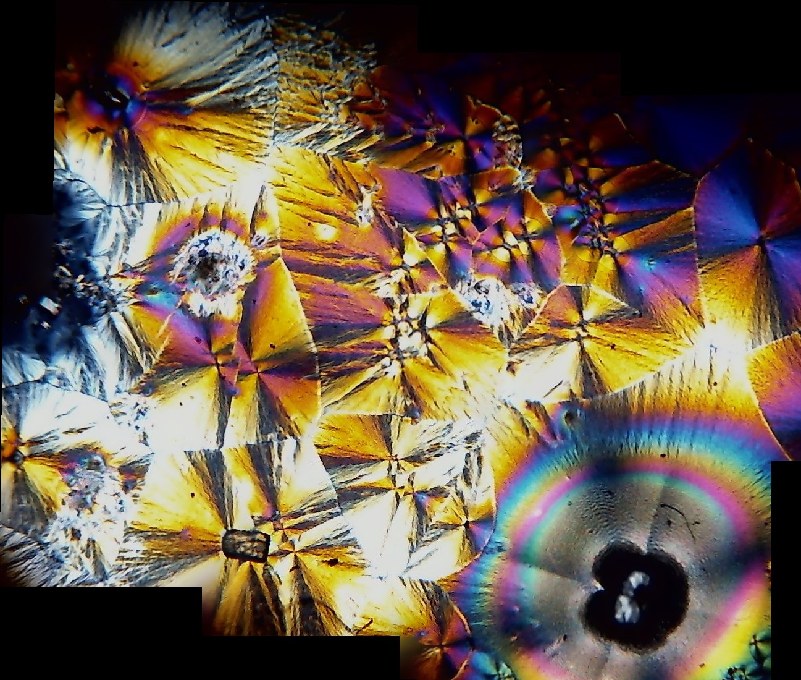

In my [previous crystal photography post](https://johnowhitaker.dev/mini-hw-projects/scope_mods.html) I showed some beautiful pics of vitamin C crystals photographed through a microscope, with polarizing film bringing out some psychedelic colors. Those were all taken with my phone pointing down through the eyepiece. The natural next step is to scan across a slide and stitch the images together to make a high-res image of a whole slide. And since I already have a 3D printer, this turned out to be fairly easy to do!


The webcam is mounted to the scope with a 3D-printed adapter. The CAD for that, and all code, is in [this repository](https://github.com/johnowhitaker/webcam_mosaic). The software sends G-CODE commands to the printer over USB to move the slide in small increments, then waits for it to settle before taking a picture. Since coding is ~free thanks to AI, it has a GUI based on PyGame for setting the start position, and fancy command-line args and everything :D Here's an example command you might run to take 9 images in a 3x3 grid:

```bash
python3 mosaic.py \
  --serial_port /dev/ttyUSB0 \
  --camera_device /dev/video4 \
  --prefix "capture/myscan" \
  --x_step 1.5 \
  --y_step 1.5 \
  --n_x 3 \
  --n_y 3 \
  --settle_time 300
```

This stores 9 individual images:



These can be stitched together in a few different ways. I include a notebook using OpenCV to do this in the repo. Here's the result of stitching the 9 images together:



Sadly, the webcam quality isn't great! So after all that, the best results came from using the phone with [this app](https://play.google.com/store/apps/details?id=com.bcdvision.mapstitch&hl=en_US) to make mosaics. The results are *ok* ([example](https://drive.google.com/file/d/1NlRSY9DtAnj5N4UNMiZVUJp4BTVCKlKC/view?usp=drive_link)) but I hope to find a better solution soon - maybe it's as simple as using the phone as a webcam and manually stitching the images based on the grid coords.