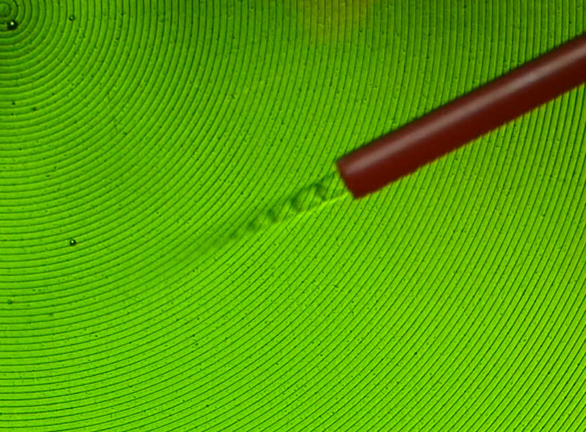

Schlieren imaging is a technique that allows you to see changes in air density. Most setups require parabolic reflectors, carefully placed razor blades and fancy cameras, but it turns out you can get a hacky version working with nothing but a cheap ([this one](https://www.amazon.com/gp/product/B00IITFX02/ref=ppx_yo_dt_b_search_asin_title?ie=UTF8&th=1) cost me $7.99) Fresnel lens and a phone. You really need vieo to do it justice (see [this thread](https://x.com/johnowhitaker/status/1880467363881185445) for some of my first tests) but trust me, it's really cool to see something that is normally invisible:

My favourite thing to see so far was the shock diamonds in the stream of gas coming out of a 'canned air' duster. I've wanted to try this since I read [this Hackaday piece](https://hackaday.com/2024/02/18/canned-air-is-unexpectedly-supersonic/) about this. Wild stuff:

Initial tests were just hackily balancing things to line up an LED, the lens and my camera. I've since 3D-printed a bracket ([CAD link](https://cad.onshape.com/documents/ce126238a89f034cdb0b8e1f/w/934005ecead5a54ecd8e6407/e/09ada8d4f4095200976abf23)) and tried out Lumix FZ80 camera too, with good results. Here's the current setup:

The green LED for illumincation is nice - using a white LED or other light source shows a lot of chromatic abberations etc thanks to the cheap plastic lens. Nothig some software tweaks can't fix, but the monochrome look is pretty cool.

One reason I don't need the razo blande at all is the small apeture of cellphone cameras (and my small-sensor lumix) - if you try with a fancier camera you might need to experiment a bit. 

Alignment is critical but it's rpetty easy since you can see the 'image' of the LED and move the camera into rough position then do final tweaks back and forth while looking at the live view.

I'm probably going to have to make videos for this and the crystals stuff to show them best, stay tuned for a new youtube link soon maybe :)