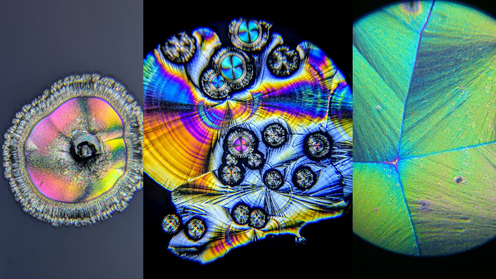

I recently bought a cheap microscope ([this one](https://www.amazon.com/dp/B0BYYY51HJ?ref=ppx_yo2ov_dt_b_fed_asin_title) for $87 but there are lots of variants in this category) and after some fun micro-organism hunting I started seeing what mods I could do to make it better. First up was adding 'darkfield' mode, by placing a black plastic disk to block the center of the light source. This makes the background dark, but anything that scatter light shows up lighter. Here's a before-and-after of a small crustacean:

Next, I added a piece of [polarizing film ](https://www.amazon.com/dp/B0BYYY51HJ?ref=ppx_yo2ov_dt_b_fed_asin_title) into the light path within the body of the microscope, and another just above the light source. They're set so that together they block ~all the light. But if something in between them rotates the polarization of the light, it will show up. Vitamin C crystals (like the header image) are strongly birefringent, so they show up really well. Other crystals work too - here for example are some different views of some epsom salt crystals:

More pictures and some video on my twitter [here](https://x.com/johnowhitaker/status/1878117000821776688) and [here](https://x.com/johnowhitaker/status/1877178198326198575), and I might have to record a video about this too, to share the timelapses of crystals growing and the mesmerizing motion of them dissolving. 

This feels in a similar category to my [giant bubble experiments](https://johnowhitaker.dev/mini-hw-projects/bubbles.html) - why did nobody tell me it was this easy to do something so cool!?

PS: crystals of some unknown salt in darkfield, brightfield (default), and polarized light. In polarized light you can see small vitamin C crystals that I was trying to purify out from the salt before my pure stuff arrived :)

