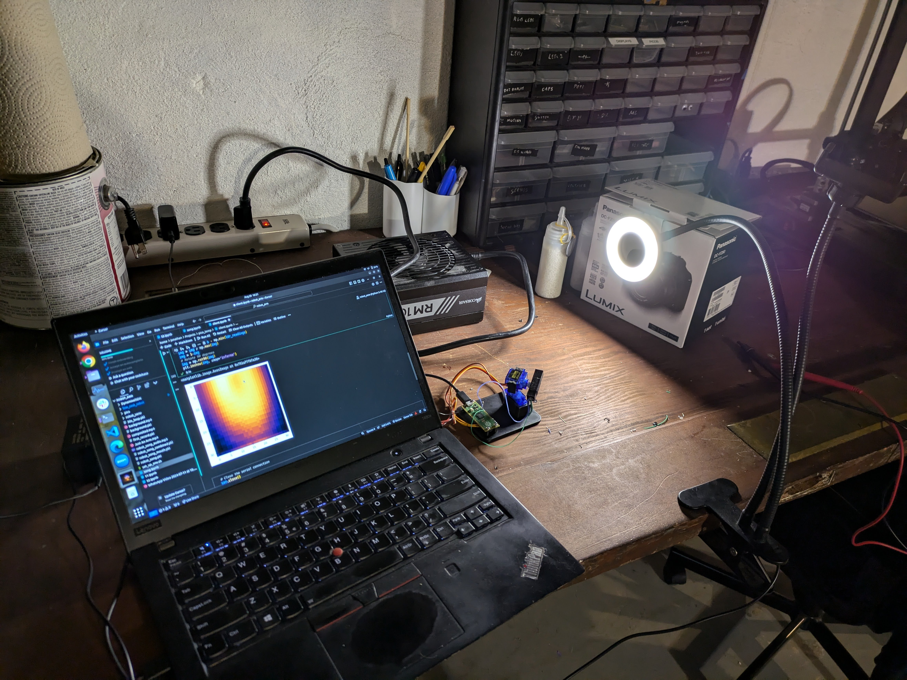

Taking photos one pixel at a time is a funny idea. It's been done a few tmes (e.g. https://hackaday.com/2024/07/23/photoresistor-based-single-pixel-camera/, love the construction techniques!) but I wanted to make my own, partly to see if I could use AI to imagine better pictures based on the data. A recent paper (https://arxiv.org/abs/2408.07541) finally pushed me over the edge in terms of motivation, and so yesterday when I needed a quick win after a slow low-motivation day I whipped this up.

The design is quite simple - a few 3D printed parts hold two servos in place such that they can scan a tube back and forth. A Raspberry Pi Pico microcontroller controls the servos and reads the voltage, with the LDR and a 10k resistor forming a voltage divider. The Pico sends the data to a laptop over USB, where I can control it and plot the data however I like. 

I've uploaded an assembly video [here](https://youtu.be/K5qvwNy6jYg), and I'll hopefully do a follow-on post about the software side when I get time. The files to get a minimal pic like the one above working are dumped on GitHub [here](https://github.com/johnowhitaker/single_pixel_camera). You can get the 3D print files from this [printables link](https://www.printables.com/model/981878-single-pixel-camera) or on GitHub.