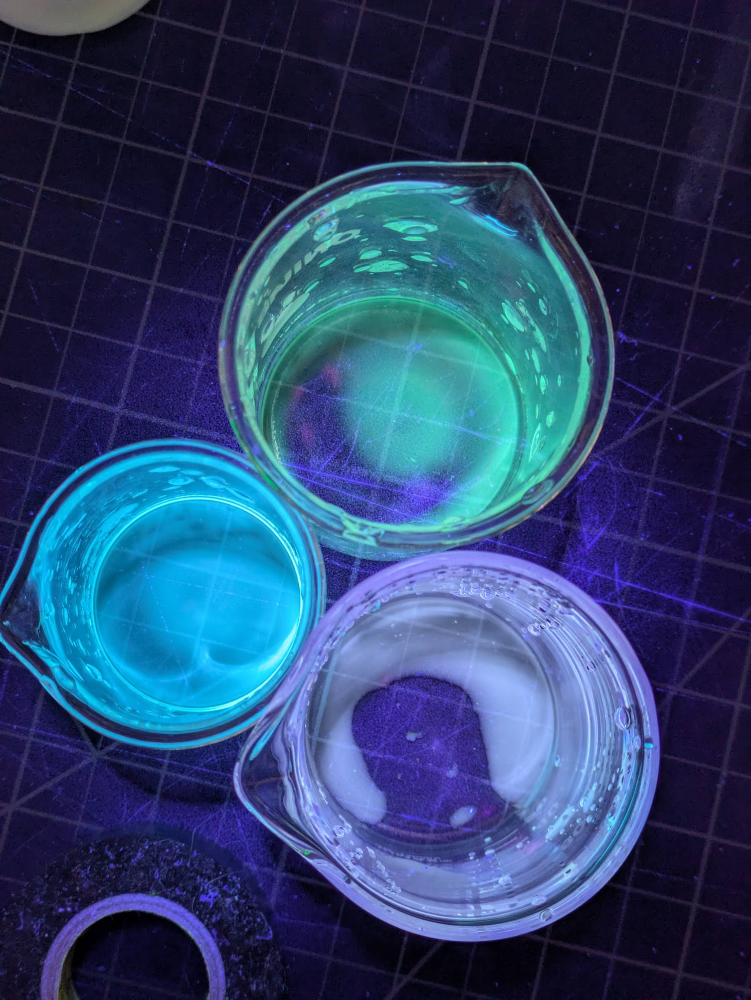
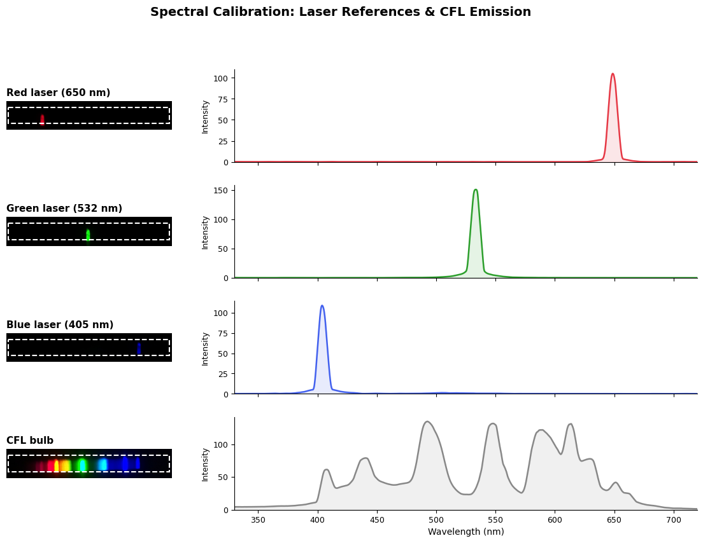
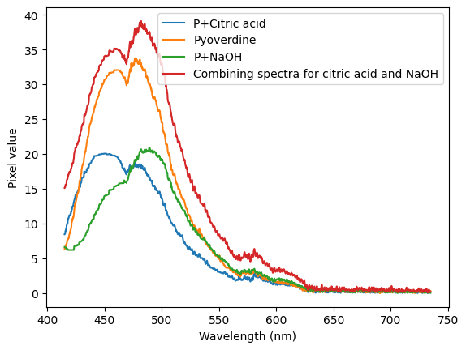
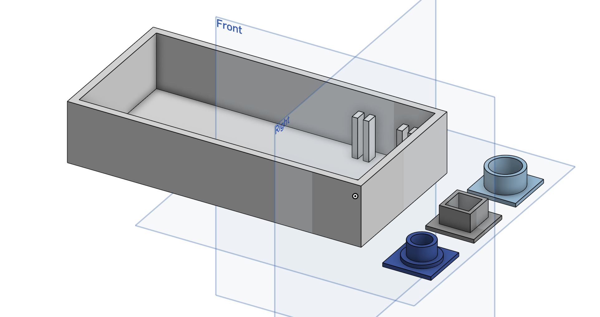

Since my [previous post](https://johnowhitaker.dev/posts/putida.html) I've continued tinkering with the flourescent pyoverdine produced by pseudomonas putida. I made some really pure stuff with solid phase extraction using activated charcoal (no luck getting access to LC-MS sadly) and also just extracted a bunch for further experiments. In todays post: what happens when you shift pH. Spoiler, fun color changes :) The first test:

I'd noticed some older colonies shift to green, and green/yellow rather than blue when some stained my hands a while ago. So I started adding things to it to see what would happen. Citric acid and Vitamin C both shifted it to whitish, almost pink (at least in comparison to the normal color). Some strongly basic NaOH shifted it to green. To get a better picture of this, I made a spectrometer using a diffraction grating and a raspbery pi camera in a box. I calibrated it with a few laser pointers - by looking at the pixel values in one area of the image, we get a rough view of the spectrum (my slit is a fairly wide cut in some cardboard, nothing fancy here).

Putting some pyoverdine extract in ethanol in three vials, and adding some citric acid to one and NaOH to another, we get the following spectra:

To me, this indicates that there might be two different flourescent compounds in the extract! More to investigate, I bought a tube to try my own LC to see if I can separate them.

A few more pics:

PS: [Code for the plots etc](https://gist.github.com/johnowhitaker/d9e8d41fa5c215dfd16b7c94f651ef3f)