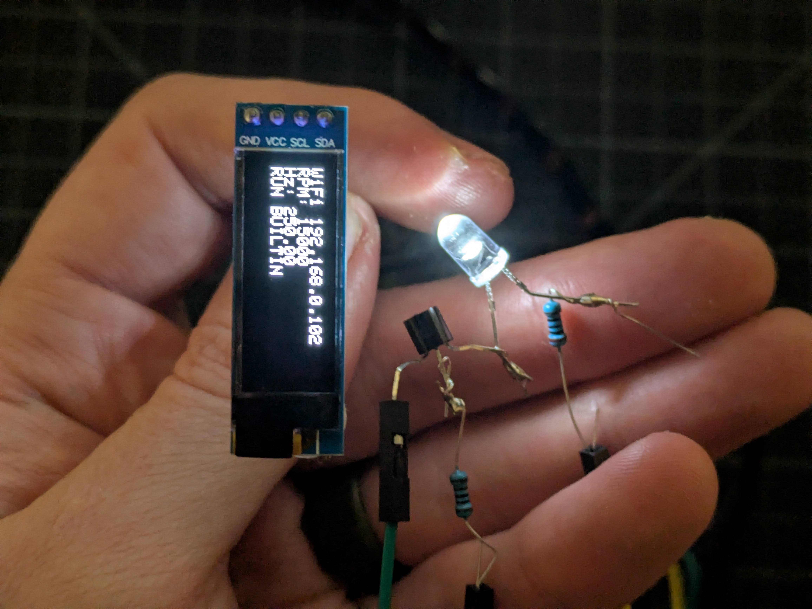
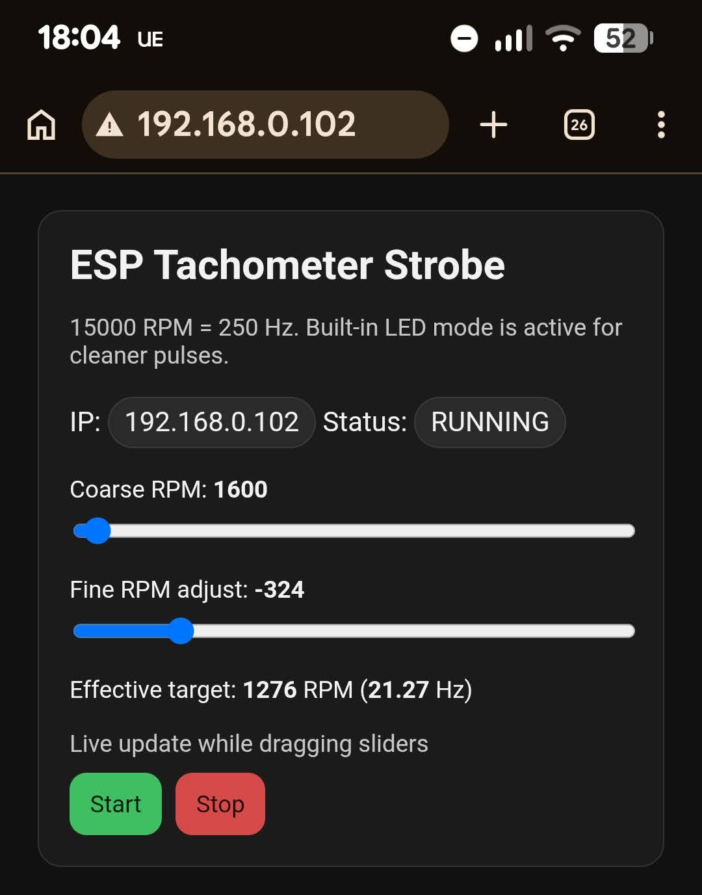
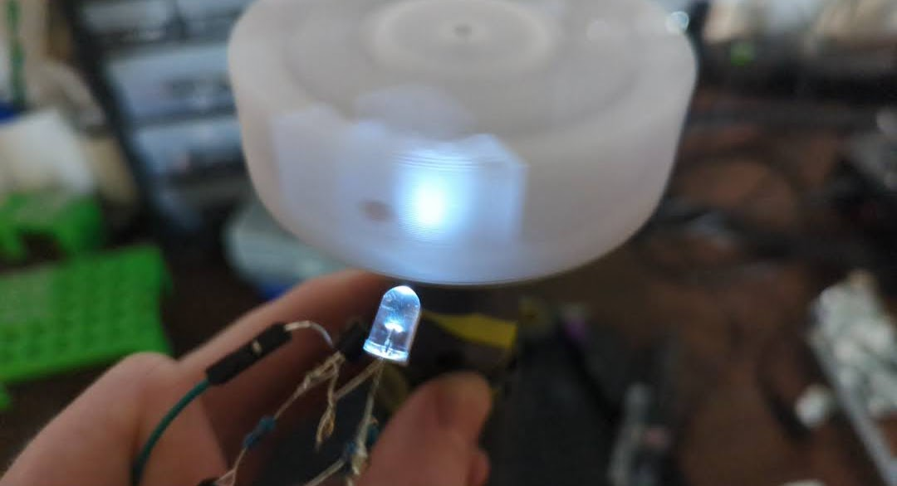

I wanted to know how fast my dremel 'centrifuge' spins, so I hooked up a transistor + LED to an ESP8266 module I had lying around, and had codex spin up something that gives me a webUI to vary the pulse rate of the LED. With a bit of fiddling you can figure out how fast something is spinning. Pics:

Doesn't seem worth sharing the code, ideas if you want to re-create this:

- A transistor lets you push more current through an LED compared to wiring one directly to a pin of the ESP8266. I used a BC547 that I had on hand. The base of the transistor is connected to a GPIO pin of the ESP8266 through a resistor (e.g., 1kΩ), the emitter is connected to ground, and the collector is connected to the negative leg of the LED. The positive leg of the LED is connected to a power source (e.g., 3.3V or 5V) through a current-limiting resistor (e.g., 220Ω).
- Ask for codex to close the loop - I didn't want to be copying code back and forth to the Arduino IDE for this, I'm sick and I know just what I want. So I installed the arduino cli, and it was more than happy to use that plus misc scripts and such that it wrote for itself to find the board, connect, verify that it could read the serial output, etc etc. I basically just had to give it my WIFI creds and some gentle steering towards the behaviour I wanted.