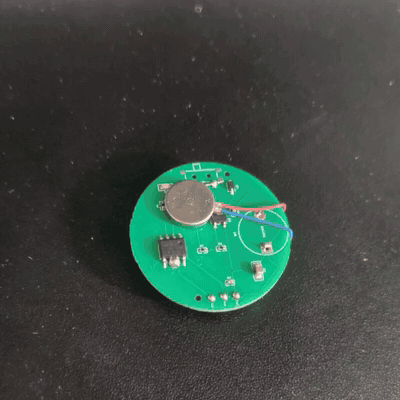
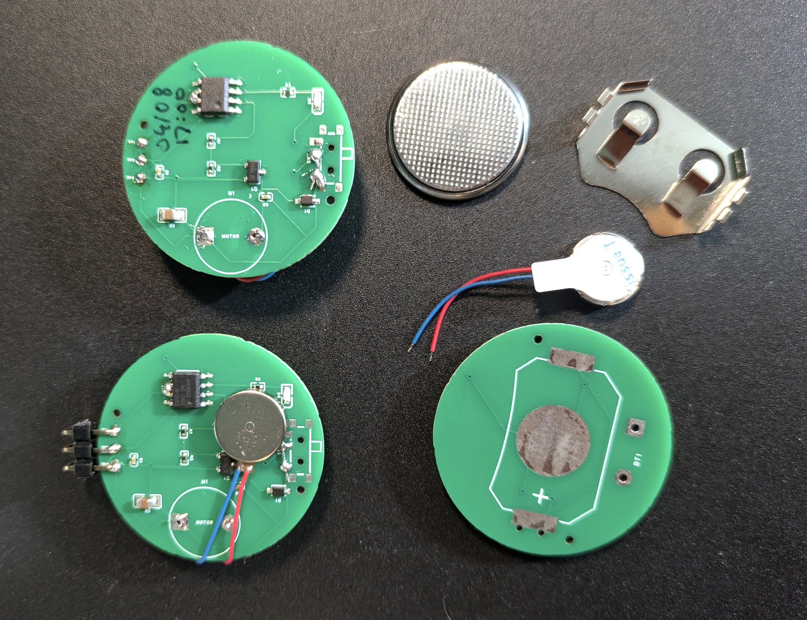
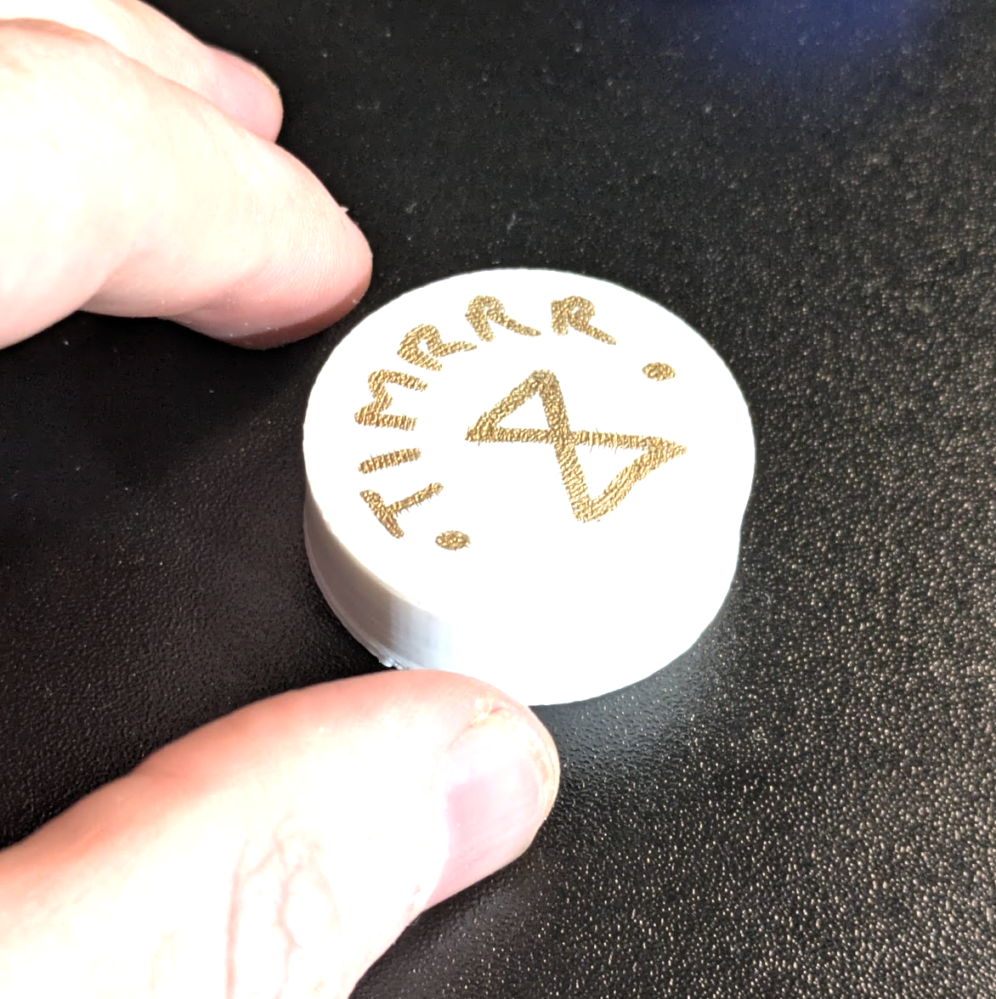

title: Timrrr - A Small Buzzer To Train Time Sense
date: 2026-08-27
categories: 
    - mini-hw-projects
description: "A little PCB project to help with time awareness"
---

This is a physical manifestation of a trick I came up with in college, for times when I find myself getting lost in flow a little too much. It buzzes every 5 minutes. Not annoying enough (for me) to be a problem, just enough of a notification to snap me out of it if I'm scrolling X or something, reminding me that time is passing.

It runs on a coin cell, and uses a very efficient little haptic motor for the short buzz. I estimate the battery life at months if not >1y! (I'll update this post when the test one stops buzzing every few seconds). This was a fun little test of how easy it can be to get something made with 'vibe PCB design' and overseas PCBA. 5 boards, assembled (apart from battery clip and motor, which I ordered separately) were $15 with a JLCPCB coupon, and design was nice and quick with codex doing most of the menial stuff (I had to take over for the layout and some final check). We did miss one mistake, two pins need to be bridged for programming to work haha.

I can get this far lower profile! I'm considering a version that will work as a pendant or in a coin pocket, maybe running a small kickstarter to fund a production batch. But even this clunky version is pretty dinky - I have one in a 3D printed case that lives in my pocket whenever I remember, and sits on my desk while I work.

I'll be honest, it's a little easy to misplace something like this and forget that it exists, since it doesn't offer any flashy gamifications or whatever to keep you as a user. But when I remember to have one on me, it saves me from losing time to YouTube, X etc multiple times a day, while never noticeably intruding on the bits of life that actually matter.

Source code etc: https://github.com/johnowhitaker/timrrr

(Writeup dated Aug 27 but I haven't done anything besides use it since I assembled the test units on 04/08)