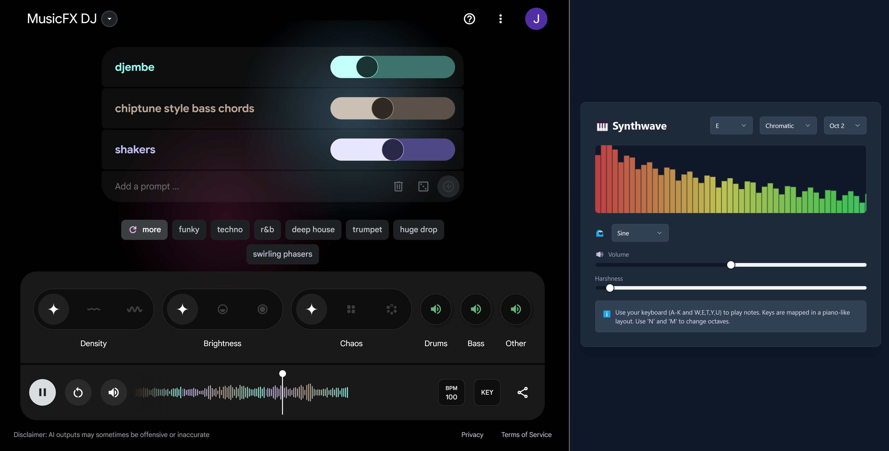
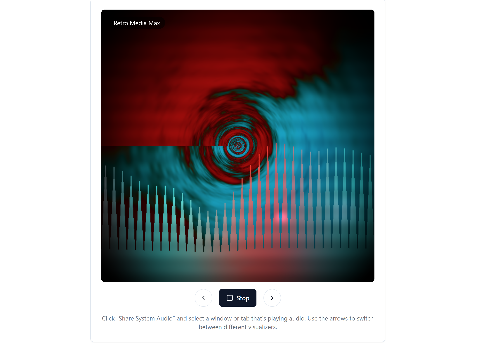

I've been enjoying creating lots of little projects with Claude artifacts and other tools (post on that soon). Two especially fun ones were both audio related: a mini synth and an audio visualization widget. 

The synth came up while I was messing with [Google's MusicFX DJ](https://aitestkitchen.withgoogle.com/tools/music-fx-dj) - a fantastic tool in it's own right.
I wanted a way to jam along, and while I have a few midi controllers I thought I'd instead whip up an in-browser synth using the computer keyboard to minimize time-to-jamming. This is the result:

It's very simple, but I do like being able to set different scales. Google's MusicFX DJ let's you set key too, so you can match them up and have things sound nice together. [Here's a clip of me testing this out for the first time](https://x.com/johnowhitaker/status/1849263436209016995)

Links:

- Synth hosted with github pages: https://johnowhitaker.github.io/minisynth/ (code: https://github.com/johnowhitaker/minisynth)
- And on my tools site: https://tools.johnowhitaker.com/synth

The second project comes from my nostalgia for the old windows media player visualizations. Impressively, Claude turns out to write OK shaders! There are a few to choose from, none mind-blowing but for something visible to watch while I jam with the previous setup this was a fun way to go. Link: https://tools.johnowhitaker.com/audio_viz

Both these tools came together in under an hour, between 4pm and 5pm which is usually the dead zone where I'd done being productive work-wise and waiting for my beloved wife to get home. Each took a bit of back-and-forth to get right, but also didn't need me to write much if any code. There's a joy in crafting perfect software, but there's also a joy in spontaneously bringing little things like this to life with just a bit of chatting with AI. What a time to be alive!