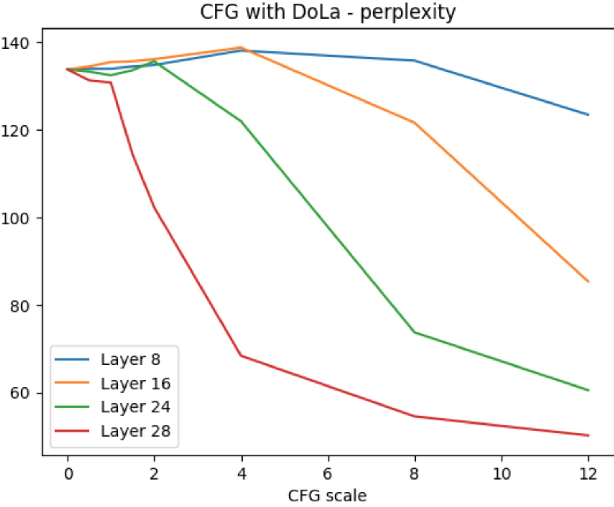

# Mini Experiment: DoLa w/ a guidance scale

DoLa contrasts early and late layers of a transformer to elicit more 'factual' responses by looking at the contrast between the two. The theory is that earlier layers focus on grammar and syntax, while later layers focus on semantics. Instead of taking the difference only, you can borrow from the diffusion model playbook and do something like classifier-free guidance where you lerp between [the final logits] and [the difference thing they use in DoLa] with a scale like 0.5 or 3. Seems to work!

Trying it on two different styles of 0-shot classification with Llama-7. Early tests so don't read too much into it, but it seems choosing the scale and layer gives some control for us to find what's best:

Twitter thread: https://twitter.com/johnowhitaker/status/1702175876769817040

I also suggested contrasting small w/ large, which got mentioned in a paper that came out a few days later: Contrastive Decoding Improves Reasoning in Large Language Models :)