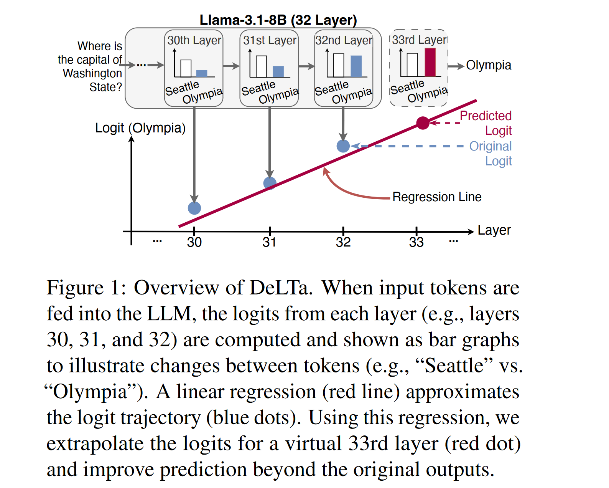
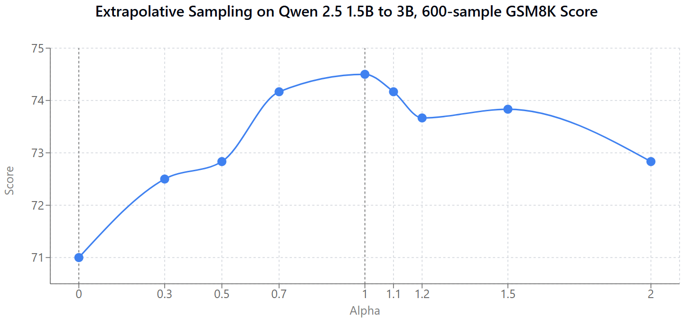

In a research chat yesterday I spoke about a fun thread of research, sparked by a recent paper: [Model Extrapolation Expedites Alignment](http://arxiv.org/abs/2404.16792). The idea of the paper is simple but fun: take an LLM that's had some SFT done, do a little DPO (or other 'alignment' technique of your choice), look at the change in the weights, then **extrapolate** in that direction to get an *even more aligned* model, saving compute. In other words, if you mix the starting model with a DPO-trained one based on a scalar *alpha*, you start with *alpha*=0 at the performance of the starting model, then as you increase it to 1 your performance rises too, 
until you hit the performance of the DPO-trained model. And if you use *alpha* > 1, you get a model that is even better than the DPO-trained one! At least, if you didn't do much DPO training - say, 10 or 20% of what you'd normally do. There's a few takeaways here related to how little the final alignment training is doing in cases like this, but the core idea is one that is worth exploring more generally - namely, **getting better performance by interpolating from a worse model/prediction to a better one and then extrapolating beyond it**. In this post I'll explore some related ideas, and my own experiments extrapolating from a small model to a big model to eke out even more performance. I've also got a [video]TODO link of me running through these papers and then taking you on the journey of trying the experiments, so you can get a picture of how fun this kind of research can be.

## Past Work

For me, the classic example of this kind of idea is 'Classifier Free Guidance' in diffusion models. You interpolate between the prediction from an unconditional model and a conditional one, and then extrapolate beyond it. This is a very powerful technique, and it's been used in a lot of different ways. Introduced by Salimans and Ho in 2021, it gained popularity through the GLIDE paper which used it to get open source text-to-image diffusion working well early on in the diffusion model revolution, where it has since become a staple of pretty much all subsequent text-to-image systems.

I remember Katherine Crawson and others discussing extending the idea to LLMs and AR models in general soon after that - and sure enough a literatre search finds papers like [Stay on topic with Classifier-Free Guidance](http://arxiv.org/abs/2306.17806) that do just that, comparing the preictions with and without a piece of context in the prompt and doing CFG-like scaling of the logits before sampling. (I found this paper after re-inventing the idea to myself and going looking).

Another set of works doing something similar is [DOLA: DECODING BY CONTRASTING LAYERS IMPROVES FACTUALITY IN LARGE LANGUAGE MODELS](http://arxiv.org/abs/2309.03883) which contrasted predictions based on early vs late layers in a model for improved factuality (I did an [experiment](https://johnowhitaker.dev/mini-projects/dola_cfg.html) back then in 2023 extending it with a CFG-like guidance scale) and [DeLTa: A Decoding Strategy based on Logit Trajectory Prediction Improves Factuality and Reasoning Ability](http://arxiv.org/abs/2503.02343) which did something similar by fitting a regression line through the preds of the model at different layers:



Aside: I found the delta paper while using the Ai2 [Paper Finder](https://paperfinder.allen.ai/) tool to look for DoLa since I was blanking on the name, it's an incredible lit search tool that you should definitely try out asap if you do research!

Anyway, today I thought I'd try the idea of using small -> big model and doing the extrapolation  between their logits. I know we chatted about this back then in 2023, I know I talked about it on Twitter back then too and maybe there was even a paper? But let's pretend we're doing novel research it's way more fun that way :D

## Experiment

In [this notebook](https://colab.research.google.com/drive/1yg4W6ng8Hi0KOx-FT3ThJ3JkuHWMd7Wl?usp=sharing) I set up the experiment. The key step is this: `final_logits = (1.0 - alpha) * logits1 + alpha * logits2`. Where logits1 come from a smaller model (Qwen 2.5 1.5B) and logits2 come from a larger model (Qwen 2.5 3B). Once we validate that it's all working, I load up some questions from GSM8K and get the scores like so:

```python
alphas = [0, 0.3, 0.7, 1, 1.2, 1.5, 2]
scores = []

for alpha in alphas:
    total, correct = 0, 0
    for i in tqdm(range(100)):  # Iterate through 100 questions
        q, a = data_list[i]['question'], int(data_list[i]['answer'].split("#### ")[-1])
        model_a, _ = get_answer(q, alpha)
        if model_a == a: correct += 1
        total += 1
    score = correct * 100 / total
    scores.append(score)
    print(f"Alpha: {alpha}, Score: {score}")
```

The result:



Womp womp waaaa. An early test with fewer samples had such a nice peak at alpha = 1.2 making it look like the idea worked great! Alas - in this case at least perhaps it was too good to be true. I'll update this post if I get a more positive result trying this at a larger scale.

## Conclusion

It might sound a little silly to effectively fit a curve for the preds of a few smaller models to try to predict what a bigger one might do, but I remain hopeful there might be places this works... And I can imagine scenarios where you already have both sets of preds or can get them cheaply - perhaps a speculative sampling scenario. It's also potentially a lot more useful when you have good/bad models in other ways. For e.g. the use-case I'm excited about is tweaking the context/training. Say you're working on a model for FastHTML. Since it's a new framework it isn't really in the training data, so models tend to not know it and try to answer about FastAPI or something instead. We could fine-tune a model on what examples we have, or pop some docs in context, but even then the models might really want to default to the better-known frameworks. With this, we could contrast a model with no training/context with our fine-tuned one, and then extrapolate to get a model that is even more likely to do things the "right" FastHTML way. And so on. 

Anyway, I hope this post and the video inspire you to run your own experiments - there are so many directions you can take this! If you try anything fun do let me know. Best. Johno.

## PS: Full code

For the record, here's the code that produced the data for the graph above

```python
import torch
import transformers
from transformers import AutoModelForCausalLM, AutoTokenizer
import warnings
import httpx, json
import re
from tqdm.auto import tqdm

# Suppress irrelevant warnings
warnings.filterwarnings("ignore", category=UserWarning)
transformers.logging.set_verbosity_error() # Hide tokenizer warnings

# --- Configuration ---
DEVICE = "cuda" if torch.cuda.is_available() else "cpu"
print(f"Using device: {DEVICE}")

# --- Load Models ---
model_name = "Qwen/Qwen2.5-1.5B-Instruct"
tokenizer = AutoTokenizer.from_pretrained(model_name)
terminators = [tokenizer.eos_token_id]
if tokenizer.pad_token is None:
      tokenizer.pad_token = tokenizer.eos_token

model1 = AutoModelForCausalLM.from_pretrained(
    model_name,
    torch_dtype=torch.bfloat16).to(DEVICE).eval();

model2 = AutoModelForCausalLM.from_pretrained(
    "Qwen/Qwen2.5-3B-Instruct",
    torch_dtype=torch.bfloat16
).to(DEVICE).eval();


def get_next_token_logits(model, input_ids, past_key_values):
    """
    Performs a forward pass and returns the logits for the *next* token,
    along with the updated past_key_values.
    """
    with torch.no_grad():
        outputs = model(
            input_ids=input_ids,
            past_key_values=past_key_values,
            return_dict=True
        )
    # Logits are for the *next* token prediction (shape: [batch_size, vocab_size])
    next_token_logits = outputs.logits[:, -1, :]
    updated_past_key_values = outputs.past_key_values
    return next_token_logits, updated_past_key_values


def contrastive_generate(
        model1,
        model2,
        tokenizer,
        messages,
        alpha: float,
        max_new_tokens: int = 50,
        temperature: float = 0.7,
        terminators = None
    ):

    input_ids = tokenizer.apply_chat_template(
        messages,
        add_generation_prompt=True,
        return_tensors="pt"
    ).to(DEVICE)
    past_key_values1 = None
    past_key_values2 = None
    generated_ids = []
    _, past_key_values1 = get_next_token_logits(model1, input_ids, None)
    _, past_key_values2 = get_next_token_logits(model2, input_ids, None)

    # --- Generation Loop ---
    current_input_ids = input_ids[:, -1:] # Last token in inputs
    for _ in range(max_new_tokens):
        logits1, past_key_values1 = get_next_token_logits(
            model1, current_input_ids, past_key_values=past_key_values1 # Use cache, mask isn't needed for single token
        )
        logits2, past_key_values2 = get_next_token_logits(
            model2, current_input_ids, past_key_values=past_key_values2 # Use cache, mask isn't needed for single token
        )

        # Key step:
        final_logits = (1.0 - alpha) * logits1 + alpha * logits2

        # 3. Apply Temperature and Sample
        if temperature > 0:
            scaled_logits = final_logits / temperature
            probs = torch.softmax(scaled_logits, dim=-1)
            next_token_id = torch.multinomial(probs, num_samples=1)
        else:
            # Greedy decoding if temperature is 0 or less
            next_token_id = torch.argmax(final_logits, dim=-1, keepdim=True)

        # 4. Check for EOS token
        if terminators is not None and next_token_id.item() in terminators: break

        # 5. Append generated token and prepare for next step
        generated_ids.append(next_token_id.item())
        current_input_ids = next_token_id # Next input is just the token we sampled

    # --- Decode and Return ---
    return tokenizer.decode(generated_ids)

# Load eval data
url = "https://raw.githubusercontent.com/openai/grade-school-math/refs/heads/master/grade_school_math/data/test.jsonl"
response = httpx.get(url)
data_list = []
for line in response.text.strip().split('\n'):
    item = json.loads(line)
    data_list.append(item)


def get_answer(question, alpha):
  messages = [
    {"role": "system", "content": "Answer the following question, end your response with 'final answer: your_answer'."},
    {"role": "user", "content": question},
  ]
  alpha = 1.5
  answer_text = contrastive_generate(model1, model2, tokenizer, messages, alpha,
                       max_new_tokens=300, terminators=terminators, temperature=0.7)
  numbers = re.findall(r'-?\d+(?:\.\d+)?', answer_text)
  return int(float(numbers[-1])) if numbers else None, answer_text


alphas = [0, 0.3, 0.5, 0.7, 1, 1.1, 1.2, 1.5, 2]
scores = []

for alpha in alphas:
    total, correct = 0, 0
    for i in tqdm(range(600)):
        q, a = data_list[i]['question'], int(data_list[i]['answer'].split("#### ")[-1].replace(",", ""))
        model_a, _ = get_answer(q, alpha)
        if model_a == a: correct += 1
        total += 1
    score = correct * 100 / total
    scores.append(score)
    print(f"Alpha: {alpha}, Score: {score}")

print(f"Scores for different alphas: {scores}")
# Scores for different alphas: [71.0, 72.5, 72.83333333333333, 74.16666666666667, 74.5, 74.16666666666667, 73.66666666666667, 73.83333333333333, 72.83333333333333]
```