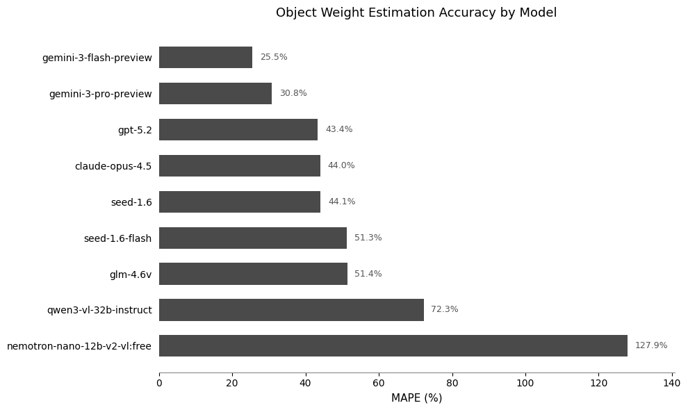
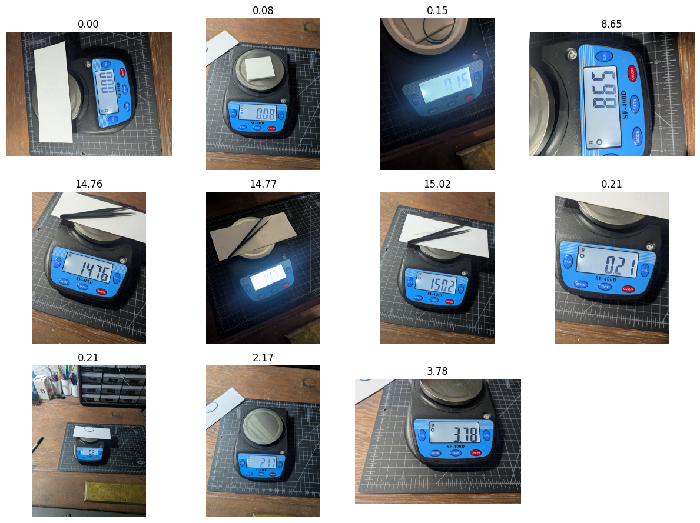
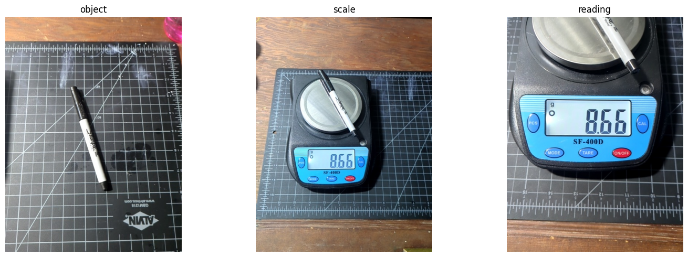

I made a tiny little eval based on asking models to esitmate the weight of various objects in grams, inspired by [this guy on tiktok](https://www.youtube.com/shorts/NqtuquniGgM) who video calls ChatGPT and makes fun of it for being bad at this.

## Inspiration

I want to quantify an automated pipetting system using a precision scale, which required reading off the weight based on a photo of the scale. It seemed like the kind of simple thing that might work with a local VLM on my mac, and I wanted an excuse to play with LFM 2.5 1.6B that was released that day. So I snapped a few pics of my scale showing different weights, in different lighting and angles, and tried moondream v3 preview, zai-org/glm-4.6v-flash, and LFM 2.5 1.6B ([code](https://gist.github.com/johnowhitaker/ce8ab1fb34c8373b5e12db0eca9e27dc)). I was a little suprised how bad they are! LFM was fast enough that I fiddled with the prompt a couple of times, and felt that if I kept the lighting constant and didn't need fancy things like sign, it might *mostly* be OK with the occasional 8<=>0 mixup. Then I tried gemini-flash-3, which was near-perfect and cost $0.0005 per image. So the only sensible answer is to use that! It's really tough to compete with a cheap, fast, API model like this with local models. Anyway, jagged frontier and all that. I figured I might as well make an eval inspired by this, and the obvious extension is to see if the models can guess the weight of the objects without seeing the scale reading too.

## Collecting the data

This is the kind of thing that competent coding models really shine at. I made a data collection 'app' with this prompt to GPT-5.2-Codex (in Codex CLI):

**"I'd like to build a dataset for an AI eval. The way I'd like to gather the data is to run a Flask app on this Mac which we will create in this currently empty directory. It should, when I visit mac.local/whatever the port is for my phone, I should get a page that asks for camera permission and then it prompts me to take a picture of an object, take a picture of the object on the scale and then take a picture of the scale reading. So three photos for every object that's going to be in the dataset. These three should all be saved with a consistent ID for that object or that data point followed by _object _scale _scale reading. The app should be kind of nice to use and give me options for retaking a photo right after I've taken it or moving on to the next photo, canceling an observation at any point. You know just basically a nice simple data gathering UI so that I can quite rapidly build up a fun little dataset to demonstrate this. Let me know if you have any questions otherwise feel free to start the implementation!"** (voice dictated)

It nailed it first try. The resulting [app](https://github.com/johnowhitaker/how_much_grams) let me quickly snap some pics of 20 objects, with 3 pics each (object, object on scale, scale reading).

## Testing Some Models

The data collection app saves triplets of images: the object, the object on the scale, and the scale reading. I used gemini flash to read the scale readings (all nicely in frame and right-way-up, so it was easy), and then fed the object images to various VLMs to see how well they could guess the weight of the objects in grams.

I used MAPE as a metric, since there's a wide range of weights. The dataset is small, but I think it captures some real variation between the different models and how well they actually do on image tasks. Feel free to expand it from 20 imags to 200 :)

[Code for the eval is here](https://gist.github.com/johnowhitaker/27b7c4e61872bdfb0fafd94da28b0631).

## Thoughts + Takeaways

- VLMs have suprising gaps. Especially these small models - it can be easy to fall into a false sense of security since they appear to have so much deep general knowledge, but when you poke at vision tasks you quickly find that they have plenty of blind spots.
- SpecID (my multile-choice species ID eval) showed me that in these cases text-only performance can be suprisingly high! You'd think a 5-way multiple choice between obscure species names with no picture would mean ~20% accuracy, but no - more common species are more likely to have pictures taken, and larger models are smart enough to pick the more common (yet still relatively obscure) species names and do a lot better than that. Here I suspect something similar happens - rather than guessing the weight of **this** lemon, I think all that some of these models get from their kludged-on vision adapters is the concept of lemon-ness, maybe 'small lemon', and then from there they answer with their text knowledge of how much a lemon weighs on average. 
- I have a friend with a related dataset for a similar but harder task, which might turn into a fine-tuning tutorial at some point, we'll see
- Gemini 3 Flask is **SO HARD TO BEAT**. It almost bums me out. It's so fast and cheap, really hard to think when you'd need local models! The big API models have their place, but cost and speed wise Flash covers a lot of the desirable part of the pareto frontier for tasks like this.
- AI is really got at one-shotting data collection apps now. Yes, you knew this already. Still, the fact that the fastest way to collect these 60 images was to spin up a bespoke web app is incredible :)