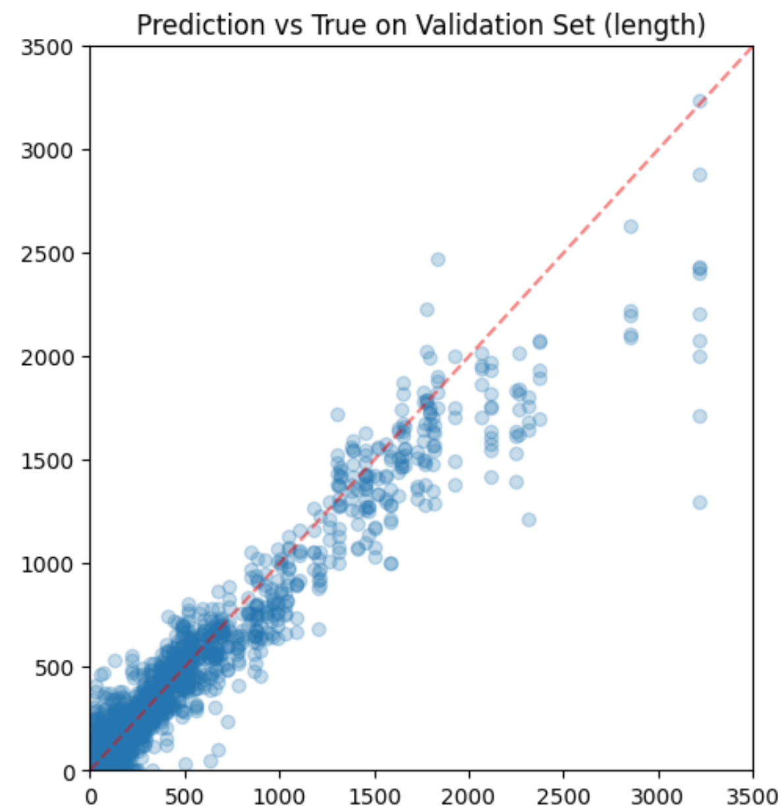

# How well can LLMs estimate length?

While discussing another paper based around 'LLM-as-a-judge' style evaluation, the topic of length bias (longer responses tend to be rated higher) came up. This prompted Jeremy to ask 'Can LLMs even estimate the length of a sequence? How well?'. So I did a few quick tests to find out, and spotted a few interesting things along the way.

First experiment: throwing some sequences through gpt-3.5-Turbo and gpt-4, using function calling to get a formatted response with a prompt like
```python
messages.append({"role": "system", "content": "Estimate the length (in words) of the passage provided by the user."})
messages.append({"role": "user", "content": f"Passage:\n {'hi'*30}"})
chat_response = chat_completion_request(
    messages, tools=tools, tool_choice={"type": "function", "function": {"name": "return_length_estimate"}}
)
```

For ever-longer snippets of a Wikipedia article, here's GPT 3.5 Turbo's estimates:


It's fairly accurate at lower sequence lengths, but diverges and starts to estimate that anything long is ~1000 words. GPT-4 also got worse above ~800 words, but with less of an obvious trend. More pics in my original Twitter [thread](https://x.com/johnowhitaker/status/1760094827147079897?s=20).

Thinking through how these models might infer the length, one possibility is that the positional embeddings can be used to estimate the length of the sequence. If the model is able to compare the positional embeddings of the first and last token, it could estimate the length of the sequence. To see how clearly positional info comes through in the latent representations of the model, fed some sequences of various lengths through the recently-released gemma-7B model and stored the final layer outputs (`outputs.last_hidden_state`). Then I fit a linear regression model on these to predict the token position from the latent representation. The R^2 was 0.99, so the positional information is very clear in the latent representations. As you can see, there's enough information in the latent representations to estimate the length of the sequence fairly well:



One interesting thought: many models are trained at some lower context length (1024 or 2048 for example) the briefly fine-tuned on longer sequences at the end of training. A popular recent strategy is to do some kind of dynamic scaling (see dynamic RoPE scaling for e.g.) where the positional embeddings for linger sequences are scaled such that they map to the same range as the positional embeddings for the shorter sequences the model was trained with. If this is the case, you'd expect length estimates for sequences above the training context length to be less accurate, and specifically to be underestimates since the positional embeddings of token, say, 4217 would be rescaled back to look like the positional embeddings of token 1024. The pattern for GPT-3.5 Turbo's estimates seems to fit this hypothesis, but of course we don't have a way to know for sure. 

This was a fun little experiment, and it's unlikely I'll take it further, but I hope it's given you some food for thought and perhaps a few ideas for your own experiments.