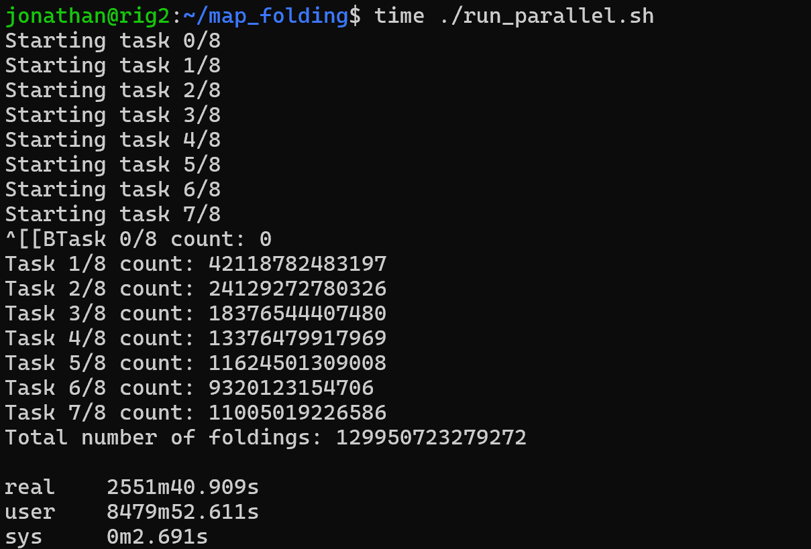

Nerd-sniped by a video from the channel 'Physics for the Birds', I looked into what it would take to add an extra item to this sequence of integers: [https://oeis.org/A001418](https://oeis.org/A001418) (Number of ways of folding an n X n sheet of stamps)
Calculating the already-known 7x7 case took 42 hours. The 5x5 case takes less than a second and the 6x6 takes a few minutes. So 8x8 will likely take a while. So unless I find a better approach or leave my code running for year, it seems like I won't be able to add to the sequence.



The code is available on [GitHub](https://github.com/johnowhitaker/map_folding), and is implemented in C. I started by converting [this Java implementation](https://github.com/archmageirvine/joeis/blob/master/src/irvine/oeis/a001/A001415.java) by Sean Irvine (which is a translation of a C version by Fred Lunnon (ALGOL68, C versions)) which implements the pseudo-code from the original 1968 paper ([PDF](https://www.ams.org/journals/mcom/1968-22-101/S0025-5718-1968-0221957-8/S0025-5718-1968-0221957-8.pdf)). o1 did almost all the work ;)

At first I thought I might be able to find a GPU-accelerated way to compute this, but no luck on that front. The code I have can divide the work among a few cores but doesn't parallelize well enough to make scaling up compute worth it. 

One side trick I liked that I can't be bothered to put into a separate TIL: using discord for notifications when it's done. You make a channel, then Edit Channel (top of channel) -> Integrations -> Webhooks -> New Webhook. This gives you a URL like https://discord.com/api/webhooks/lasiufhaliufhla

Then in your code you can use curl to send a message to that channel like so:

```bash
curl -H "Content-Type: application/json" -X POST -d "{\"content\": \"$total\"}" "$WEBHOOK_URL"
```

Where `$total` is the message you want to send and `$WEBHOOK_URL` is the URL you got from discord. It was nice waking up to a message that the 7x7 case was done!