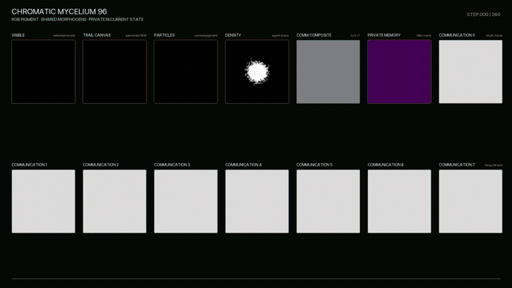
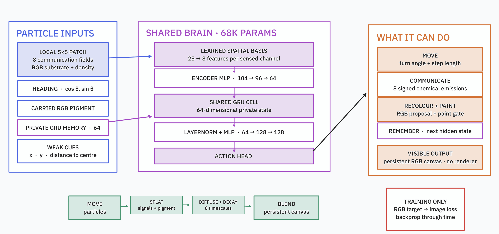
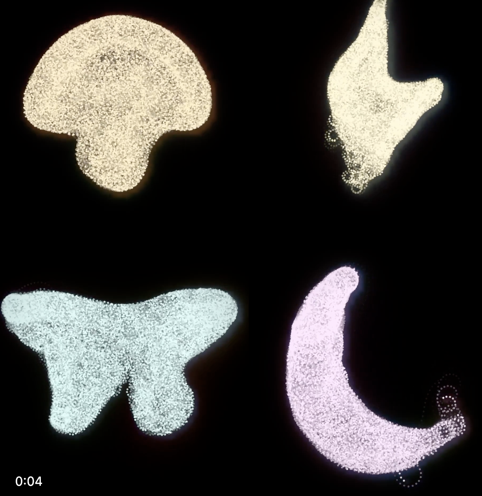
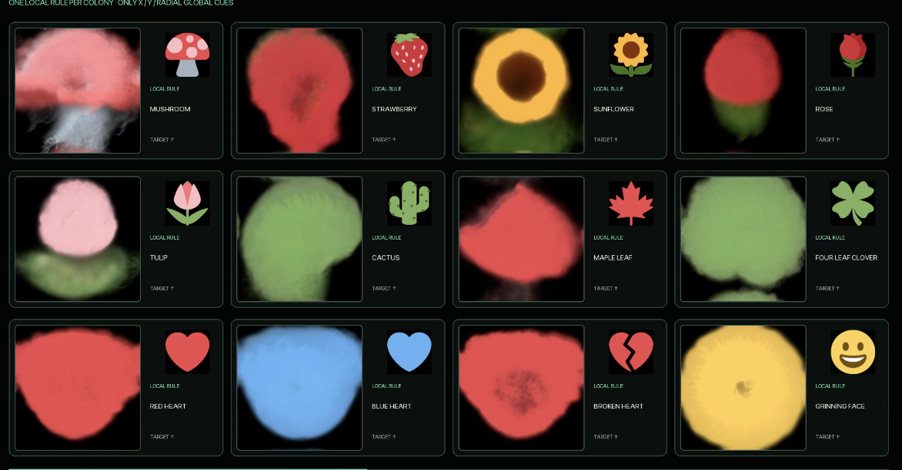

I trained a multi-agent slime mold sim style thingee to collaboratively paint emojis. This post has a few more details, but you'll want the [Twitter/X thread](https://x.com/johnowhitaker/status/2084041106367615235) for the progression and the fancy videos too.



I first got excited about physarium simulations 5 years ago, when I coded a high-performance slime sim I called "DotSwarm" in WebGL. The patterns these simple agent-based simulations produce are mesmerizing. ([Video](https://www.youtube.com/watch?v=mnuwd_z9YGE), [Observable Notebook](https://observablehq.com/@johnowhitaker/dotswarm-exploring-slime-mould-inspired-shaders)). The general premise is that you simulate 'agents' and a 'substrate'. The agents each move along with some velocity, sensing the substrate ahead of with, say, 3 'sensors' at different angles, and then choosing how much to turn based on some rule. The agents also deposit 'pheremones' to the substrate, typically modelled as a grid, and it is these patterns of pheremones that lead to emergent behaviour where agents being to follow eachother along highways etc, much like ants do. This leads to some lovely patterns:


Anyway, after my recent [explorations of neural cellular automata for games](https://johnowhitaker.dev/misc/nca_games.html), I got in touch with @Esychology and we challenged eachother to try to make a **trainable** physarium setup work. This is more challenging than NCAs - with the agents zipping about, it is very tricky to see how gradients could flow from an objective back to the weights of the agent 'brains' in a way that makes training possible! Long story short, I managed to get it somewhat working - the rest of this post will be my attempt at all the little tricks that went into it, and suggestions for how this could be taken further :)

You can also look at this [jax notebook](https://github.com/johnowhitaker/physarium/blob/main/physarium_jax_colab.ipynb) that implements it end-to-end (AI generated for a demo I gave on this to some people at an org that likes Jax), or check out the rest of the vibed code in the [repo](https://github.com/johnowhitaker/physarium).

## Let The Gradients Flow: Bilinear Splatting and Sampling

When you have a particle with some x,y position, say, 7.2, 8.5, one way you could 'draw' it or have it deposit 'pheremones' to the fixed grid of the substrate is to round off and use the nearest pixel. BUT this throws away some signal - how are you supposed to get a gradient that would nudge the particle a little to the left? Instead, it's generally a good idea to distribute the signal around the nearest pixels based on distance:


The same goes for sampling. Each particle reads some info from its neighborhood - by doing so with this bilinear sampling approach, we can get signals like "it would be better if that signal was stronger to the left" (hand waving here obviously).

## Perception, Communication, State

We have a bunch of agents (say, 4096) and a shared grid (say, 96px square). Each agent has a position, velocity, a color it can deposit, and some internal state. They 'perceive' their neighborhood, then choose how to modify their directions and the pheremones + colors they are depositing.

Importantly, the agents can't see eachother directly (this makes life a lot easier - training boids or something where each particle reacts to other nearby particles requires a LOT of tricks to make things performant). Instead, they can interact indirectly, by reading pheremones from the grid. I also 'splat' a density signal to the grid, which they can read to see how many other agents are/were nearby.

For perception, traditional slime sims use only two or three 'antennae' - to give mine a better chance of learning, I expanded to a 5x5 pixel grid that they can see. You can have this aliogned to the agent's direction of movement, or "world aligned" (I tested both) - I kept it world aligned for ease of computation. 



I also gave them a few gradients, one radial, one vertical and one horizontal. This feels a little cheaty, but not implausibly so. Otherwise we could end up with rotationally invariant setups that would really struggle to produce a target image. The jax code gives a nice concise look at the key bits:

```python
class State(NamedTuple):
    field: jax.Array       # [H,W,communication]
    canvas: jax.Array      # [H,W,RGB]
    pos: jax.Array         # [agents,xy]
    heading: jax.Array     # [agents,xy]
    hidden: jax.Array      # [agents,memory]
    pigment: jax.Array     # [agents,RGB]
```

```python
def perceive(state):
    density = density_field(state.pos, CFG["grid"], CFG["grid"])
    expected = CFG["agents"] / CFG["grid"]**2
    density = jnp.log1p(density / (expected + 1e-6))
    world = jnp.concatenate([state.field, state.canvas, density], axis=-1)
    sample_pos = state.pos[:, None, :] + OFFSETS[None, :, :]
    local_patch = bilinear_sample(world, sample_pos.reshape(-1, 2))
    local_patch = local_patch.reshape(CFG["agents"], CFG["patch"]**2, -1)
    cue_center = bilinear_sample(CUES, state.pos)
    global_inputs = jnp.concatenate([state.heading, 2 * state.pigment - 1, cue_center], axis=-1)
    return local_patch, global_inputs


def brain(params, local_patch, global_inputs, hidden):
    spatial = jnp.tanh(jnp.einsum("nkc,ks->ncs", local_patch, params["spatial"]))
    encoded = jnp.concatenate([spatial.reshape(CFG["agents"], -1), global_inputs], axis=-1)
    encoded = jax.nn.silu(linear(params["encoder1"], encoded))
    encoded = jnp.tanh(linear(params["encoder2"], encoded))
    hidden = gru(params["gru"], encoded, hidden)
    trunk = layer_norm(hidden, params["ln_scale"], params["ln_bias"])
    trunk = jax.nn.silu(linear(params["trunk1"], trunk))
    trunk = jax.nn.silu(linear(params["trunk2"], trunk))
    out = linear(params["head"], trunk)
    turn = CFG["max_turn"] * jnp.tanh(out[:, 0])
    speed = CFG["base_step"] * jnp.exp(0.35 * jnp.tanh(out[:, 1]))
    emission = jnp.tanh(out[:, 2:2 + CFG["comm"]])
    gate = jax.nn.sigmoid(out[:, 2 + CFG["comm"]])
    proposal = jax.nn.sigmoid(out[:, 3 + CFG["comm"]:])
    return turn, speed, emission, gate, proposal, hidden
```

## Learning Something Interesting

I tried re-creating some image textures using a texture loss as in the fantastic uNCA work (todo link). This works as long as the texture you want is blobs :D After poking at it for a while I was almost ready to call it on neural physarium, but then the day before my call with Ehsan to show (lack of) progress on our silly quest, I gave it one more go with codex, brain dumpimg all my ideas and challenging it to get some shapes growing. Success!



Then, with further pushing, we were able to get persistent painting working too:


The agents deposit pigment, which gradually fades and diffuses, so they must learn to keep it topped up, too. It is even somewhat robust to peterbations too, since we train with some degradation. CHeck out [this tweet](https://x.com/johnowhitaker/status/2084144556682117146?s=20) to see a video of me playing with an interactive toy I made to show this.

I use the pooled training as developed in the original NCA distil.pub article. The mushroom emoji is the best of the lot - thanks to the constant motion, finer details or more complex shapes can be a bit of a mess. Most of my exporiments looked more like this:



Still, better than nothing!

## An Evolving Way Of Doing Research

I didn't really write code for this project. Sure, I seeded it with some older code of mine, and described things in pretty fine detail as we went along. But Codex did the hard work - and this meant things got done that I would never have patience for. Lots of tweaking of the loss function to eke out extra gains. Easy ablations of things like rotating the perception vs keeping it world aligned. HTML research logs with lots of nice animations, interactive demos, and loss curves. Parallel training runs to test things using model for compute. I felt more like a thesis supervisor with an amazingly productive student, rather than a researcher in the trenches. And, as AM quipped when I said I'd made them a jax port: frameworks don't really matter these days! Wild times.

Anyway, I'll try to make a video on these too, but for now I hope this blog post at least serves as a minimal sort of write-up/reference to point at. This is a fun and unexpored area, I hope this inspires you to give it a poke too. Good luck, LMK if you train anything cool - J