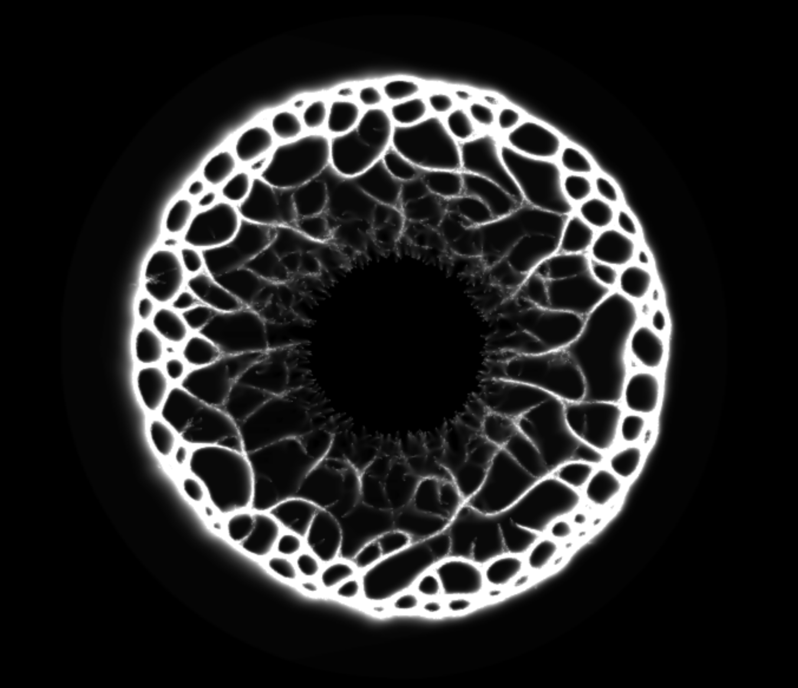
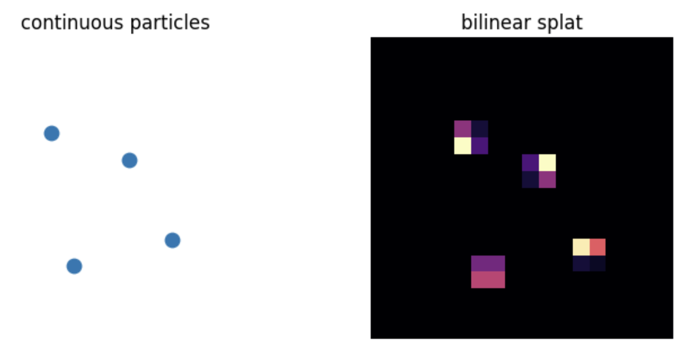
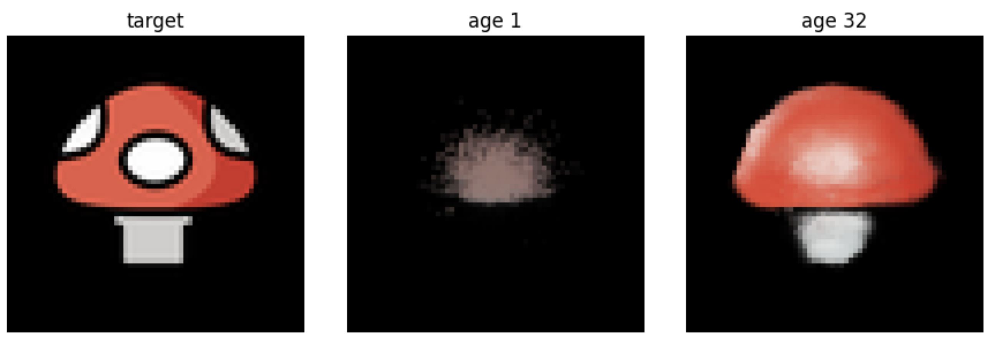

I first got excited about physarium simulations 5 years ago, when I coded a high-performance slime sim I called "DotSwarm" in WebGL. The patterns these simple agent-based simulations produce are mesmerizing. ([Video](https://www.youtube.com/watch?v=mnuwd_z9YGE), [Observable Notebook](https://observablehq.com/@johnowhitaker/dotswarm-exploring-slime-mould-inspired-shaders)). The general premise is that you simulate 'agents' and a 'substrate'. The agents each move along with some velocity, sensing the substrate ahead of with, say, 3 'sensors' at different angles, and then choosing how much to turn based on some rule. The agents also deposit 'pheremones' to the substrate, typically modelled as a grid, and it is these patterns of pheremones that lead to emergent behaviour where agents being to follow eachother along highways etc, much like ants do. This leads to some lovely patterns:



Anyway, after my recent [explorations of neural cellular automata for games](https://johnowhitaker.dev/misc/nca_games.html), I got in touch with @Esychology and we challenged eachother to try to make a **trainable** physarium setup work. This is more challenging than NCAs - with the agents zipping about, it is very tricky to see how gradients could flow from an objective back to the weights of the agent 'brains' in a way that makes training possible! Long story short, I managed to get it somewhat working - the rest of this post will be my attempt at all the little tricks that went into it, and suggestions for how this could be taken further :)

WIP post, the best place to see code in action + get an understanding of the setup is the jax NB linked below, I'll come back and finish this article tomorrow, hello early birds sorry about the mess :D


[Code](https://github.com/johnowhitaker/physarium)
[Jax nb](https://github.com/johnowhitaker/physarium/blob/main/physarium_jax_colab.ipynb)



```python
class State(NamedTuple):
    field: jax.Array       # [H,W,communication]
    canvas: jax.Array      # [H,W,RGB]
    pos: jax.Array         # [agents,xy]
    heading: jax.Array     # [agents,xy]
    hidden: jax.Array      # [agents,memory]
    pigment: jax.Array     # [agents,RGB]
```

```python
def perceive(state):
    density = density_field(state.pos, CFG["grid"], CFG["grid"])
    expected = CFG["agents"] / CFG["grid"]**2
    density = jnp.log1p(density / (expected + 1e-6))
    world = jnp.concatenate([state.field, state.canvas, density], axis=-1)
    sample_pos = state.pos[:, None, :] + OFFSETS[None, :, :]
    local_patch = bilinear_sample(world, sample_pos.reshape(-1, 2))
    local_patch = local_patch.reshape(CFG["agents"], CFG["patch"]**2, -1)
    cue_center = bilinear_sample(CUES, state.pos)
    global_inputs = jnp.concatenate([state.heading, 2 * state.pigment - 1, cue_center], axis=-1)
    return local_patch, global_inputs


def brain(params, local_patch, global_inputs, hidden):
    spatial = jnp.tanh(jnp.einsum("nkc,ks->ncs", local_patch, params["spatial"]))
    encoded = jnp.concatenate([spatial.reshape(CFG["agents"], -1), global_inputs], axis=-1)
    encoded = jax.nn.silu(linear(params["encoder1"], encoded))
    encoded = jnp.tanh(linear(params["encoder2"], encoded))
    hidden = gru(params["gru"], encoded, hidden)
    trunk = layer_norm(hidden, params["ln_scale"], params["ln_bias"])
    trunk = jax.nn.silu(linear(params["trunk1"], trunk))
    trunk = jax.nn.silu(linear(params["trunk2"], trunk))
    out = linear(params["head"], trunk)
    turn = CFG["max_turn"] * jnp.tanh(out[:, 0])
    speed = CFG["base_step"] * jnp.exp(0.35 * jnp.tanh(out[:, 1]))
    emission = jnp.tanh(out[:, 2:2 + CFG["comm"]])
    gate = jax.nn.sigmoid(out[:, 2 + CFG["comm"]])
    proposal = jax.nn.sigmoid(out[:, 3 + CFG["comm"]:])
    return turn, speed, emission, gate, proposal, hidden
```

