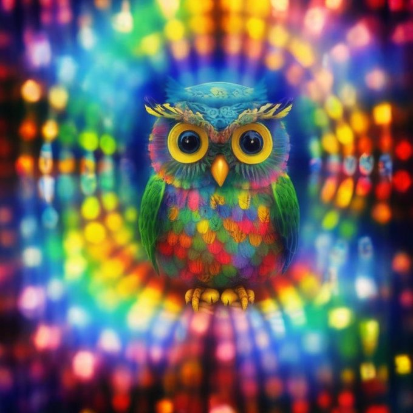

# Reward Hacking with RainbowDiffusion

An experiment incorpoarting an aesthetic model as part of the training loss went wring in all the right ways! And my boss let me release the result on [huggingface](https://huggingface.co/johnowhitaker/rainbowdiffusion) :)

I figured out that weighting the loss by aesthetics was probably better, then realized filtering tha data was equialent to that with binary weights, which led to Playground V1. Nice pics from it:

https://twitter.com/johnowhitaker/status/1641154136447041545

https://twitter.com/johnowhitaker/status/1641463396473225216

Similar tricks (including pyramid noise) made for a better fine-tune of DeepFloyd IF which sadly never got improved or released: https://twitter.com/johnowhitaker/status/1654130007948824580