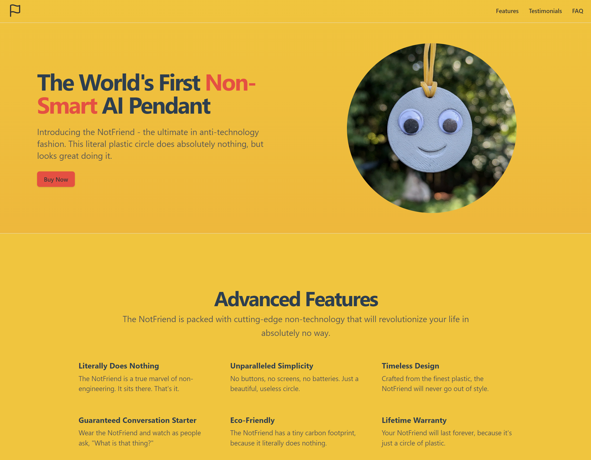

We've been working on FastHTML, a web app framework that makes it easy to build web apps with Python. In the process, I personally have learnt a lot about how the web works, and spent a fair amount of time figuring out 'good' ways to do things for the examples and documentation we've been putting out. But one side-effect of having an easy-to-use web app framework is that I've also been reaching for it in my personal projects, and I thought in this post I'd share some notes from a few of these experiments. None of these projects are particularly exemplary, but that's sort of the point - if they were good, they'd cout as work! So, take these as inspiration (you can do thigns) but not as examples (you should probably do things slightly differently).

## NotFriend

Project URL: [notfriend.org](https://notfriend.org/)
Code: https://github.com/johnowhitaker/notfriend



In one of our answerai 'watercooler' calls, the topic of the 'Friend' pendant came up. I jokingly onted that notfriend.org was available, and that we should do some sort of parody. I did my more serious work for the day then knocked out the site (now visible at [notfriend-production.up.railway.app](notfriend-production.up.railway.app) - more on that shortly) that evening, sharing it the next morning once I'd tested the payments and tweaked a few minor UI things to my satisfaction. 

It seems like the standard approach to designing a visually appealing site these days is to hire a designer to sketch out the 'look' of a site in figma and then spend ages trying to match that in code. I got a taste of how tedious this can be helping to do exactly this for an internal project, and Jeremy had a similar experience working with the design team on the FastHTML homepage. We both came away with the same conclusion: how do people live like this? Alternative apporaches that feel more reasonable are:

- Start from a template
- Use a set library of components. We're starting to explore this with fh-bootstrap, and there are community attempts to port things like shadcn to FastHTML.
- Get an AI to do all the hard work! Spoiler, this is what I went with for NotFriend :)


The tool I tried is called Vercel V0, although [OpenUI](https://github.com/wandb/openui) from Chris Van Pelt seems like a great open-source alternative that lets you control the model, system prompt etc. V0 spits out code, and has a mechanism for requesting design changes ("make the header larger, change the color palette to greens..."). I copied the generated HTML into our ['h2f' converter](https://h2f.answer.ai/) and voila - a decent-looking starting point to tinker with. 


Another pleasingly simple part of the process was letting people actually buy the thing! Taking payments via stripe is as simple as setting a few secrets and then sending the user to a checkout page created by stripe:

```python
# They submit a form with their email, physical address and type of product
@app.get("/buy/")
def buy_credits(product:str, email:str, address:str):
    s = stripe.checkout.Session.create(
        payment_method_types=['card'],
        metadata = {"product": product,"email":email,"address":address},
        line_items=[{
            'price_data': {
                'currency': 'usd', 'unit_amount': 2496,
                'product_data': {'name': f'You are buying a NotFriend ({product} version) - thank you for being a part of this!'},
            }, 'quantity': 1,
        }],
        mode='payment',
        success_url=DOMAIN + '/success?session_id={CHECKOUT_SESSION_ID}',
        cancel_url=DOMAIN + '/cancel',
    )
    return RedirectResponse(s['url'])
```

You can add a webhook to listen for successful payments and then update the user's account in your database, but for this project I just manually checked the stripe dashboard and then sent orders to the addresses myself - passing the metadata along with the order made this easy. I had two sales - digging around the stripe dashboard to find the info was a perfectly reasonable approach. When you have thousands of sales you can set up automations, but that's a good problem to have! I don't want to make out that this is completely trivial, but wow the ability to set this up, and the ease with which I could pop a few notfriends in the mail and send them off, really highlights how doable it is to set up a small business online these days (if you're lucky enough to live in the right place).

## DistilHN

Project url: [https://distilhn.com/](https://distilhn.com/)
Code: https://github.com/AnswerDotAI/fasthtml-example/tree/main/hacker_news_reskin


This one was a re-do of a project I first made in ~2021/22. It takes the front-page articles on Hacker News, summarizes them and presents them in a nice UI with links to both the articles and the HN comments. The original version used a BART model for summarization, and Flask for the backend. It took remarkably little fiddling to get a FastHTML version out of Claude ([conversation link](https://claude.ai/share/86b73f06-af42-4e85-96ce-f6f74a224ca8) for answerai people). 

It's amazing how anyone can now drop in code like this:

```python
sp = """You are a helpful assistant that summarizes articles. Given an article text, possibly including unrelated scraping artefacts, return a summary of the article. If the text is just something like 'enable javascript' or 'turn off your ad blocker', just respond with "Could not summarize article." Otherwise, respond with just the summary (no preamble). Favour extremely conciseness and brevity. Start directly with the contents. Aim for <100 words."""
async def summarize_text(text):
    chat_completion = client.chat.completions.create(
        messages=[{
            "role": "system",
            "content": sp
        }, {
            "role": "user",
            "content": f"Please summarize the following text: {text}"
        }],
        model="gpt-4o-mini",
    )

    summary = chat_completion.choices[0].message.content.strip()
    return summary
```

This is  page I actually visit, since unlike regular HN I can actually get a sense of the article without having to read the whole thing, and it helps me avoid ending up with tons of tabs and comments sections opened. It's really special that anyone with a bit of coding knowledge can make something like this, and then share it with the world, in hours rather than weeks. Bespoke software for the win :)


## Moodle - the benefit of progressive extension

Project URL: [moodle-game.com](https://moodle-game.com/)
Code: https://github.com/AnswerDotAI/fasthtml-example/tree/main/03_pictionary/moodle_demo


FastHTML lends itself to tacking on features as you go. Start with a homepage. Add an about route. Add a navbar. Add a countdown. Add a high-scores list. You can end up with something a little chaotic (see the source code) but 'locality of behaviour' means it's generally super easy to see how one specific thing works. This is how I ended up with Moodle!

To illistrate what I mean by locality of behaviour: if you want to know how the leaderboard works, you only have to look at one place main.py:

```python
@app.get('/leaderboard')
def leaderboard():
    # Top 10 in last 24 hours and approved games only
    fastest_games = games(where="end_time IS NOT NULL AND end_time > strftime('%s', 'now', '-1 day') AND approved",
                        order_by="(end_time - start_time) ASC",
                        limit=10)
    rows = []
    for i, game in enumerate(fastest_games, 1):
        duration = game.end_time - game.start_time
        player_name = game.player_name if game.player_name else "Anonymous"
        rows.append(
            Tr(Td(str(i)), Td(player_name), Td(game.word),
            Td(f"{duration:.2f} seconds"),
            Td(A("View", href=f"/game-summary?game_id={game.id}"))))

    table = Table(Thead(
        Tr(Th("Rank"), Th("Player"), Th("Word"), Th("Duration"),
            Th("Details"))),
                    Tbody(*rows),
                    cls="table table-striped table-hover")

    return Title("Leaderboard - Fastest Games"),  Navbar("leaderboard"),  Main(
            H1("Top 10 Fastest Games (past 24 hours):", style="text-align: left;"),
            table,
            A("Back to Home", href="/"),
            cls='container')
```

We're at ~8,500 games played, and I'm going to write up another post on the model performance and such soonish, so I won't go into that here. Key takeaway: FastHTML mostly got out the way so I could focus on thinking about what I wanted to add, and even though this app has sort of crossed the point where one might consider restructuring/refactoring it, it's still very manageable. And the AI models that make it all work have cost us next to nothing so far. Magic!

## Conclusions

I feel like there's a very large space of ideas that I know I can do now. This makes me happy. Hooray for FastHTML :)