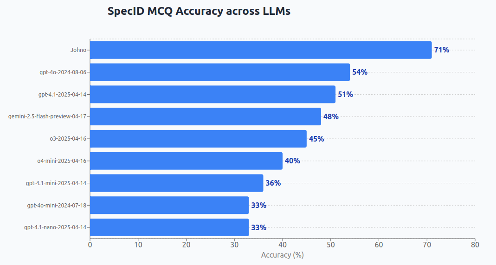
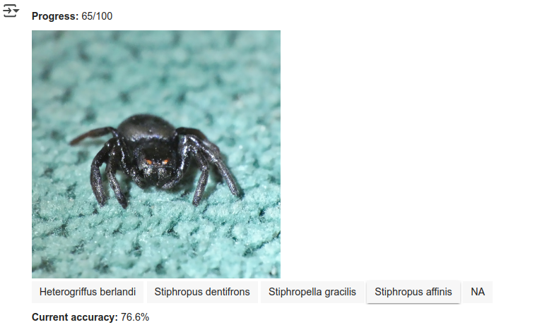

We were talking recently around "What is something you could do through a chat interface that current LLMs can't?". One example I give personally is identifying Zimbabwean spider species - a lot of which are ~undocumented* so knowledge on what the living specimens look like is concentrated in a few heads, plus a smattering of posts on Facebook and iNaturalist. Anyway, I thought I should put my money where my mouth is and make an actual eval for this, to see how badly SOTA multi-modal LLMs do. Here are the results:

The way I constructed this eval was to pull 100 photos with confirmed "research grade" identifications from my iNaturalist catalog. Each sample gets up to four 'distractors' - species names for closely-related organisms in the same ~family/group as the target. Multiple-choice is significantly easier than dredging up the name 'cold' (especially since many latin names have clues that match visual aspects of the species). And the quiz is harder for me that it could have been, since I included all species (bugs, birds, plants) not just spiders! Turns out I'm way worse at the latin names outside my comfort zone :D Still - at least at present I have a lead on the best models - just not as much of a one as I expected! It's stunning that 4o can get more than half of these right. 

For the human baseline, I set up an interface that had me guess myself. It took less than 12 minutes total - here's the prompt that produced the code: "his is a dataset I made, with an image and up to five candidate species. I want to get a human baseline for this dataset. Can you give me code that, in a Google Colab notebook, shows the picture and five buttons (some will need less, can use "NA" if there are less than 5 options) and has me click which one I think is the right one, before storing my guess and showing the next one? Use ipywidgets, include a way for me to see progress (how many done + left) and score (current correct %)." And [here's the result](https://github.com/johnowhitaker/specid_eval/blob/main/SpecID_Human_Baseline.ipynb). Try it youself if you dare :)

The spider above by the way? It fell from a tree onto me, and I eventualy figured out what it was (first record for Zimbabwe) thanks to this passage from the 1923 **Araignées du sud de l'Afrique** :"Céphalothorax noir, avec les yeux latéraux antérieurs et postérieurs situés sur des saillies orangées. Chélicères, pièces buccales, sternum, pattes-mâchoires, pattes brun-noir. Abdomen gris-noirâtre foncé.". There have been a handful of records with nice pics shared since, and it featured on a guide, but this is the kind of obscure digging needed sometimes to ID these things.

Anyway. Make your own evals! Occasionally suprising, easy, fun! Show me! That is all :)

- [Dataset on HuggingFace](https://huggingface.co/datasets/johnowhitaker/specid_eval_jw) - let me know if you want me to try a model on a private ~equivalent dataset.
- [Code + preliminary results with a script to run it yourself](https://github.com/johnowhitaker/specid_eval)

*Although I did write a field guide to the more common ones!