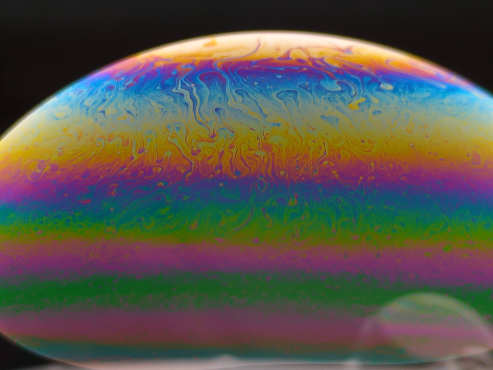
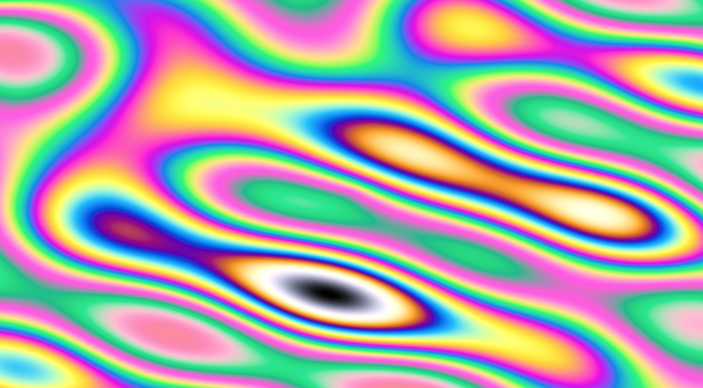

I learned recently that all it takes to get nice photos/videos of bubbles is a wide area light source - which I happened to have on hand in the form of a video light a friend was getting rid of. You blow a bubble onto something that will keep it in place - in my case an inverted teacup, and then photograph the reflection of the light. The results are stunning:

It amused me that I liked these so much given that I've also been loving my [crystal photography](mini-hw-projects/scope_mods.md). More than that - the color palettes seem very similar... Turns out, this is because they both rely on similar thin-film effects (although not identical, since in the crystal case the colors show up thanks to the polarizing filters and the crystals ability to change the polarization of light). You can look up the 'Michel-Lévy color chart' to see the expected color for a section of a given thickness and birefringence. I found [this code](https://github.com/markus-bauer/calculated_Michel_Levy_Chart) to calculate these values, and turned them into [this shader](https://www.shadertoy.com/view/Wcf3R8) which looks like this:

Not nearly as pretty as the real thing though - for that I'll need to venture into the world of fluid dynamics simulations, a rabbit hole I look forward to immensely :)