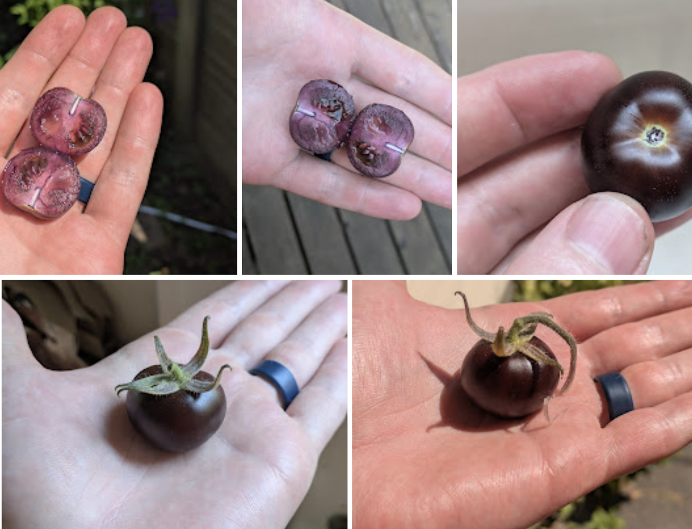

Hello, teardown attendees :) You likely got here clicking the 'How Does This Work?' link from the pipette bot demo. This page has a little more about the bot, and a little more about the other things we may have spoken about. After the event it will hopefully have a gallery of some of the art created this weekend!

## The Hardware

The 'motion platform' is an Ender 3 V3 SE 3D printer that has served me well over the past few years. A Raspberry Pi hosts the site and sends G-CODE to the printer. The micropipette sits in a 3D printed holder with a Dynamixel XL430 servo and control board in charge of pushing the plunger. You can swap in a lower-volume micropipette for more precise work. The servo is one I happened to have on hand from a past robotics project, a little pricier than necessary for this application I suspect. Paper is held to the bed by magnets. [original conception](https://johnowhitaker.dev/posts/cnc_pipette.html)

## The Code

To turn this into a demo I ~~waved a magic wand~~~ asked Codex to whip up an interface based on the previous code I used to give the bot a control API. The resulting code is [here](https://github.com/johnowhitaker/pipette/tree/codex/pipette-pixels) but comes with no warranty, not even the implied warranty of 'a human has read this at some point'. My opinion on interfaces like these is that it's most fun to roll your own to your exact specifications - the latest coding models speak web UI and g-code well enough to bash something together in minutes. This demo was completed from a voice prompt + a couple of follow up requests while I rode the bus to the Portland Art Museum on Wednesday :)

## Operation

You draw a picture, which gets added to the queue. It is 'painted' by dispensing droplets of liquid in a grid pattern - by default they sort of sit there on the paper. You can have fun by 1) wetting the paper first using the spray bottle of water for some wet-on-wet watercolor vibes, 2) spraying afterwards 3) dabbing with paper towel / tissue to get rid of excess liquid or 4) whatever you like.

If I'm not there, odds are the printer is in semi-auto mode. Put a piece of paper in the marked spot, stick it down with magnets on the corners, then hit the central scroll knob/button thingee on the printer interface and it should start on whatever the next drawing in the queue is. Given the crowd, I expect some surprises and take no responsibility for what happens. 

## Other Things We Might Have Spoken About

The recent [microfluidics tests](https://johnowhitaker.dev/mini-hw-projects/microfluidics_1.html)

The purple tomato seeds are from a bioengineered tomato from norfolk healthy produce, are not for sale but can be shared with your local community (a lovely approach): https://www.norfolkhealthyproduce.com/pages/faqs

The duckweed has been transformed using agrobacterium carrying this RUBY plasmid: https://atinygreencell.com/products/pcambia2300-rubygreen

The DIY gene gun [works](https://ln.johnowhitaker.com/entry/51) but is waiting for full tests, [here](https://johnowhitaker.dev/mini-hw-projects/asgg2.html) is an early WIP post from a few months ago.

The DVD hacking adventure has a writeup [here](https://johnowhitaker.dev/posts/dvd_hack.html)

The e. coli engineering project has a writeup + video [here](https://johnowhitaker.dev/misc/chasing_green.html)

Anything else is probably linked somewhere on https://johnowhitaker.dev/ or https://x.com/johnowhitaker. My gmail is also johnowhitaker if you want to get in touch that way.