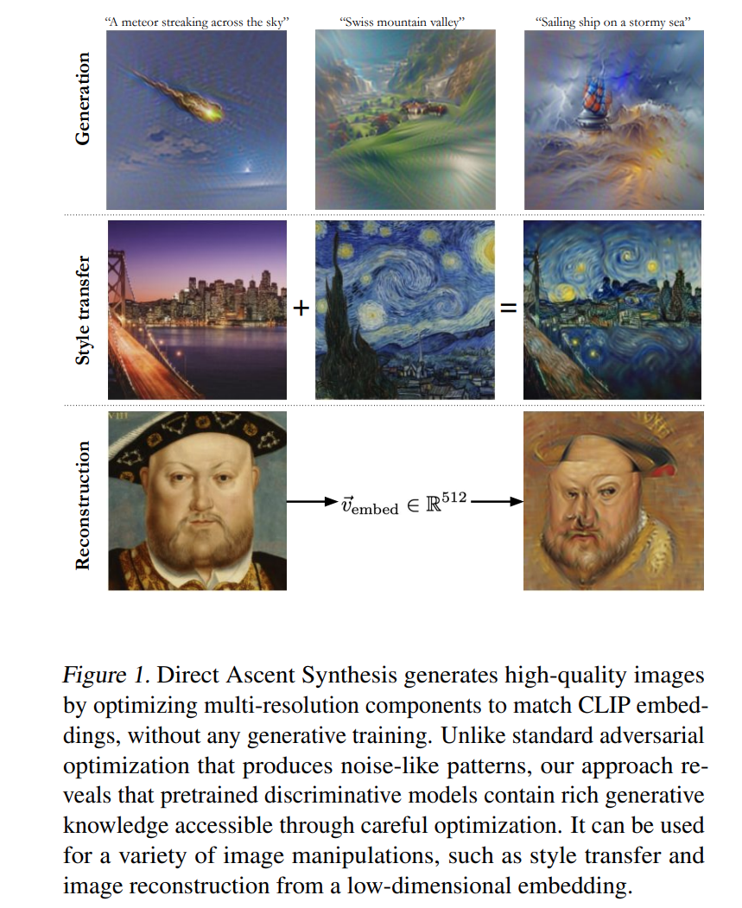

I have a paper out! What!?!? Johno doesn't write papers. True. But when Stanislav Fort discivered a neat trick that was one I'd also found back in the day, we got talking and figured it ought to be better documented so other people can use it too. I have to say: he did all the hard work! I sadly didn't have time to play much, but did chip in a little. This blog post is a few of my own thoughts, but you should read the [paper](https://arxiv.org/abs/2502.07753) first.



The TL;DR is as follows: instead of optimizing raw pixels, optimize a collection of image tensors at different resolutions that get resized and stacked together to form the final image. This turns out to have really neat regularization effects, and gives a really nice primitive for seeing what 'natural'-ish images trigger various features in classifiers etc. This is pretty much the idea behind my 2021 ['imstack'](https://github.com/johnowhitaker/imstack) stuff, but made cleaner and more general.

The other trick is to do some augmentations, critically adding some jitter (different crops) and noise. Once you have these pieces in place, you can optimize towards a text prompt with CLIP, or do style transfer, or trigger a specific class in a classification model... the possibilities are endless. Here's the code to make the quintessential 'jellyfish' from an imagenet model for e.g. ([colab](https://colab.research.google.com/drive/1gLZXcPIKpBwYWgweOVli9ORcOyJ-khJ5?usp=sharing))

```python
def stack(x, large_resolution):
  out = 0.0
  for i,p in enumerate(x):
    out += F.interpolate(p, size=(large_resolution, large_resolution), mode='bicubic' if resolutions[i] > 1 else 'nearest')
  return out

def raw_to_real_image(raw_image): return (torch.tanh(raw_image)+1.0)/2.0

large_resolution = 336
resolutions = range(1,large_resolution+1, 4)
image_layers = [torch.zeros(1,3,res,res).to("cuda") for res in resolutions]
for i,p in enumerate(image_layers): p.requires_grad = True
optimizer = torch.optim.SGD(image_layers, 0.005)
for step in tqdm(range(100)):
  optimizer.zero_grad()
  images = raw_to_real_image(stack(image_layers, large_resolution))
  images = make_image_augmentations(images, count=16, jitter_scale=56, noise_scale=0.2)
  loss = -model(normalize(images))[:, 107].mean()
  loss.backward()
  optimizer.step()
```

I want to do a video explanation soon to capture more thoughts on this and show off more of what this technique can do. See also, [Stanislav's announcement post](https://x.com/stanislavfort/status/1890724291752100265). The rest of this post is me rambling on some tangential bits that have come up since the paper was released.

## Thoughts

The initial responses to SF's post about the paper on Twitter were an interesting mix:
- 'Wow this is amazing' (often a little *too* enthusiastic, in the 'this makes diffusion models obsolete' direction!)
- This is nothing new and you don't cite [X]. Some were reasonable suggestions for related work, some were thigns we did in fact cite (lol) and a fair few were missing the point of the paper, interpreting it as somehow claiming the idea of generation via inversion as opposed to just saying 'hey we found a better method to do that that actually kinda works now'. 

Some of the misunderstanding was maybe on us re: wording, some was due to this coming out in 2025 despite being an older idea, and some was folks being trigger-happy - understandably so, having seen previous works that ripped off ideas from the good old days of AI art. Getting involved in the discussion was interesting for me: I was 'part of the scene' back then, and while everyone was riffing off eachother's ideas and sharing cool stuff freely, it wasn't exactly documented - if you weren't there in the eleutherai discord and the various private channel offshoots or checking out the copy-of-a-copy-of-a-copy-of-a-colab notebooks you'd have no idea what ideas had or hadn't been done. I contributed new stuff to the collective, as did many others, and didn't really care about attribution or first dibs. But since a lot of that happened outside of academia, I pity any researchers trying to work on adjacent things - there's no paper search that will turn up that early work! Fortunately, there did end up being papers on some of the key ideas, which we were careful to cite (with updates to add a few I missed thanks to the helpful Tiwtter discussion).

I'm a little conflicted though - I don't like the idea that an idea doesn't count unless it's on arxiv. I don't like the idea that if you *do* put it on archive belatedly a twitter mob might yell at you. I was very happy when SF reached out - as soon as he realized my imstack work pre-dated his independant discovery of the idea he went straight to the ethical "I could never write this up without you" stance, but if he had I honesty wouldn't have cared (apart from 'hey great minds think alike) since how the heck would he be expected to find a pokey github pages project with a few colabs or my old YouTube lessons with 100s of views. I'm glad we've got a thing we can point at now if we (or anyone) builds on this cool idea. Anyway.

Going forward, I think my approach is going to stay the same as it mostly has been: write things down as easily as possible (tweets as things go, blogs asap), share things freely, try and point to things that inspire me and hope to inspire others, don't fuss if someone else has the same ideas or builds on mine.