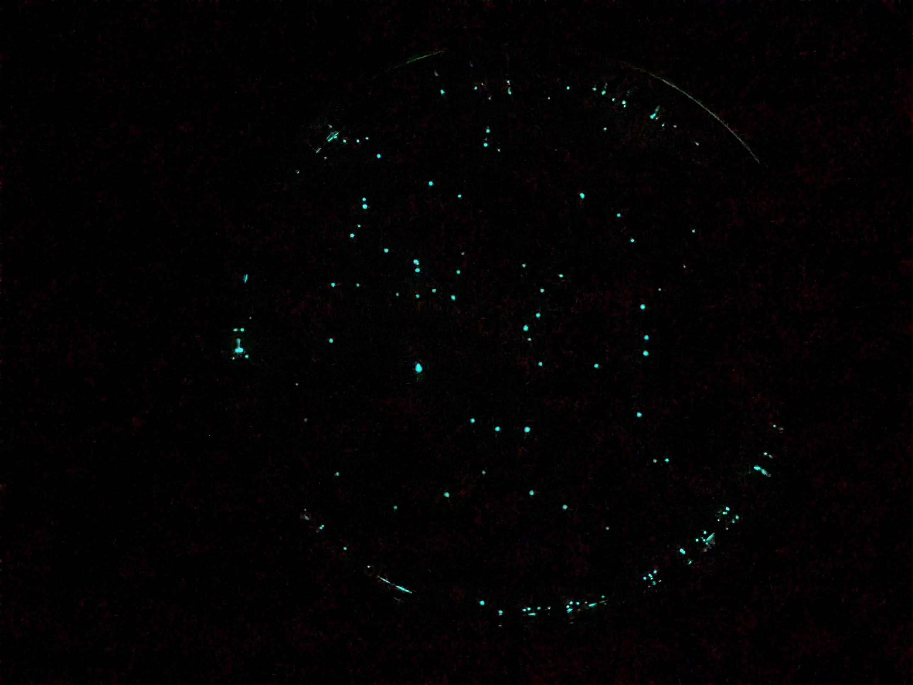
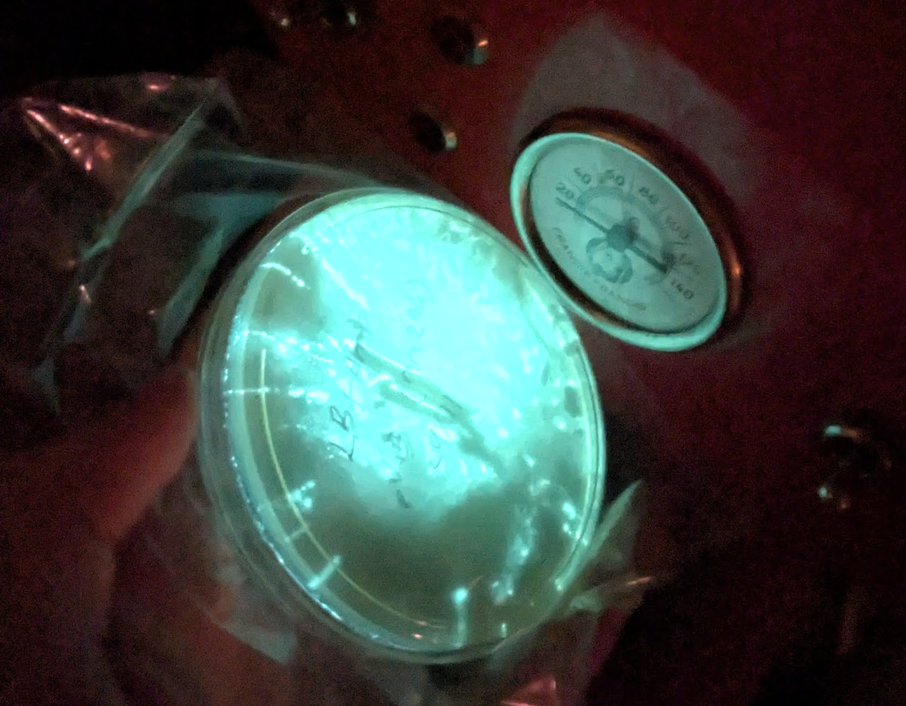
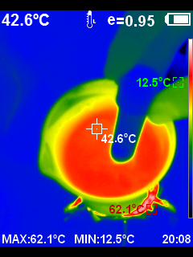
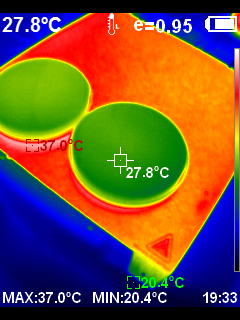

This weekend I did my first successful bacterial transformation, inserting a plasmid that makes *E. coli* glow in the dark by expressing the 'lux' genes from bioluminescent marine bacteria. I'd [had no luck](https://johnowhitaker.dev/mini-hw-projects/2024-03-30-bio.html) with a kit from the Odin (which I've since heard many bad reviewds about) - this time I went with an upgraded kit but also took advantage of more knowledge and tools aquired in the meantime, and it went extremely smoothly. This is sort of the 'Hello World' of synthetic biology, so naturally here's my first agar art:

This is all practice for when I get my own custom DNA made. How cool is it that this is possible! The glow is suprisongly bright - I had to cover the plate I put on my nightstand :) Here's a plate ~12 hours after a transformation, you can see individual specks which are small colonies, each started from one individual cell that successfully took up the DNA and could thus survive on the antibiotic-containing agar:

Here's a plate that had some liquid on the surface which spread things around. It's so bright you can read things like the dial on our coffee machine (photo on Google's night sight mode so a little enhanced):

It even grow nice and glowy on my home-made agar with no antibiotic, although I don't think that would last. The strain (MM294) is super safe and de-fanged, this is something they let high-schoolers do. All in all a great way to warm up for later projects :D Details below for the curious.

## The Details

I'm working with [this kit](https://www.carolina.com/gene-expression-advanced-topics/glow-in-the-dark-transformation-4-station-kit-with-perishables/211087P.pr) from Carolina Biological Supply Company, which contains enough materials for four students, but realistically can stretch to ~8 transformations, with easy ways to extend it further.

The kit comes with 4ml AMP @10mg/mL. They say to add it all to 200ml agar, but for the 8-person kit they give the same qty and say to add it all to 400ml agar. I decided to keep back 2ml (1ml + 2x 0.5ml aliquots) to freeze for later.

The process for pouring the plates I went with is:

- Wipe down surfaces and gloves with IPA
- Melt the agar (bottle in boiling water with loose lid for a while, or microwave in short bursts. Make sure it is not cloudy and lumpy, and has all properly melted)
- Let it cool to 55C. Work carefully by a flame
- Pour 8 plates, and a few ml in a falcon tube for later stab of the starting e. coli
- Add the remaining 2ml AMP (to half the bottle of agar, i.e. 200ml -> 100mg/L AMP which IIUC is standard) and swirl to mix
- Pour 8 more plates
- Invert, label, bag em up in ziplocs to store in the fridge, keeping one LB plate out to streak the starter

And here's my protocol, cutting a few minor corners:

- Use a sterile pipette to add 250uL CaCl2 soln (50 mM) to a 15ml tube.
- Place tube on ice for 10 minutes (along with the plasmid which I got out the fridge)
- Transfer a few isolated colonies (goal is 2-5mm diameter from one or more) to the CaCl2, spinning the loop to dislodge the mass and then pipetting up and down a few times to mix (I used same pipette as measuring CaCl2 since still clean). Should look cloudy white, no clumps
- Cells go right back on ice as soon as you're done adding em and mixing.
- Add 10uL of plasmid DNA. They say 1 loopful, I couldn't get a bubble to form, I did 10uL with one of the janky pipettes I have around (luckily I'd practiced this, it's ~2mm up the tubes I have give or take).
- Incubate on ice for 5-10 minutes. Label the plate while waiting. I added 6 glass beads at this time too, for spreading the cells later.
- HEAT SHOCK: move from ice directly into 42C water for 90 seconds, then back to ice for >=1 minute.  Gently agitate while in water bath.
- Using fresh sterile pipette, transfer 250uL LB to tube, tap to mix, and leave at room temp for 5+ mins to recover and start expressing antibiotic resistance
- pipette 100uL onto plate (I used same LB pipette) then spread by shaking the balls back and fourth
- Let it rest a few minutes to absorb then dump out the balls (and disinfect them with IPA in my case)
- Place plate upside down on 3D printer bed and 'incubate at 30C for 24-36h or 36-60h at room temp'. (with 3D printer set to 35 plates are more like 28 but I don't want to push too high so I left it at that).

Tips
- Add the plasmid gently
- Work clean, don't panic
- Make sure the agar is fully melted (otherwise you get goopy lumps, don't ask me how I know)
- You can up your chances by adding more cells / more DNA. My first run I didn't get many cells on the loop, the second go I used the wire innoculating loop and got a bigger colony or three that had had 12 hours more growth compared to the first run. 

There are some great resources for learning more about this, my top rec is probably the [Thought Emporium YT channel](https://www.youtube.com/@ThoughtEmporium).

Anyway, stay tuned for more bio fun. I might have to set up a separate lab notebook to keep protocols and updates from polluting the blog post feed, organisation TBD :)