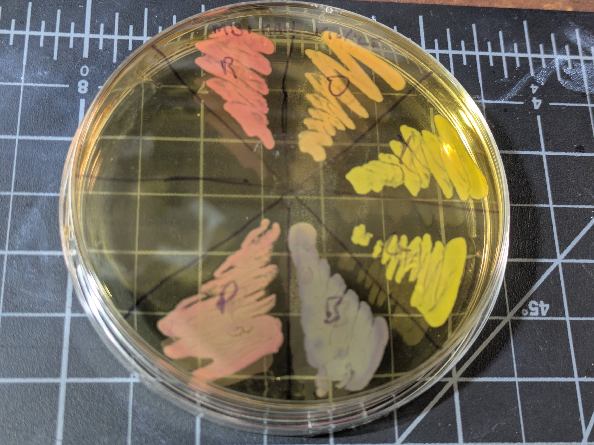
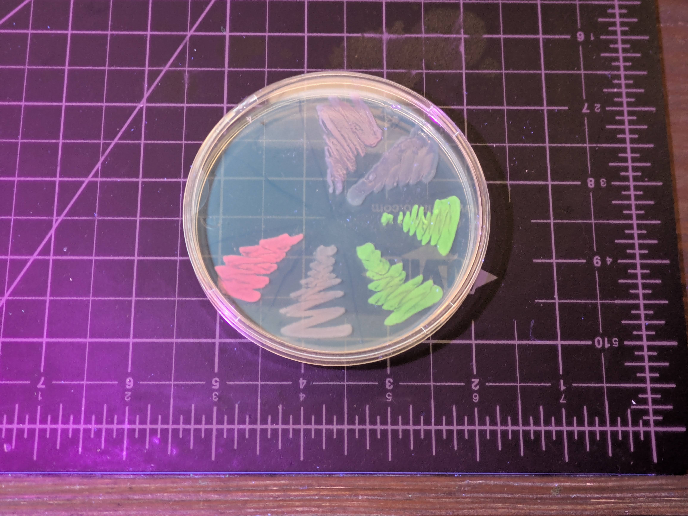
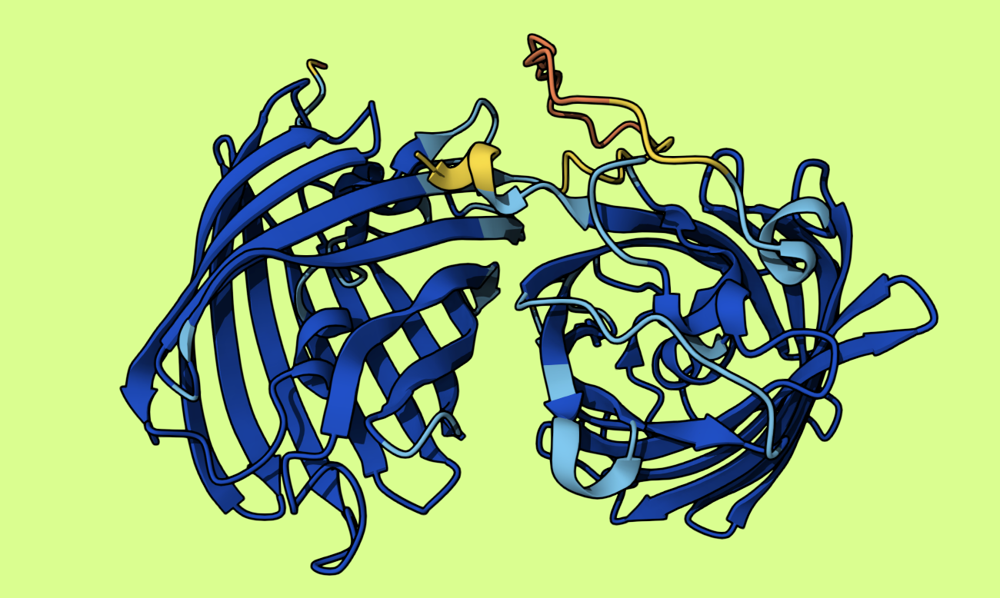
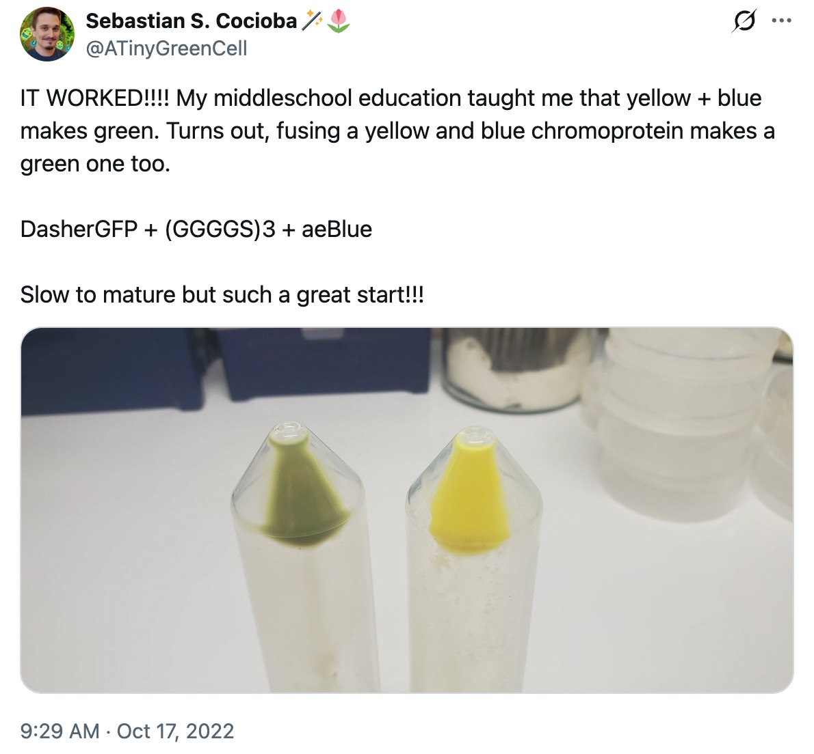
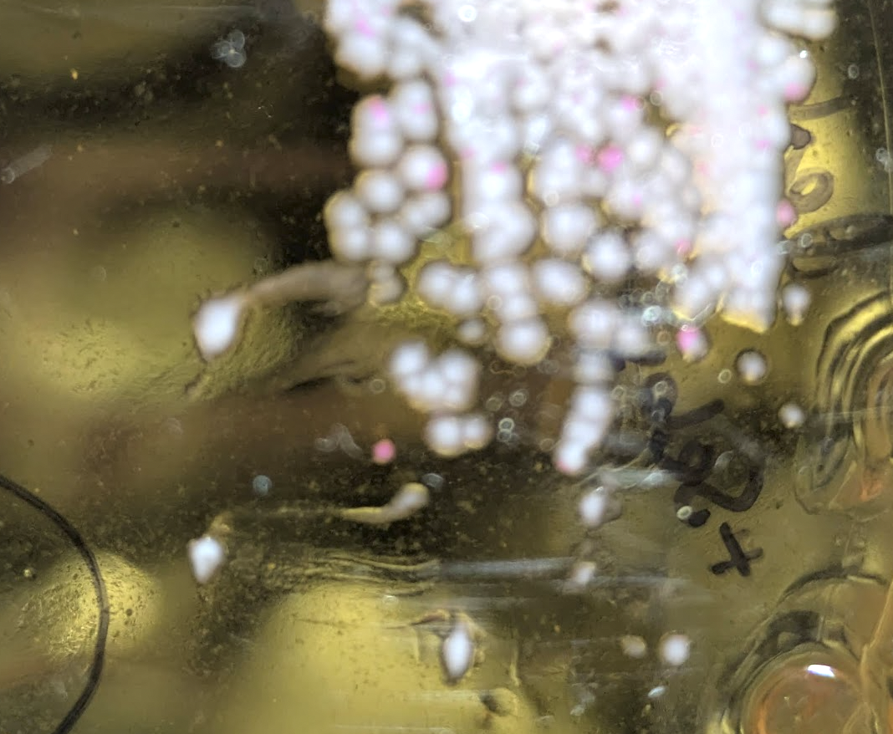

I've been getting back into DIYBio, and the next step I wanted to design was making a custom plasmid. Casting about for ideas, I thought it would be neat to try for something that looks visibly green under natural light. You see, I'd bought a few [Rainbow chromoprotein sets](https://atinygreencell.com/products/rainbow-chromoprotein-expression-plasmid-set) from Sebastian (@atinygreencell) to support his epic work, and while they are delightful, the green is basically yellow:

At least, until you look under UV or blue light - it's a flourescent protein, so it glows bright green then (so do a few others):

After a deep dive into how Touracos get their green (TIL: copper) I decided to try a wacky idea.

## Take 1: Fusion

Inspired by this [electric blue plasmid](https://thethoughtemporium.ca/products/electric-blue-1?srsltid=AfmBOooZZSCoBpI6RyCKpJSG7oRdLvRdTOQMlUCsEKbNAkohtPZlEHYI) designed by Justin from the Thought Emporium, I figured I'd link together a yellow protein and a blue protein to get green. That's how it works with paint, right? I dug around, found some candidate proteins, designed a construct, and had even started the order process for what I thought would be a very cool new protein:

I learned a ton about how the whole process works. It seems a lot of plasmid design involves copying strings of ATGACCGCGCTGACC... around, which I didn't want to do, so I set about constructing it out of known pieces in a solveit notebook (an interactive coding environment). You can see the code [here](https://github.com/johnowhitaker/BLY/blob/main/attempt_1_flawed/BLY_Designing_The_Plasmid.ipynb). Some bits I learned:

- Keeping track of start and stop codons
- Linking two proteins with a flexible linker
- Back-translating from an amino acid sequence to DNA that should express it
- The various other pieces of plasmid design - promoters, origins of replication, antibiotic resistance markers, terminators, Ribosome Binding Sites (RBS), etc.
- Cloning restriction sites, including checking for accidental ones in the parts I wanted to use and making substitutions to remove them

I'm pleased with the [result](https://github.com/johnowhitaker/BLY/tree/main/attempt_1_flawed), but as I waited for the DNA synthesis to start, a final LLM-assisted check caught a fatal flaw: aeBlue is a tetramer! That is, four monomers come together to make the final protein. Having yellow monomers hanging on could tangle up the process, leaving me with a non-functional mess. Oh no! Thankfully I managed to contact the kind folks at GenScript who were synthesizing the DNA for me, and they were able to cancel the order before it was made, and I frantically changed plan last minute and sent new DNA to them instead.

## Seb's work

More recently, chattingh to Sebastian, I mentioned this project and, lo and behold, he actually did just this way back in 2022! 

He thought it hadn't worked, but eventually after putting it in a more productive strain and growing it out for a while, he got some visible green color. And he used aeBlue as his blue piece - so maybe mine would have worked after all! Alas. Still, having the chance to chat to someone experienced who had already tried this gave me some vital info for the rest of the project.

## My revised plasmid

I somewhat frantically fell back on a plan B when I was rushing to get a new sequence to GenScript. The new plan: make the yellow and the blue separately, each with their own RBS and terminator, on the same plasmid. This way, they can fold up independently, hopefully avoiding the tetramer problem. And if the balance is off, this has the benefit that I can switch to a different promoter or RBS for one or the other to try to tune the expression levels. Here's the new design (and the [notebook](https://github.com/johnowhitaker/BLY/blob/main/BLYv2_green.ipynb) that I designed it in):

I switched to a weaker promoter than Seb's designs, worrying about burdening the cells. This was probably a mistake given that it took him ages to see any expression - but then I didn't know about his work then. I also gave up on worrying about cloning sites, and tried to keep it minimal. I did change the amino acid sequence of the fwYellow protein though, to add an easter egg I'll reveal later ;)

## Getting it in cells

I got the new plasmid in the mail, and an hour after it arrived the DNA was in some cells sitting replicating on a plate. The protocol I followed was essentially the same as that in my last post on [glowing bacteria](https://johnowhitaker.dev/posts/bacterial_transformation.html) - with a few shortcuts and refiniements. I did have to whip up some sterile water to dilute the DNA - fortunately I have some syringe filters that did the job nicely. And now I have extra on hand in case I need it again in a hurry. The more you do, the more you learn and the moretricks you aquire! I'm feeling a lot more competent as I practice all the pieces of this puzzle.

Alas, my transformed colonies grew out with ~no visible sign of color (well, with some imagination I think they're sliiiightly darker than normal). I presume they took in the plasmid, since they're living quite happily on kanamycin plates, but I guess the expression levels are too low to see anything. The strain I used is an old one, MM294, which isn't optimized for protein expression. Seb had to switch to a BL21 derivative to get his to show up. So, I hold out hope.

## Next steps

I'm currrently 'curing out' some of Seb's bacteria - streaking and re-streaking on plain plates in the hopes they ditch the current plasmid, leaving me plain BL21 ready to transform with my own plasmid. I actually tried a transformation a little impatiently this weekend, and was left with a lawn of cells - there were plenty that still had his kanamycin resistance, so I'll need to be more patient curing it out :)

You can see in the pic above some pink colonies luring among the white ones, after I streaked out the first 'white looking' dot. I tested some candidate colonies on plain vs kan plates and saw no growth for one of them, but I guess I got unlucky when I then picked the cells for the transformation step. Lesson learned :) Once I get a successful transformation into these BL21 cells, I'll grow some on plates and some in liquid culture and see if we can see any green at all. Either way, it's already been a great learning experience.

I'll also say, it's wild that an amateur can, with the help of some friends and AI, whip up a custom plasmid design, get it synthesized, and have it expressed in bacteria in a matter of weeks for a few hundred dollars. What a world! But also, a little scary. Mostly exciting though - I see the majority of uses for tech like this being positive, creative projects and hope more and more people get the joy of working with the living world. See you in part 2, hopefully ft some green!

PS: even if the proteins misfold or I fail from here, I'll let you in on my secret. The amino acids at the end of the fwYellow sequence: VIKAVDLETYRGSGREEN. So, *technically*, I made GREEN! Uncountable copies in my plain-looking colonies, spelling out a small victory even in the midst of a setback. (A project for the future is running some PCR+gels to verify this small victory if we don't get a more obvious one!)

Until next time,

J