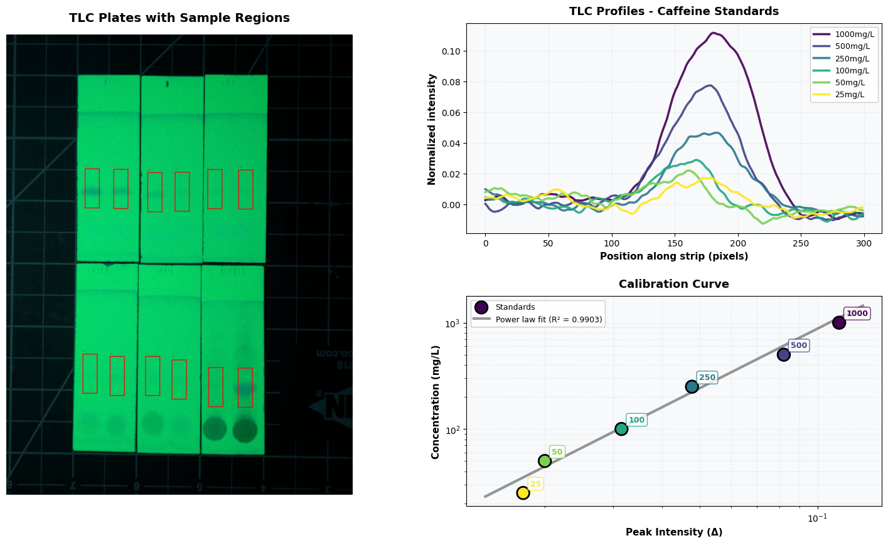
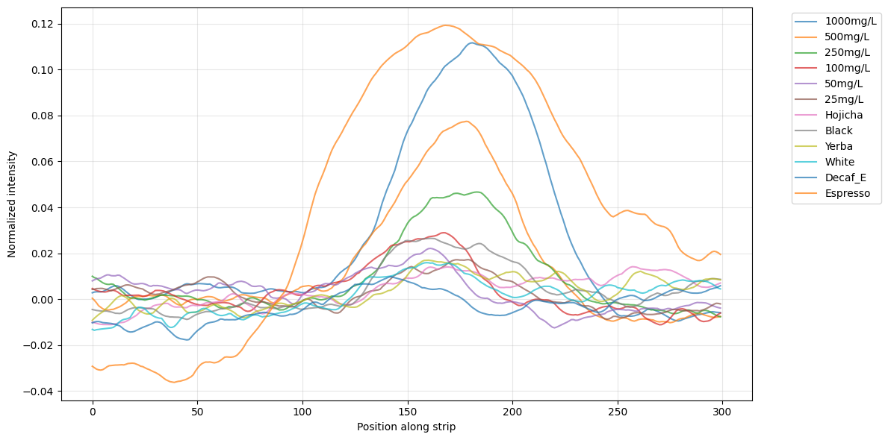
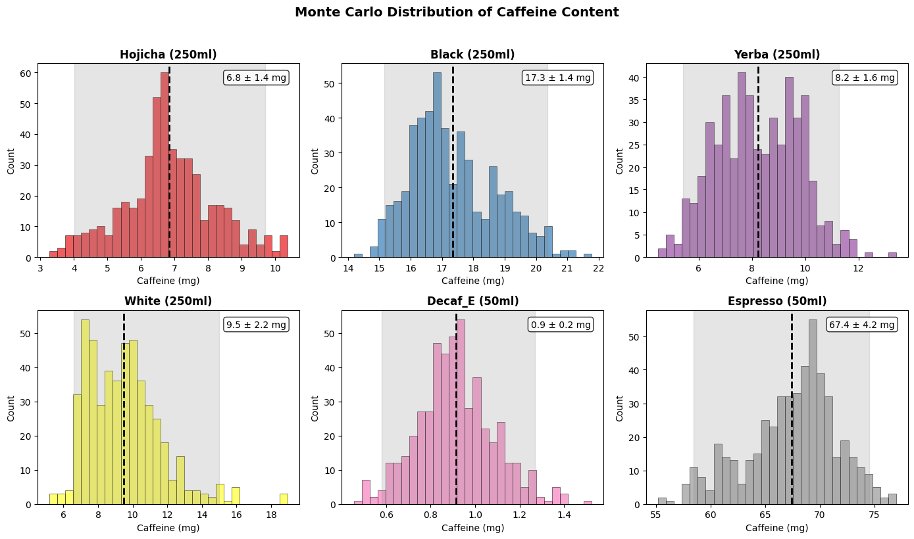

Caffeine. Call it a drug, call it a vitamin. Many of us consume it daily - but how much? I've been a ~daily tea drinker a lot of my life (with periods of tapering off occasionally just to prove I'm not that big an addict) but strong coffee or yerba usually feels too strong for me. It's bugged me for a while that there aren't good options for figuring out how much you're getting. When I steep my tea for seconds rather than minutes, what does that do to the dose? Are the green tea variants that claim 'low caffeine' really much less than regular black tea? How 'decaf' is decaf coffee? What about those kombuchas and boba teas and such people buy that don't have any labelling for caffeine levels at all? Until this project, the cheapest option for testing at home was a $3k tester that cost >$10 per test that was featured in a James Hoffman video [citation needed]. It's based on differential pulse voltammetry, and looked pretty tricky to replicate at home. I'd looked into spectroscopic analysis, but you need pretty fancy setups to isolate out the caffeine signal from all the other stuff you might have dissolved in a beverage.



Then 3 weeks ago I was reading up on thin layer chromatography (TLC) for something else and wondered: would caffeine show up? Turns out the answer is yes! The TLC plages I got have a coating that flouresces under 250nm UV light (and I have a germicidal UV light for mutagenesis, post on that soon) but caffeine strongly absorbs that wavelength, and should show up as a dark smudge. I had some pure caffeine on hand too (for growing crystals, and to help mutagenesis, post soon too maybe) so I could make up some known concentrations for reference. The idea worked 'in my head' - I could see the blots in my minds eye. But of course, the real world would be messy, the concentrations would be way too low, it would never work the way I hoped right? Wrong! It totally worked!

## The Method

Here's the approach I settled on after a few tests.

- Mix up reference concentrations: 1000mg/L, 500mg/L, 250mg/L, 100mg/L, 50mg/L and 25mg/L
- Spot on 7uL of the liquid to be tested near one end of a TLC plate. You can fit two comfortably on a plate - 3 is a squeeze, unless you spot much smaller quantities (you can spot, dry and re-spot to boost the signal, but it's hard to be consistent).
- Place in a few mm of Ethyl Acetate (EA) in a container (after letting the EA sit and evaporate a bit) and let it run up most of the plate.
- Take out and dry flat.
- Photograph while illuminated by a 250nm UVC bulb. (Wear safety goggles, UVC is not good for skin or eyes, mine lives in a box and is handled with care)

This is already enough if all you care about is a rough measure of whether something is decaf, for example. But to make things a bit more quantitative, I loaded the image into solveit (an interactive jupyter-like environment) and grabbed the pixel values around each sample region, averaged and smoothed them, and plotted the results.

Plotting the delta between the peak and the baseline, we can get a measure that increases with concentration. Fitting a power law to the known concentrations gives us a way to estimate the concentration of the beverages. It's pretty noisy at the low end though, and I was worried arbitrary choices like the size of the rect we draw around the blob might give different results. So, like a good scientist, I added error bars by re-running the analysis for a wide range of settings so we can estimate confidence intervals ("Monte Carlo sensitivity analysis" if you're feeling fancy).

As expected, decaf coffee < hojicha < white tea < black tea << espresso. The tea and yerba here are brewed my way, which is weak sauce. I tend to pour hot water (temp depending on tea) over the tea leaves or teabag, swish it around, and serve. Coming soon: results for brewing as the teas' containers suggest.

## More accuracy

The lowest two concentrations are hard to distinguish (indeed, I'm not sure if I got em switched to be honest) so all our teas are actually on the low end of a range this method can work for. There are two easy ways to fix this:

- Boil off 90% of the volume to get a stronger brew that will leave a clearer spot
- Extract + concentrate the caffeine with EA. Some will be left in the tea, but we can do this to our known concentration samples too and get a repeatable method that way too. 

I'm going to try one or both of these soon - and will update this post when the results come in...

Update 1: shaking with EA then running that didn't seem to give a useful signal

## Stuff that mattered / didn't work

- Acetone did move the caffeine, and with it I could actually see the spots under daylight while the plate was still wet with acetone. But it was smeary and hard to see - EA was much better.
- Spotting samples on the plates one at a time, then running them a few days later, gave smeary messes. Run them soon after the spots dry. Once you've run the plate, you can keep it and compare it to others - so e.g. as long as I stick with the same volume of liquid and the same solvent I should be able to run future samples without needing to re-do the calibration ones
- Running the plates in landscape mode lets you fit more samples on there, but makes it harder to get clean data out
- Illumination changes can be calibrated out, but ideally you want even lighting from the UVC and a steady, focused pic from a decent camera. Make sure it isn't over-exposed and that the spots are clearly visible.

## Re-Running on an energy drink with a known concentration

I did a run with "Melting Forest" MUSHROOM ENERGY, a curious beverage I spotted in our local New Seasons. Gratifyingly, the estimate (144.1mg +- 19.4mg) matches up perfectly with the stated dose on the can (150mg). Here's the [code](https://gist.github.com/johnowhitaker/c3bb0bca0c4c8f37324641c90e617e2c). The video at the top walks through it.

## Future plans + conclusions

Besides running this on a few more beverages and brew methods, I don't really have grand plans for this. I hope this post + the accompanying video enable others who've wanted something like this to replicate the process, and who (like me) were frustrated by the lack of options for cheap testing. And more than that, I hope it inspires you to look for places in your own life where a bit of science could answer a question that you have :) Until next time,

J

PS: [code](https://gist.github.com/johnowhitaker/43737282ef1da367aca7df9bf4a35522) from this first analysis, I'll clean it up and share when I make the video (IF i make one, no promises)

PPS: coffee has other cool compounds that fluoresce under 360nm UV:

In the plate pictured in this post:

Top row: standards (last two possibly switched?)
Bottom row: Hojicha teabag, black teabag, yerba mate teabag brewed extra weak, Bai Mudan white tea (leaves), decaf espresso, regular espresso. TODO: measure espresso volume of my home cup.