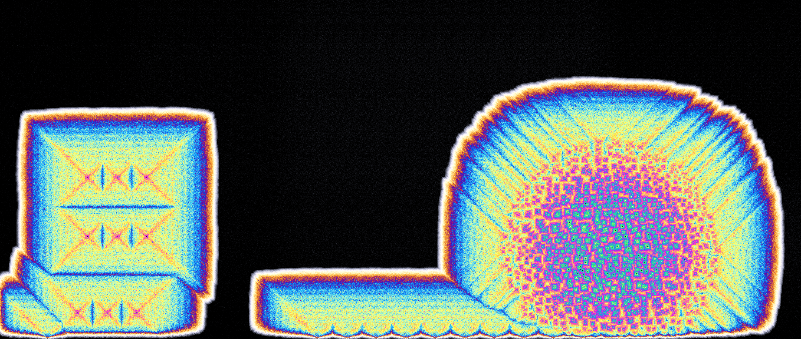
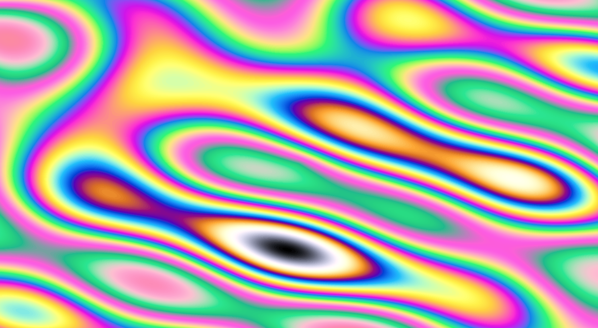
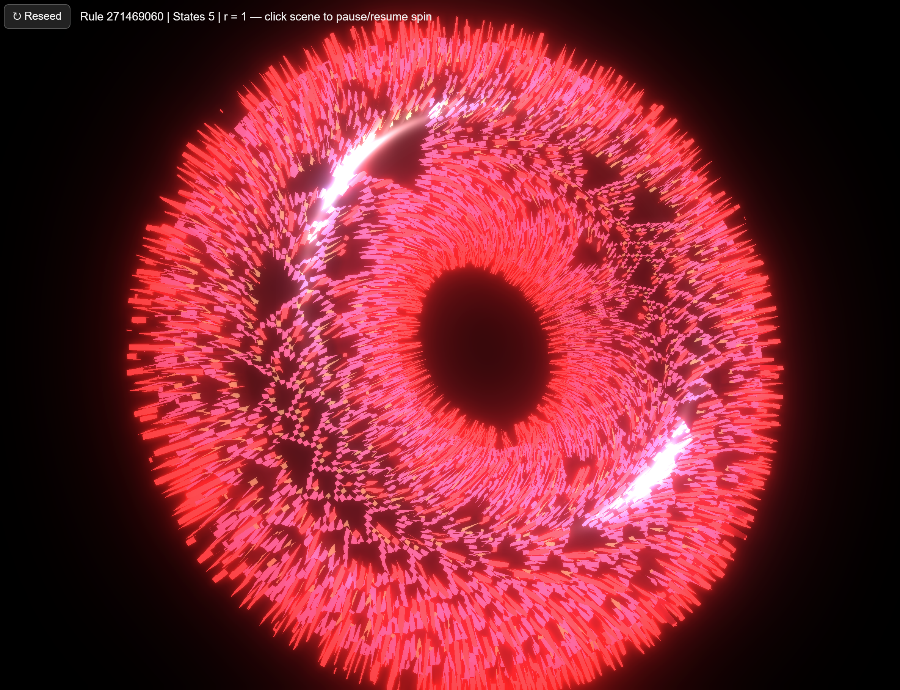

I've been kinda busy, and a few small projects have gone undocumented, so I'm sharing stubs here in case I don't get to them later.

### Crystal Growth Shader

I made [this shader](https://www.shadertoy.com/view/wXSSzK) after thinking how easy it would be to simulate crystal growth, with crystal formation depleting concentration but making it more likely more crystal grows there, and everything represented as channels in an image for shaders. AI-assisted quick prototype came together quickly, and I swapped in the Michel-Levy colors from my [bubble shader](https://www.shadertoy.com/view/Wcf3R8) to make the image above. Lots of fun tweaking constants.

(THe bubble shader - don't know if I shared before)

## Travel Crokinole

I like Crokinole and so does my friend Jeremy Howard - but when we both travelled to Singapore a normal board wouldn't fit in my suitcase so I had this travel set cut by the fantastic SendCutSend which bolts together. I tapped holes for bolts to act as the pegs and used cut aluminium disks as the pucks, with some speed powder (basically polenta as far as I can tell) they glide beautifully. With nothing the flat surfaces tend to slow things once there's no air cushion. I tried magnets as an inductive braking edge barrier but they were too weak - not sad, I now have lots of small magnets which I often need :) The game was a success, I got lots of Answer.AI friends hooked :)

## CA on a donut

Idle demoscene ThreeJS project while I read a Wolfram article, [here's the code](https://chatgpt.com/canvas/shared/682e225a55b08191b70e57a1070985c4). Made after playing with a rule with horizontal wrapping and thinking how cool it would look on a torus. modern AI models like o3 are incredible - it got it wrong but then did lots of python playing to figure out what to change!!

## Edison cylinder (WIP)

I bought an edison cylinder for $5 - amazing piece of history. These hold ~2 minutes of audio. I tried various ways of spinning it (pictured is too fast, no pics of most successful) and the closest I got to audio was dragging a reflective thingee with a piece of wire out the edge over the grooves and then bounding a laser off of it, then turning the light intensity into audio with an existing circuit I have lying around, but it doesnt track the grooves well at all. Might not bother, I hoped this was a wax cylinder and the main goal was to make a music-themed candle for my FIL but alas it's vinyl haha. 