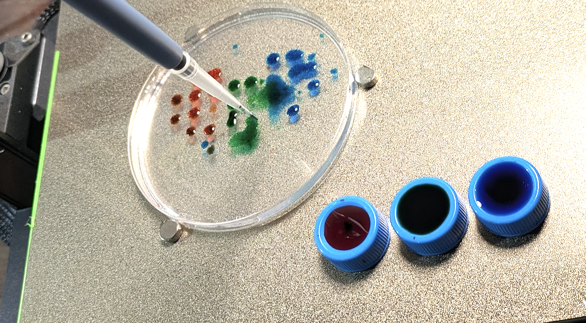
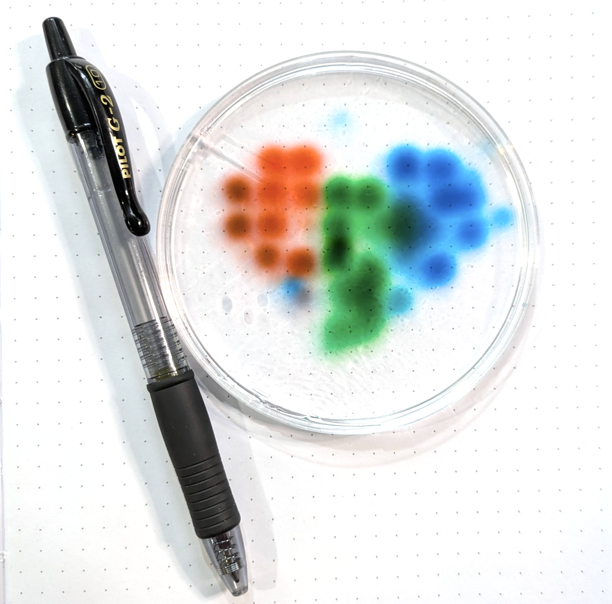
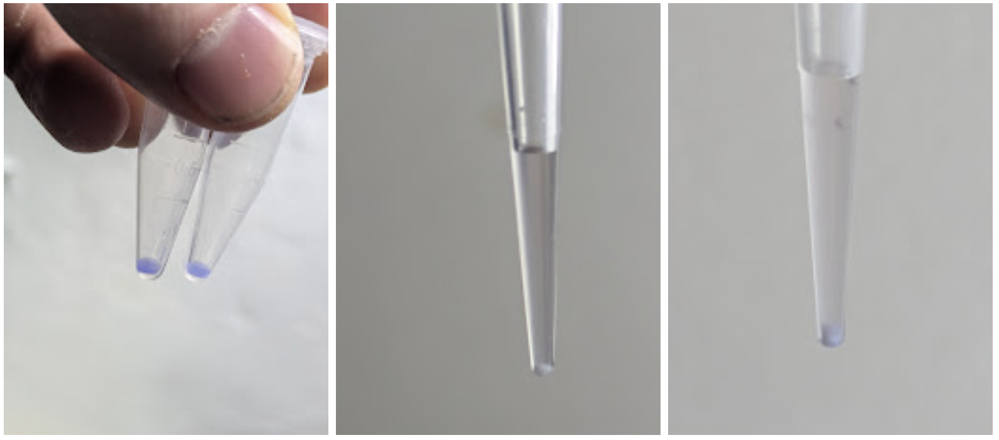
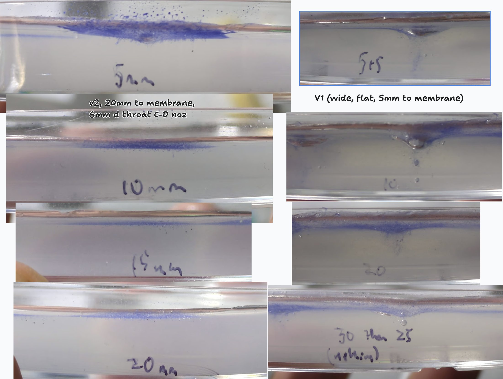
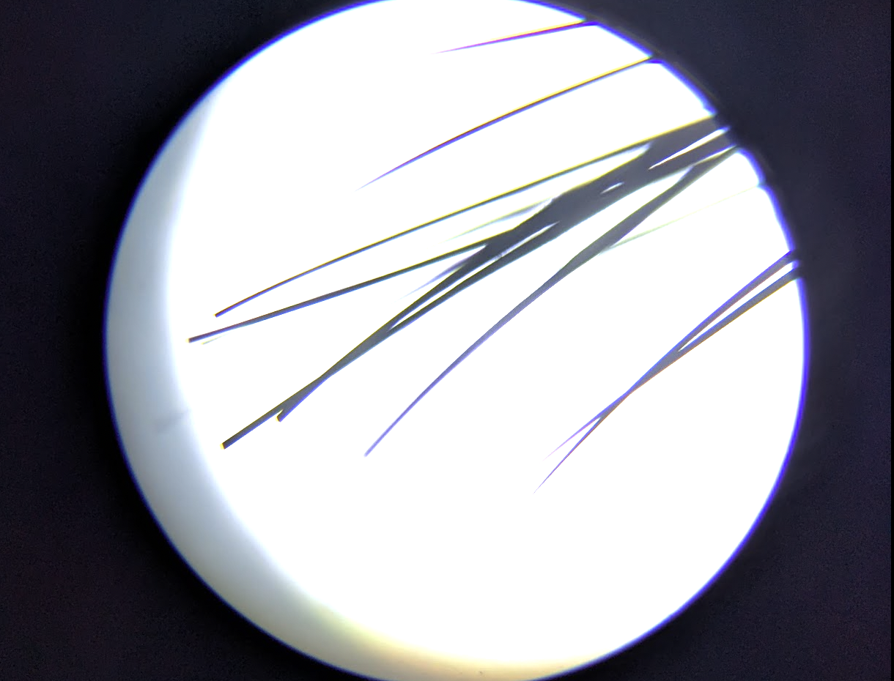
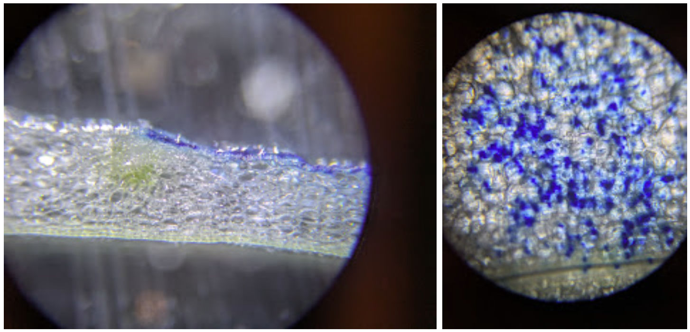
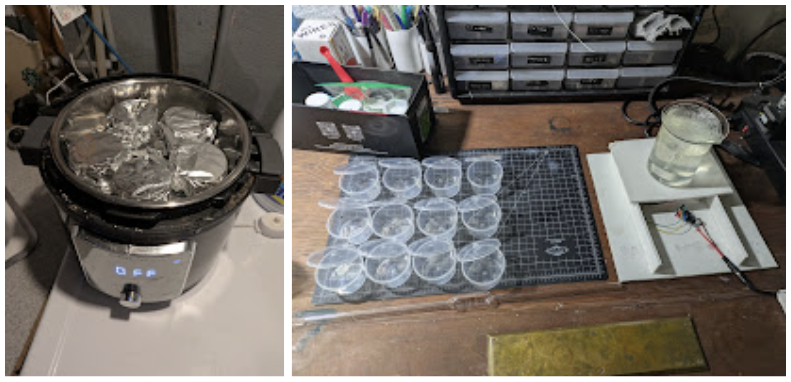
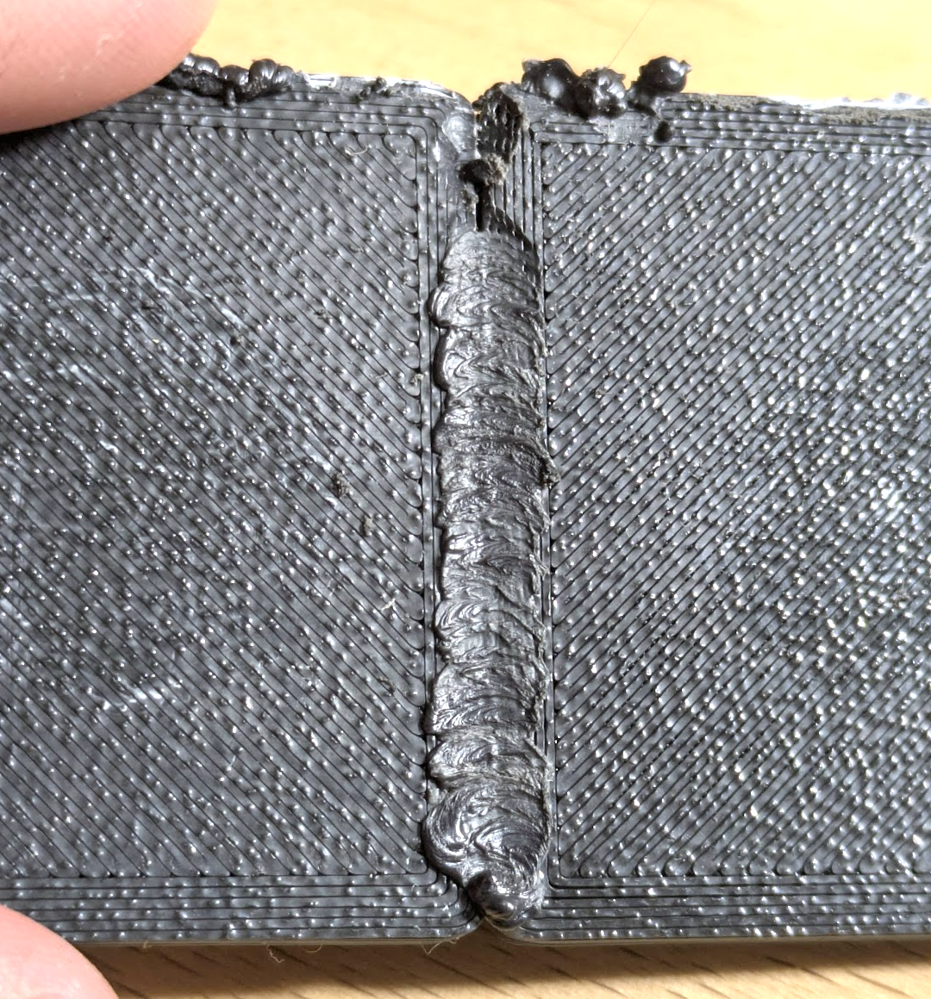

I had a productive weekend, and should write it all up! Many projects are simmering away with long waits before they resolve, so I'm dumping them all in this post :)

## CNC Pipette

I've enjoyed hearing [Jason Kelly](https://x.com/jrkelly)'s take on why bio should abandon the lab bench and let automated labs (like the ones his company Ginkgo makes) do the work of moving liquids and things around, freeing up the smart minds to actually think about cool experiments rather than spending all their time on menial lab tasks. Sounds good, although I simultaneously think far more people should do a little lab stuff to open their minds to the realities of the real world, and worry how much might get missed if you only see what you set out to measure!

Anyway, with all that discussion fresh in my mind, one of the things I did this weekend was whip up an attachment for my 3D printer that holds my pipette and can suck up and dispense small amounts of liquid. End goal: agar art with colorful microbes, of course :D A Dynamixel servo that I had on hand pushes the plunger thingee on the pipette, with both it and the printer controlled by a raspberry pi or laptop (the latter after I ran the wrong G-Code and spilled colorful water on the former!).

The [CAD](https://cad.onshape.com/documents/42cf135ce4b1a1a34746c4ee/w/bec91f2a6df1f3690807754b/e/2f528fdceb0af6a3583d11d3?renderMode=0&uiState=696e7b486f2ab6c24a30a134) and [code](https://github.com/johnowhitaker/pipette) are still WIP, contact me if you're interested in this or wait until the next weekend I feel like tidying it up + making a more thorough video documenting the project. My favourite result so far comes from the first test, before I dialed in liquid dispensing:

I've since done some agar art with my pet blue fluorescent Pseudomonas sp. that is growing out nicely - will upload pics once I make a few more artworks.

## Biolistics

- Carrot TC all got contam from carrot not media

- Ran some Thai Tea concentrate (low C) and Puerh (very high C for tea) through caffeine TLC process

