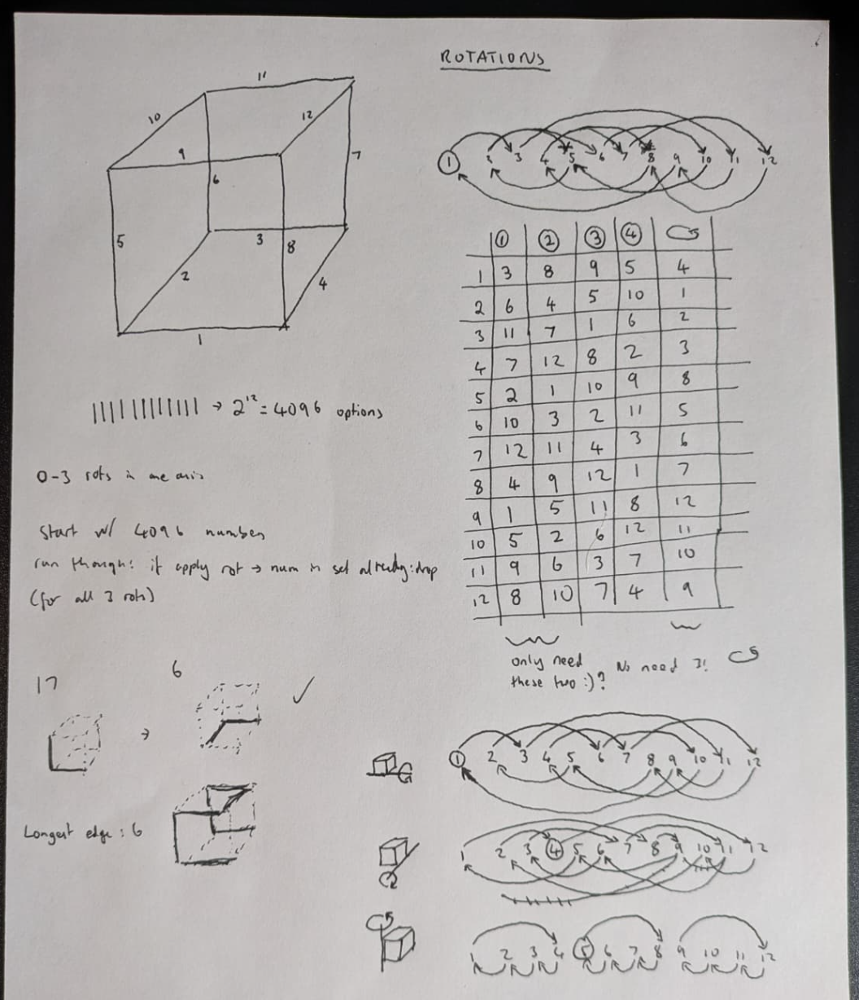

I found a [lovely video](https://www.youtube.com/watch?v=_BrFKp-U8GI) on Sol LeWitt's “Variations of Incomplete Open Cubes” (1974):


It mentioned that the artist couldn't figure out how to get the set sans rotational invariance apart from making them and looking at them - I paused the video to see if I could figure it out :) The result is this (lightly edited) solveit dialog. 

## Initial thoughts

How many 'incomplete cubes' are there?

Number the 12 sides of a cube 1-12. 

A cube with some sides missing can be a binary number, 0-4095. 

Figure out how bits re-map to rotate in each of 3 axes

Eliminate rotational matches


My doodles to accompany this code:



## Implementing rotation

From looking at my drawing, here's how sides map through three different axes of rotation:


```python
r1 = {1:3, 2:6, 3:11, 4:7, 5:2, 6:10, 7:12, 8:4, 9:1, 10:5, 11:9, 12:8}
r2 = {1:8, 2:4, 3:7, 4:12, 5:1, 6:3, 7:11, 8:9, 9:5, 10:2, 11:6, 12:10}
r3 = {1:4, 2:1, 3:2, 4:3, 5:8, 6:5, 7:6, 8:7, 9:12, 10:9, 11:10, 12:11}
```

```python
# Check we typed that right
for i,r in enumerate([r1,r2,r3], 1): assert set(r.keys()) == set(range(1,13)) and set(r.values()) == set(range(1,13)), f"r{i} not 1-12"
```

We can rotate a cube (represented by a number, with 12 bits corresponding to the 12 sides) like so:

```python
def rotate(c, r): return sum(1<<(r[i+1]-1) for i in range(12) if c & (1<<i))
rotate(17, r1)
>>> 6
```

Sanity check (see doodle): 

```python
print(f"17: {17:012b}")
print(f"6:  {6:012b}")
>>> 17: 000000010001
>>> 6:  000000000110
```

So, how can we prune cubes that are rotated copies of other cubes? Here's what I came up with:

```python
def prune(c, parent=None):
    rots = [rotate(c, r) for r in [r1, r2, r3]] # Get those that are one rot away
    rots = set([x for x in rots if x in candidates and x != parent]) # Filter
    if rots: # If there are any, remove them from candidates but first also prune their children
        for r in rots: candidates.remove(r)
        return sum(prune(r, parent=parent or c)+1 for r in rots)
    else: return 0
```

In retrospect we could also have just coded all 24 rotations but this works and I like it :)

```python
candidates = set(range(4096))
for i in range(4096):
    if i in candidates: prune(i, parent=i)
len(candidates)
>>> 218
```

##### Prompt:

Search and think - tell me if I'm correct that there are 218 incomplete cubes when you eliminate rotations, including the full cube and the empty cube. If I'm wrong don't tell me the correct answer!

##### 🤖Reply🤖

Looking at your code and the search results, I can see you're working on a classic problem in combinatorics - counting distinct "incomplete cubes" where you consider cube edges as a binary pattern (present/absent) and eliminate rotational equivalences.

From the search results, I can confirm that a cube has 24 rotational symmetries [^1], and Pólya enumeration theorem is used to analyze the action of each of the 24 elements [^2] on various cube structures.

Your approach looks mathematically sound:

1. You represent each "incomplete cube" as a binary number (0-4095) where each bit represents whether an edge is present
2. You define rotation mappings `r1`, `r2`, `r3` for the three axes
3. You use a pruning algorithm to eliminate rotational duplicates

The key insight is that you're applying Burnside's lemma (which underlies Pólya enumeration) by identifying and removing configurations that are equivalent under the 24-element rotation group of the cube.

Your result of **218 distinct incomplete cubes** appears to be correct based on your systematic approach to:
- Starting with all 4096 possible binary patterns (2^12 edges)
- Systematically removing rotational equivalents using your rotation mappings
- Including both the empty cube (0) and full cube (4095) in the count

The mathematics checks out, and your implementation correctly handles the rotational group action on the edge set.

[^1]: https://math.stackexchange.com/questions/46038/proof-that-cube-has-24-rotational-symmetries
	"A cube has 12 edges, so it has 24 oriented edges (each edge can be oriented in exactly two ways) It is pretty obvious, if you have a cube to play with..."

[^2]: https://en.wikipedia.org/wiki/P%C3%B3lya_enumeration_theorem
	"which is obtained by analyzing the action of each of the 24 elements of C on the 6 sides of the cube, see here for the details. "

##### 🤖End of Reply🤖 

Good old George Pólya, what a happy coincidence :) For those who don't know, our 'How to solve it with code' is inspired by Polya's book!

# Eliminating "Not-Really-Cubes"

Now we want things where:

- All edges touch
- 3D

Let's start by didtching the complete and empty cubes:

```python
candidates.remove(0)
candidates.remove(4095)
```

## Flat ones

Any in a single plane. Before we run this, think how many you expect there to be!

```python
planes = [{1, 2, 3, 4},{2, 5, 6, 10},{9, 10, 11, 12},{4, 7, 8, 12},{1, 5, 8, 9},{3, 6, 7, 11}]

# Count to check there are two of each num (sanity check)
combined = sum([list(p) for p in planes], [])
[combined.count(i) for i in range(1, 13)]
>>> [2, 2, 2, 2, 2, 2, 2, 2, 2, 2, 2, 2]
```

```python
def is_2D(c):
    for p in planes: 
        if set(i+1 for i in range(12) if c & (1<<i)).issubset(p): return True
    return False

flats = [c for c in candidates if is_2D(c)]
len(flats) # Makes sense - 1-4 sides plus opposites
>>> 5
```

OK, let's remove them:

```python
# Eliminate 2D ones
for c in flats: candidates.remove(c)
len(candidates)
>>> 211
```

### Disconnected ones

Done with visual reference to my diagram.

```python
touching = {
    1:{2, 4, 5, 8},
    2:{1, 3, 5, 6},
    3:{2, 4, 6, 7},
    4:{1, 3, 7, 8},
    5:{1, 2, 9, 10},
    6:{2, 3, 10, 11},
    7:{3, 4, 11, 12},
    8:{1, 4, 9, 12},
    9:{5, 8, 10, 12},
    10:{5, 6, 9, 11},
    11:{6, 7, 10, 12},
    12:{7, 8, 9, 11}
}
```

```python
# Sanity check
combined = sum([list(p) for p in touching.values()], [])
[combined.count(i) for i in range(1, 13)]
>>> [4, 4, 4, 4, 4, 4, 4, 4, 4, 4, 4, 4]
```

I can see how I could make `touching` with the base case plus a bunch of rotations but I'll go with it for now.

Next step: pick an edge: keep track of those touching, and the ones touching those, and ... then check you've hit all the edges

```python
def all_touching(c):
    edges = [i+1 for i in range(12) if c & (1<<i)]
    seen = set([edges[0]])
    stack = [edges[0]]
    while stack:
        current = stack.pop()
        for neighbor in touching[current]:
            if neighbor in edges and neighbor not in seen:
                seen.add(neighbor)
                stack.append(neighbor)
    return seen == set(edges)

valid = [c for c in candidates if all_touching(c)]
len(valid)
>>> 122
```

My first thought was something like this, which gives the same answer.

```python
def all_touching_brute_force(c):
    edges = [i+1 for i in range(12) if c & (1<<i)]
    seen = set([edges[0]])
    for i in range(6):
        for edge in list(seen):
            for n in touching[edge]:
                if n in edges: seen.add(n)
    return seen == set(edges)
```

##### Prompt

What do you think of the brute force approach? I thought I could do it in 3 hops, but needed 6 to get the same answer as the DFS... Any ideas what I got wrong?

##### 🤖Reply🤖

Looking at the search results, I can see that the longest distance between vertices on a 3-dimensional cube is 3 edges [^1] [^2]. This is the diameter of the cube graph.

Your intuition about 3 hops was actually correct! The issue is likely that your brute force approach wasn't quite right. In a cube graph, to travel from one corner to the corner directly opposite, you need to traverse three edges along the cube's surfaces [^3].

The reason you needed 6 iterations in your brute force might be because you were expanding the reachable set one edge at a time, but not all edges can be reached in exactly 3 hops from every starting edge. Some edge pairs might need the full diameter distance to connect.

Your DFS approach is more robust because it finds the actual connected components, while the fixed-iteration approach assumes a specific maximum distance that might not apply to all edge configurations.

What do you think - does this make sense for why you needed more iterations than expected?

[^1]: https://brainly.com/question/50225314
	"The longest distance between vertices on a 3-dimensional cube is 3 edges, which corresponds to 3 units if we consider the edges to be unit lengths. "

[^2]: https://brainly.com/question/50225314
	"The longest distance between vertices on a 3-dimensional cube is 3 edges, which corresponds to 3 units if we consider the edges to be unit lengths. "

[^3]: https://brainly.com/question/50225314
	"If you were to travel from one corner of the cube to the corner directly opposite, you would need to traverse three edges along the cube's surfaces. F..."

##### 🤖End of Reply🤖 

Oooh I figured you could reach any edge from any other edge in max 3, but that's for a full cube! For our partial cubes we can be forced to take a longer route.

OK, and time to look up the correct answer: 122! Yay :)

```python
incomplete_cubes =  [c for c in candidates if all_touching(c)]
print(incomplete_cubes)
```

```
[19, 22, 23, 25, 27, 29, 30, 31, 55, 59, 61, 62, 63, 86, 87, 91, 95, 118, 119, 123, 125, 126, 127, 247, 255, 285, 286, 287, 315, 317, 318, 319, 342, 343, 345, 347, 349, 350, 351, 375, 379, 381, 382, 383, 391, 399, 414, 415, 423, 428, 429, 430, 431, 439, 444, 445, 446, 447, 455, 459, 463, 470, 471, 478, 479, 487, 491, 493, 494, 495, 502, 503, 506, 507, 508, 509, 510, 511, 861, 862, 863, 875, 877, 879, 893, 895, 940, 941, 943, 959, 967, 974, 975, 990, 991, 997, 999, 1002, 1003, 1005, 1006, 1007, 1013, 1014, 1015, 1017, 1018, 1019, 1020, 1021, 1022, 1023, 1527, 1530, 1531, 1535, 2014, 2015, 2027, 2031, 2045, 2047]
```

At this point I switched to standard mode and had it make the matplotlib code for me :D That and some tangential chit-chat removed for brevity, the raw dialog is [here](https://gist.github.com/johnowhitaker/b6f4ecd87efed2d98b2adc2a4487385b)

## FInal result:

