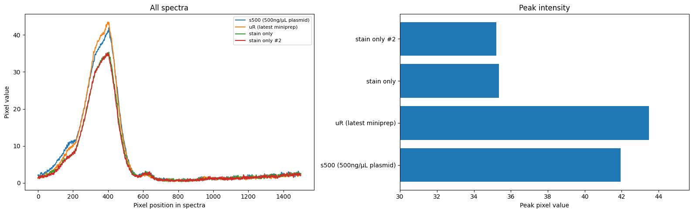
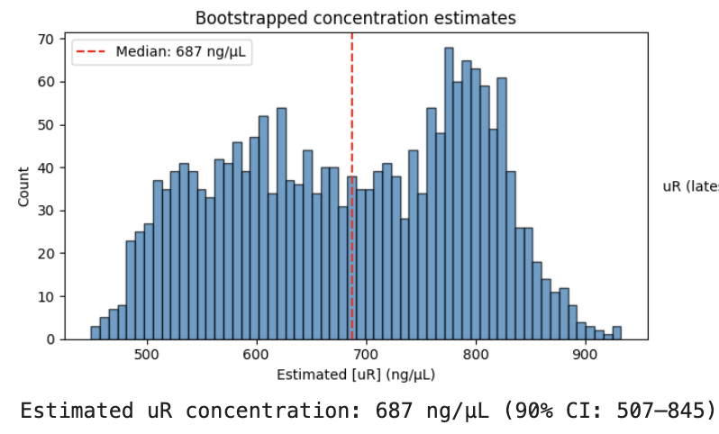

In microbio, a common procedure is a 'miniprep', where plasmid DNA is extracted from bacteria (often e. coli, which is good at making lots of copies) for insertion into some other organism. I've done a few, but had no good way to know if they worked! Typical approaches look at absorption at 260nm, and I don't have a UV spectrometer. In this post I'll show my trick for getting around this problem to estimate DNA concentration with my existing cobbled-together visible light spectrometer.

The key trick is to mix a small amount of the DNA sample with a dye that binds to DNA and fluoresces when illuminated with visible light. I used SeeGreen [stain](https://www.minipcr.com/product/seegreen-nucleic-acid-gel-stain/) - I prepared a dilution with 2uL of stain in 20ml water, and then mix 1uL of DNA into 100uL of the diluted stain. A blue LED shines down into the sample. I use some yellow film to block most of this blue light from reaching the camera in the spectrometer, and instead look at the intensity of the green fluorescence emitted by the dye. The more DNA there is, the more dye binds and fluoresces, so this gives us a way to estimate DNA concentration.

We also need a reference with known concentration. I used some spare plasmid I had on hand to make a 500ng/uL reference (well, I had to add 5uL of 100ng/uL DNA to the diluted stain, but close enough). And then as a baseline I made several vials to which no DNA was added. Here are the results, looking at a sample from my most recent miniprep and comparing to the standard and the two baseline samples:

Code is [here](https://gist.github.com/johnowhitaker/3aa41553b027c29d307766fcc06a79cf) for the curious. Since the exact figures you'll get vary depending on choices like the bounding box used in the image, I did some quick bootstrapping to give a range of values, picking a final estimate of 687 ng/µL (90% CI: 507–845). 

Note, the confidence interval there only accounts for the variability of the image analysis. There could be additional variation from bad light sealing in the spectrometer, volume measurement errors, the fact that my reference sample was from a few uL of old DNA in a tube that had been shaken up, etc etc. I suspect the reference might be more like 300 ng/µL than 500, for example, which would knock the estimate down to around 400 ng/µL. Still, the miniprep kit targets 30-50ug total in 100uL elution, and I did try to stack the odds in my favour, so the estimate is in the right ballpark.

Importantly, the estimate is not 0, which is what I was really worried about :) If I wanted more precision, I'd do repeat estimates, average over multiple exposures, and make up more known reference samples. But for what I want, this is more than good enough to move on to the next steps of my project. Although I will want to do a gel to assess the quality of the DNA too - once I get my hands on a DNA ladder. At the moment we know there is DNA, but not how much is plasmid vs genomic junk that might have made it through :)

Anyway, that's all, see you in the next one.