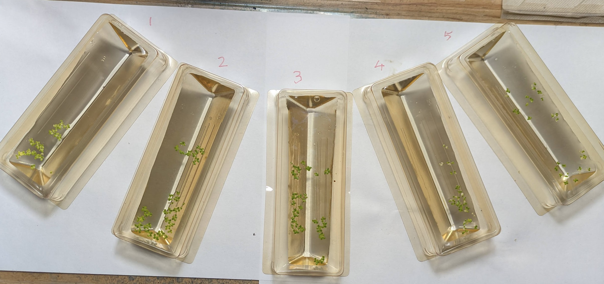
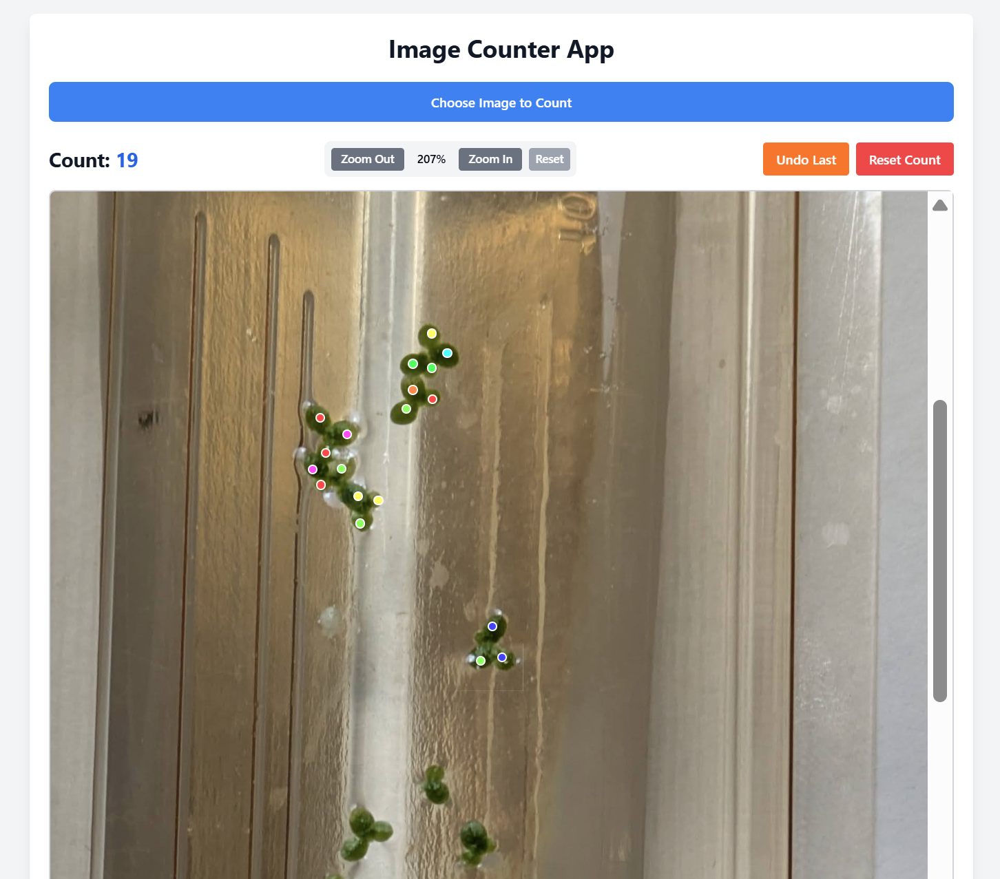
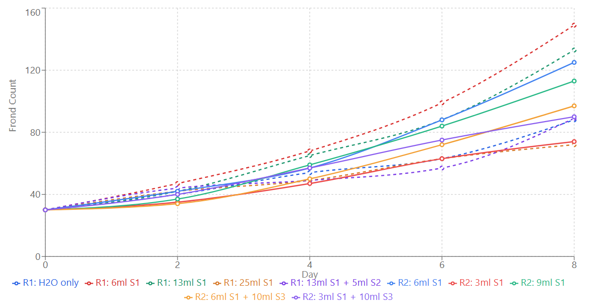

My friend REDACTED is a scientist at SCIENCECO who are working with some people from BIGLAB to explore using AI models to optimise PROCESS using SCIENCECO's epic technology for automating experiments in FIELD. We've had some fascinating conversations about where AI for science is now, and where it could go in the near future. To explore some of these ideas, let me share my own experiment that I've been running over the past few weeks, which is a lot easier to talk about without getting anyone in trouble ;)

## The Experiment

Inspired by [a tweet](https://x.com/ATinyGreenCell/status/1938362004240019899) from legendary amateur biologist Sebastian Cocioba, I had grabbed some duckweed (*Lemna minor*) from a nearby pond on a whim. The goal of this experiment is to figure out a good growing strategy for it. Or, more specifically, to see if o3 can figure out a good recipe, with me essentially acting as a meat robot to implement its chosen protocols. Here's [my chat](https://chatgpt.com/share/688f729c-b224-8010-9c0d-fd41eaff8cc6) where I laid out the setup and had it set conditions for the experimental runs.

The setup involves 5 tubs, each of which will be started with 30 fronds of duckweed in 50ml of water with various nutrients added. I have a hydroponic mix ('Maxigrow') containing Nitrogen, Phosphorus and Potassion (NPK) as well as some micronutrients, some KDP to vary the potassium content, citric acid, baking poweder or pH UP and DOWN solututions, and a couple of other chemicals on hand. I counted the number of fronds in each tub every 2 days for 8 days total. Based on the results from the first run, I had o3 suggest a second set of conditions and ran those too.

I manually counted the fronds for most of the experiment, but to combat COVID brain fog I had Claude make me [this artifact](https://claude.ai/public/artifacts/2ca3e089-9a2d-436c-b945-61a268848d0c) that I could use to count them more reliably from a photo instead for the final results.

To make it easy to mix up the various recipes, I made three stock solutions: S1 (5g/L MaxiGro), S2 (5g/L KDP) and S3 (5g/L baking soda).

## The Results

The recipe that did best was 6ml S1 + 44 ml tap water (i.e. 600mg/L MaxiGro), achieving a doubling time of 3.5 days. This fast growth is what makes duckweed great for this kind of experiment :) This ideal level is quite a bit less than the recommended concentration of this hydroponic nutrient for general use - which makes sense given what I've read about duckweed's preferences. Dropping to even lower nutrient concentrations gave less growth, with clear loss of color in the smallest few cases. Going too high also caused trouble, with bleached leaves ('chlorosis') and less growth too. This recipe was top in both the first and second runs (it was kept in the second as a baseline).

Overall, I'd say I'm pretty impressed. Sure, I could have done this just fine without AI, but it's cool that we can tap into something that can skim the literature at lightning speed and take advantage of tons of scientific training data to give us reasonable starting points for experiments like these.

## "Hmm, That's Weird"

One of the tubs in the second run developed a thin, shiny film almost like an oil slick, likely caused by bacterial growth. Would an AI-only system have 'noticed' this? Or would it have been stuck with a potential confounder invisible to it if all it could see was the proposed inputs and the final output counts...

A lot of science can be done by just 'following the recipe', but many of the greatest discoveries come from something not going to plan - with a human there, filled with experience, to notice and go "hmm, that's weird". Hmm, that's weird, my bacteria died where that mold is growing. Hmm, that's weird, my photography film is getting foggy near my uranium salts. Hmm, that's weird, ...

Even when you're not hoping for crazy breakthroughs like these, there are so many places where this instinct comes in when doing biology. Hmm, that's weird, these cultures smells funny. Hmm, that's weird, there's a precipitate in some of the wells, maybe the tirzepatide isn't soluble enough in this solvent mix. Hmm, that's weird, it's gone all **goopy**. This is the thing REDACTED keeps on emphasizing to me - there is sooooo much knowledge that isn't necessarily written down when it comes to frontier science, so much practice required to build the instinct for the 'hmm, weird' moments that comes from time at the bench, not from textbooks. At least for now, it's hard to see how current training methods could instil these things into an AI[1].

## So What Did We Learn?

I think one headline takeaway here is something like the following: **Fancy AI models can boost performance of systems given knobs to tweak, by making reasonable initial guesses and iterating from feedback.** I have no doubt we'll see lots of results along these lines in the next few years - AI systems beating human baselines on everything from chip design to protein synthesis, using RL or just smart application of reasoning models + tools for automated or semi-automated experiments. **BUT** I think it's premature to ignore the ideas of curiosity and suprise that run as a continuous thread through the history of science. If we're only ever chasing an outcome we've planned and measured in advance, then we're missing out on so much[2]. To me, the more exciting way to view it is something like this: **Every enthusiastic amateur now has a capable and knowledgeable 'advisor' on hand, and as long as we keep up the curiosity and invest in our own learning, I think the human+ai combo has the potential to enable all sorts of cool science in the years to come.**

Footnotes:

[1] - Although it's interesting to think about how this could change. Imitation learning like the pre-training/SFT paradigm seems like a poor way to learn to pick up any kind of insight like this. But with RL tasks getting longer and more complex, I can begin to see how we might start to get 'micro' insights despite only training for a specified outcome. "[code] now pass [test]" leads to "hmm, that's weird, I'd expect the output to be 0 in all cases". Perhaps long + general enough RL can reward true curiosty + exporation, just as long evolution towards the 'reproduce' outcome eventually led to clever stone knapping and modern civilization shortly thereafter. I remain [uncertain](https://johnowhitaker.dev/essays/future-ai.html) :)

[2] - I went and bought 'Why Greatness Cannot Be Planned: The Myth of the Objective' after I typed this - by all accounts it's a fantastic book on this subject that I've been meaning to get to for a while, stay tuned for a review to land on my [books](https://johnowhitaker.dev/books.html) page soon :)