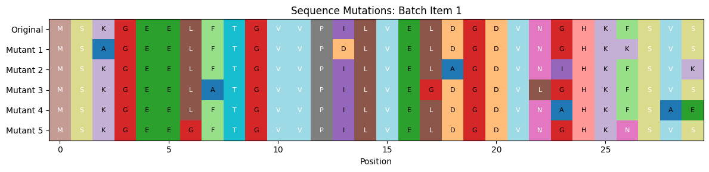
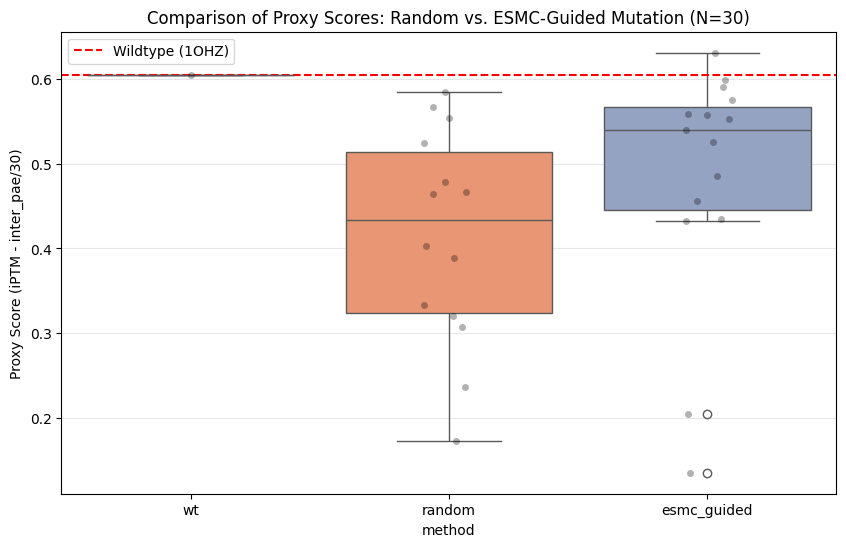

Rambly video poking at some of the new models released by Biohub, seeing if leveraging their protein LLM can give us better ways to mutate candidate sequences for downstream tasks. I AM A NOOB - do not take anything in this video as gospel :) Corrections welcomed, comments and thoughts appreciated!



[Notebook link](https://colab.research.google.com/drive/1mvqlTVIScs6mMVhw0ZlyXxnan6RuWjxg?usp=sharing)

ESM gives a masked language model that operates on amino acid sequences, with each AA being a token. The main idea from the video is to take advantage of this when making a mutation of a sequence, by replacing random AAs with ones the model things are plausible/likely, ranther than completely randomly replacing them.

I had AI help cobble together a quick and dirty test, comparing random mutations with this approach on a made-up task around a cohesin target + dockerin binder. The score function is a little fudged, although even 'real' prot engineering tasks do tend to blend in model prediction confidence as part of their score functions. Anyway, at least in this mini demo, the new mutation strategy produces higher-scoring candidates than random:

After this initial dabble, I did check out the newly-released actual binder design flow that the biohub people shared, and it is a lot fancier and more involved. Still - at one point they do initialize the mutable AA positions with `0.01 * torch.randn(...)` and I thought, hey, maybe I could instead use the logits from the model, inspired by the dabbles above. This at first appeared to work really well - the total loss (all I looked at initially) was way lower! But this is just because the loss includes a term comparing the model prior with the learned dist, and by initializing based on the model prior we obviously do well on that! And, it turns out, worse on everything else that actually matters:

Still, nice to see how the pros actually do this stuff. And it does feel like there might well be plenty of space for speed improvements, I may have to spend more of my modal credits trying to improve this more generally with all my old training/optimization tricks :)