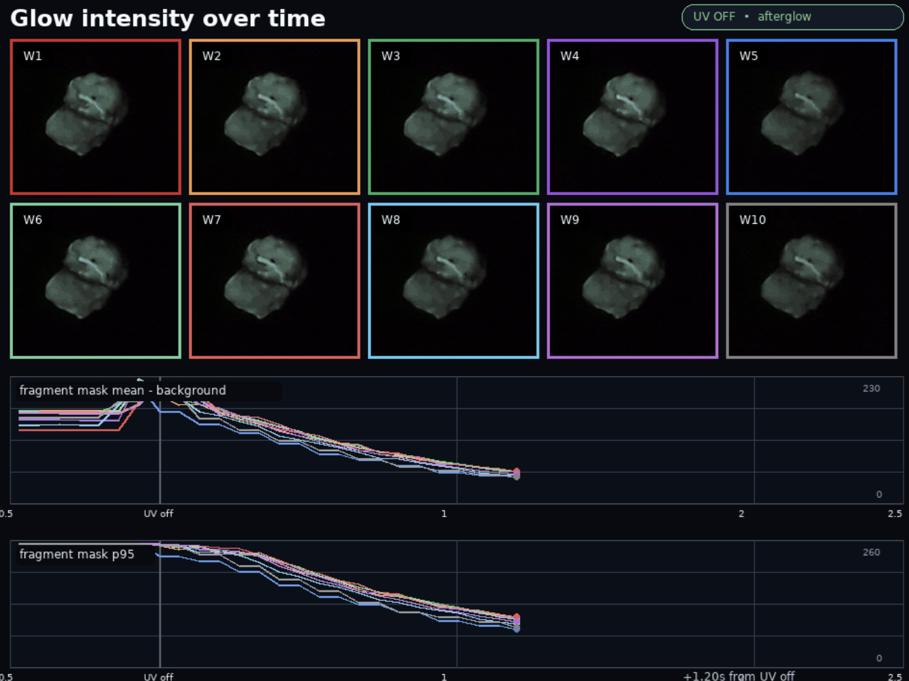

I was out at night with my 365nm UV flashlight looking for fluorescent minerals and photographing glowing bugs. You know, regular stuff. My wife and I noticed something glowy that stayed glowing after the light swept away - this lingering glow ('phosphorescence') is way less common than regular fluorescence. Turns out it was poop! Specifically, the urate-rich white cap on a bird/reptile dropping. I carried it back to camp and then back to Portland for further analysis.

Video [here](https://www.youtube.com/shorts/crbw4qYpvz8) shows the effect in action. [X/Twitter thread](https://x.com/johnowhitaker/status/2073395647051681977?s=20)

It was only the hardened outer shell of the white cap that showed the effect. Putting some in water instantly killed any persistent glow. Breathing humid air over a sample increased the rate at which the glow faded. A night exposed to humid Portland air completely killed the effect too, although heating the sample at ~45 degrees C for a few hours restored it, as did leaving it in a bag with a pile of CaCl2. Restored glow decayed with tau~=1s. 

A final note: the CaCl2 used as dessicant also showed phosphorescence??? If I hit it with my bright UV torch in the dark then turn off the torch, the round CaCl2 pellets (I bought these for food science stuff) also glow faintly for a sec or two. I have not seen this documented anywhere. Neither can I find any lit on glowy poop! My hunch is that this is just a hard thing to notice in general life, so lots probably goes un-documented.

I somewhat hopefully tested chicken poop - but alas even after a brief attempt at drying I saw no afterglow. Perhaps baking some in the desert sun for a week might change that, or perhaps whatever diet the mystery desert bird was eating is required to get the right mix of purines + matrix to set up the long-lasting triplet states responsible for the glow...

Anyway, fun stuff :)