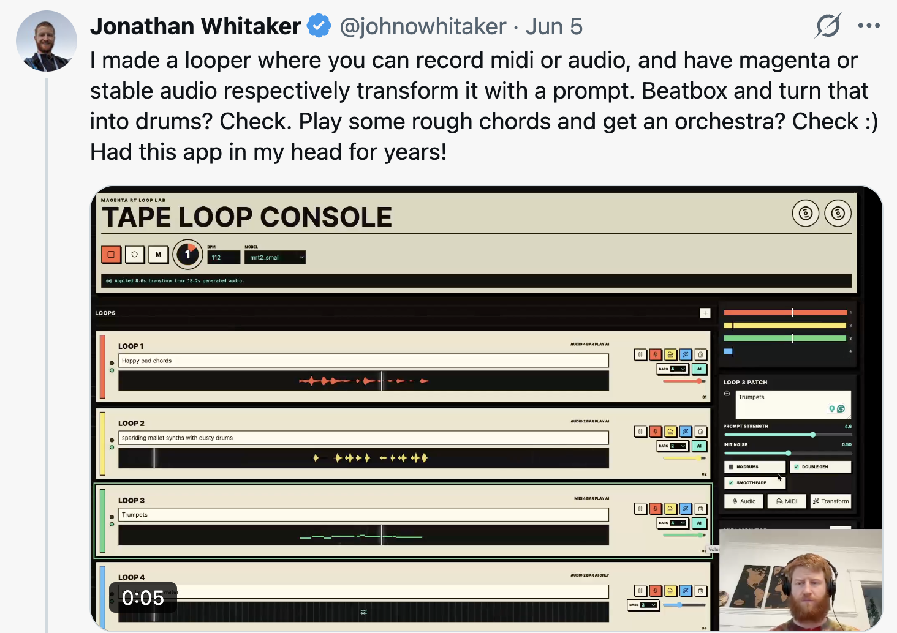

I made [Inkwash](https://johnowhitaker.github.io/inkwash/) over the weekend. It is a watercolor-like sketching experience, where you draw with 'ink' then move it around with a brush, complete with fluid dynamics, water drying, ink color bleeding, etc. Check out [a video of an early version in action](https://x.com/johnowhitaker/status/2065118226879811737?s=20), the [interactive explanation of how it works](https://johnowhitaker.github.io/inkwash/about) or just check out the [Github repo](https://github.com/johnowhitaker/inkwash). 

It is tailored specifically to my exact sketching style, which in real life involves a G2 pen and a water brush, plus occasional watercolors. For the first time, I have a digital approximation of that which lets me capture what I see in the same way. It is, for me, a perfect, joyful piece of software.

And the way I made it is extraordinary - or would be, if the magical hadn't become mundane: I asked the computer for it. With a handful of [prompts](https://github.com/johnowhitaker/inkwash/blob/main/prompts.md), Claude Fable 5 built the app up and refined it with me. And, when asked, it spat out a delightful interactive [explanation](https://johnowhitaker.github.io/inkwash/about) of the mechanics. This is the kind of thing that used to require weeks of loving dedication & skill to make. Now, the majority of my 'development' time was playing with the app and thinking about what else would be neat to include.

The weekend before, I had a similar experience making a music looping [app](https://github.com/johnowhitaker/magenta-realtime/tree/main/examples/looper) with GPT 5.5. in codex, albeit with a bit more involvement on my part:

I don't quite know what to write about these things. Fable, specifically, feels like another jump in terms of understanding intent and being able to do the hard work to make things happen with software. And (barring government interference) things are only going to get better from here.

I don't feel the need to drop everything and monetise/market these apps. If I'm sharing them at all, it's to say 'hey look, something fun to play with'. I am writing this post because I guess I should link these cool things I made from my site? But mostly they're for me - bits of software that I wanted, and now have. I still see lots of cynical takes along the lines of 'if AI is good then why aren't there loads of new hit apps in the app store / new SAAS companies killing it'. Honestly, for me, the feeling is that software might end up looking a lot more personal. I have my fun art app now - I expect you to make yours, if you want it! It doesn't have to be perfect, the code doesn't have to look just right. The models will keep getting better, the scope of what we can make will keep growing, and (I hope) there is going to be so much fun stuff made in the future. Hooray? ¯\_(ツ)_/¯