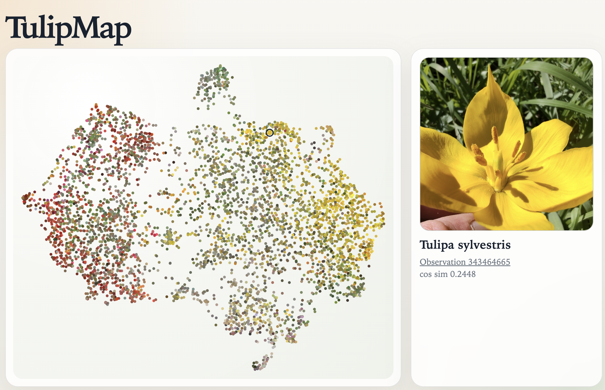
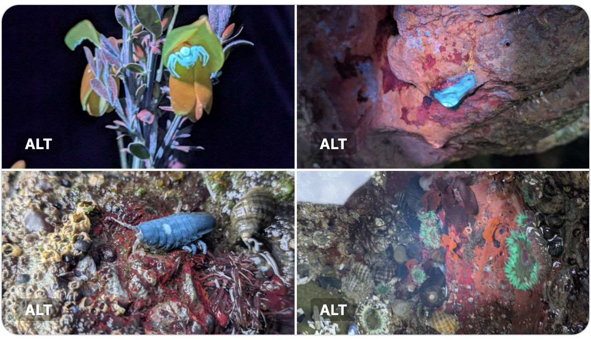
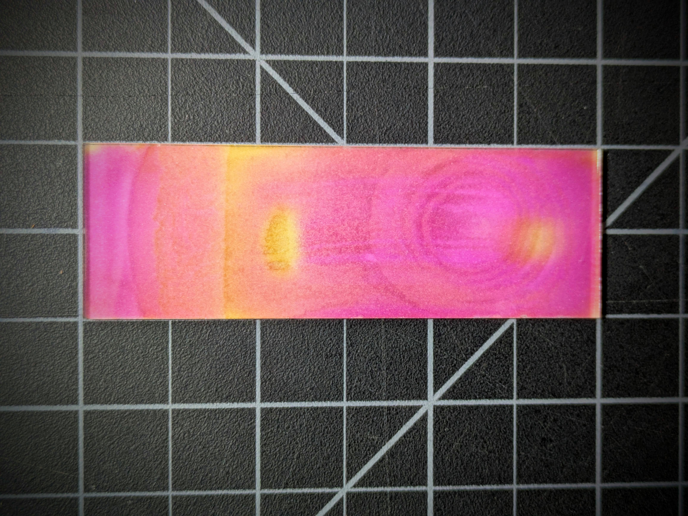
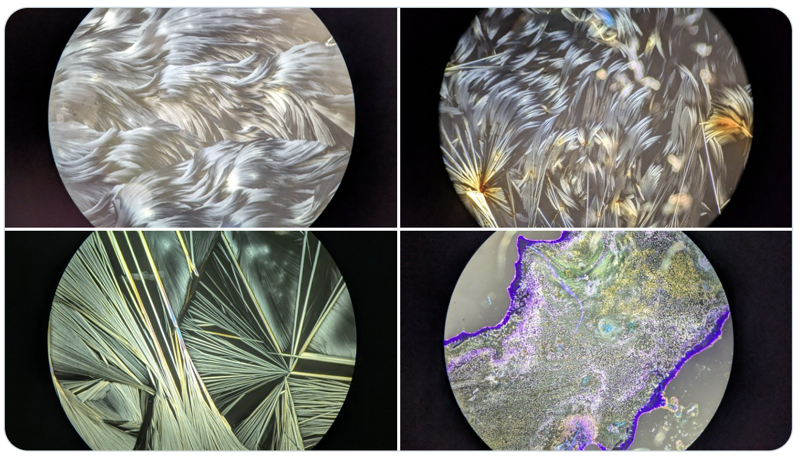
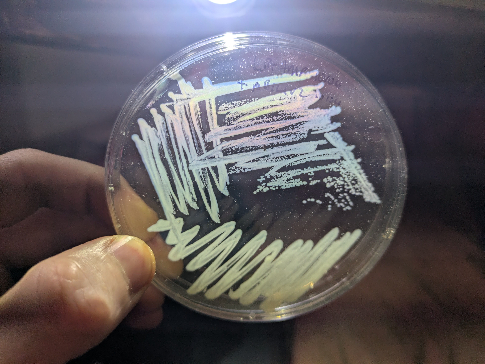
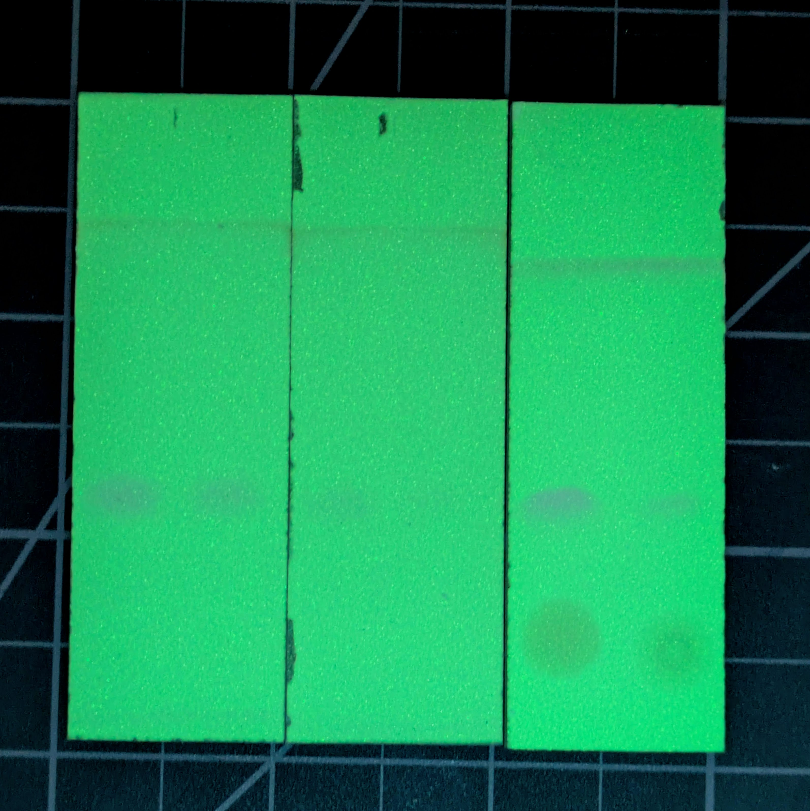

I'll start this post with various small updates of things I've been up to, then switch to reflection on why I'm taking an extended sabbatical, and how it's going so far.

## Small Things

Here's a few recent experiments and such:

I made an [interactive site](https://johnowhitaker.github.io/tulipmap/) to explore tulip varieties ([code](https://github.com/johnowhitaker/tulipmap), [video demo](https://x.com/johnowhitaker/status/2042761964225757486?s=20)). The UMAP clusters of the CLIP embeddings map nicely to color and locale, made it very easy to get a general vibe for the genus - I'll definitely be copying this for other taxa!

My wife and I camped out by the Oregon coast and I took some photos of things under my UV flashlight. More pics on my [iNaturalist](https://www.inaturalist.org/observations?user_id=jonathan_whitaker&verifiable=any) once I take em off my SD card.

I extracted nicotine from tobacco and learned how to [stain TLC plates with KMnO4](https://ln.johnowhitaker.com/entry/29), accidental science art :) 

I tried an energy drink, crystalized some on a slide, [used TLC to confirm that it does indeed have a ton of caffeine](https://ln.johnowhitaker.com/entry/30), and logged my vitals over the day.

I noticed that some bacteria have [a lovely rainbow effect in the right lighting](https://ln.johnowhitaker.com/entry/28)

Tried [taking some caffeine out of coffee with activated charcoal](https://ln.johnowhitaker.com/entry/31), to some success! Image shows four references (1000, 500, 250 and 100 mg/L caffiene) and then some artificially strong coffee (left spot, rightmost plate) vs some that went through the charcoal decaf process (far right), with significantly less caffeine!

Others: 

- Made a [bad but fun theremin](https://x.com/johnowhitaker/status/2044633992411205707?s=20)
- Filmed some [fun glowy fluid dynamics](https://x.com/johnowhitaker/status/2042741123370901743?s=20)
- Isolated a nice orange yeast https://ln.johnowhitaker.com/entry/27
- Grew out third and final (?) attempt at green e. coli, https://ln.johnowhitaker.com/entry/32, cloning strain, ran out of amp so transformation into gave BL21 questionable results, satellite colonies, no strong color yet
- Working on an explanation re: the green bacteria ([WIP renders of the main proteins doing their thing](https://x.com/johnowhitaker/status/2045501838519415032?s=20)) - video coming soon 
- Agrobacterium transformation attempts on tomatoes, duckweed ongoing (another successful ish duckweed one worked for a couple of fronds, another attempt waiting for results)
- Tending to various plants, since it's the start of spring here! Growing out some purple tomatoes, some berries, etc.

## Sabbatical!!!!

Now the somewhat larger life update: I'm taking at least 6 months completely off work @ answer.ai. It feels like a particularly pivotal time in AI, and I want to reflect on what I should be working on going forward. Plus, I'd had an extended bout of sickness and was feeling a little burnt out and unproductive, so this will hopefully blow off the cobwebs. 

So far, I've been really enjoying the wide open time (space) feeling. Not that work at answer was unpleasant - far from it - but 'work' is intertwined in my head with being productive, making progress; there are always outstanding TODOs. Having an empty agenda is a delightful contrast. As with all similar times in my life, my subconscious is frothing with a host if ideas that have been biding their time, possibilities that couldn't quite justify themselves over the business. I've been trying to linger in this feeling, taking it easy, spending lots of down time walking and thinking and reading rather than rushing into the first ideas that pop up.

A less enjoyable note has been how quickly financial concerns popped up. We've got some runway of course, but now that my income has dropped to 0 I have to re-think a lab budget that was previously pegged at 'a day's income per month' and figure out a balance between 'not making the most of this time by trying to be too thrifty' and 'burning runway by spending too much'. I might have to factor in some notion of profitability into what I choose to do, something I've been fortunate at avoiding for most of my life. Such is the reality of living in a lovely but expensive place like Portland :) It's not all downside though - I've already applied to one "micro-grant", and making at least some work legible to such funding structures might impose at least a modicum of structure to an otherwise completely un-structured play time that could turn out helpful... But not yet, the focus for now is rest and recharge and fun.

As for directions I'm thinking of exploring, there are tugs in various directions:

- Everyone is running into AI applications, 'agents', etc. This strongly makes me want to run the other way - I much prefer exporing weird and 'uncool' spaces not the trendy *thing*.
- But AI is going to be hugely impactful, and I might still be able to steer it in ways I'd like it to go
- And I miss AI research. We've been very application-focused at answer, so I haven't gotten to stretch my old deep learning + model training muscles in ages - there may be fun non-mainstream AI research work that could be fun, especially with coding agents there to skip some of the more painful parts of idea testing.
- (Maybe even some mechanistic interpretability work? More niche, still space for fun new ideas, relatively impactful?)
- On the other hand, I always love being in a field where I have a different set of skills to everyone else, so maybe I should get *further* from the AI core and instead help people without AI/coding/tech skills. 
- And DIY Bio is fun and intellectually stimulating, also humbling+frustrating in its ability to not go quite as planned. I might see if I can get a chance to work with some bio people in a lab nearby if I can weasel my way in
- Making hardware used to be the thing I thought I'd end up doing. Now that I live in a country with McMaster Carr, Amazon Prime etc that might be a lot easier! Cons: does require some capital (as does bio) compared to messing with software, pros: holding real things in your hands and touching the world with your code is always cool.

I might have been a little more burnt out than I like to admit, closely watching the ever-advancing frontier of AI and trying to keep up + work on things that at times felt temporary given impending advances... Rather than committing to any of the above soon, the short-term plan is to dabble with everything, slowly - spinning plates, looking for things that are fun rather than projecting out to impact or income. This usually works out well :)

Anyway, it's an exciting experiment. I feel really good about maximizing flexibility at this time, and look forward to seeing how it evolves. If you have ideas or want to chat, well, my calendar is as open as it'll ever be, feel free to reach out! And if you want to watch how this goes, keep an eye on this blog and on [X](https://x.com/johnowhitaker), I'll try to keep logs of how this is going and what I'm up to. Until next time, J.