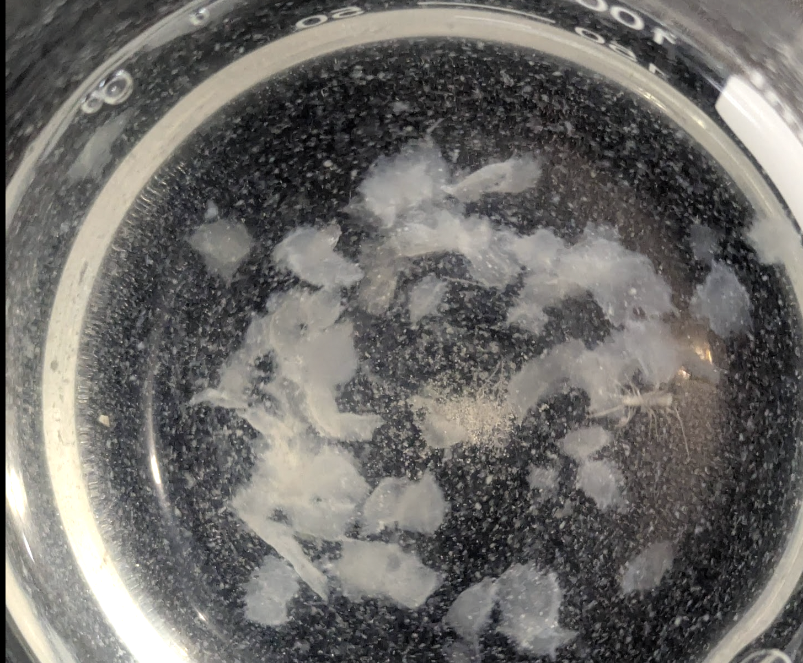
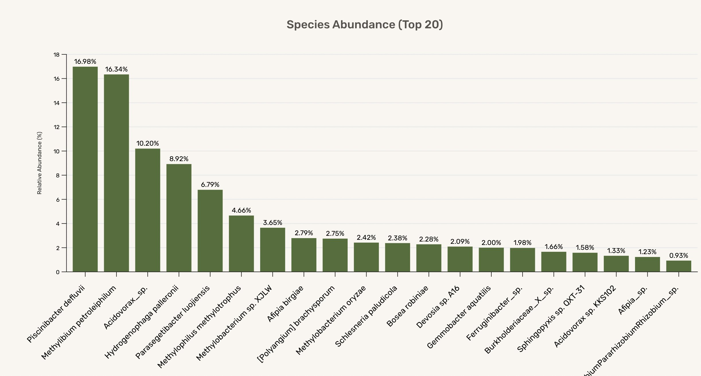
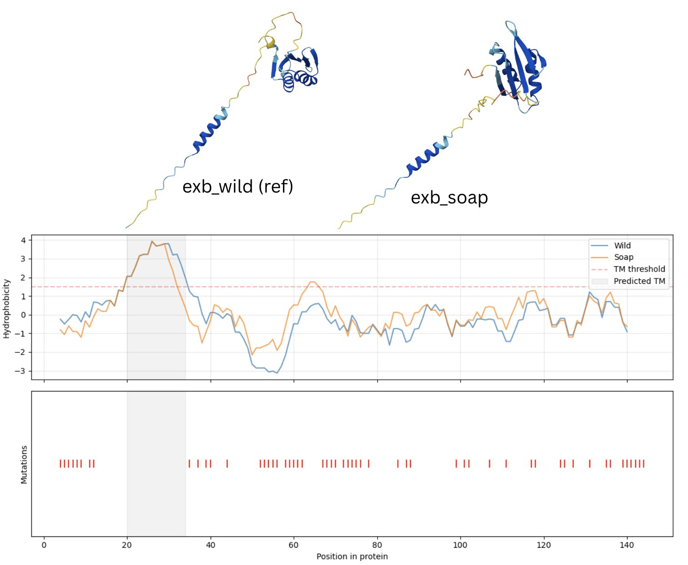

When I encounter an organism, I like to know what it is. My wifge once asked me, puzzled, why I have this drive. I stand by my first answer: I want to know if I can eat it! Naming something allows us to cross-reference information about that thing - from recipes to life histories :) Birds are easy - they sell books with pictures. Same goes for mammals, mushrooms, plants etc - at least the common ones. Bugs and spiders are harder - for some, you have to look at their naughty bits under a microscope (annoyance at this fact prompted me to put lots of working into making photo guides). When you get to bacteria, there's really no hope in most cases... at least, that's how I felt until recently! Turns out you can find out 'what is this' these days for a relatively modest sum of money, thanks to the magic of gene sequencing. In this post I'll share my first experience answering one such question, then dig into a case study with data from a friendly internet biologist to show how far one can explore with some free tools (and a bit of specialist know-how).

## What the floc is that?



Towards the end of my [duckweed experiments](https://johnowhitaker.dev/posts/dwebench.html), I noticed some things floating in some leftover stock solution of hydroponic nutrients I had made up. White, goopy blobs about a cm long. Was this some sort of weird precipitate? Some bacteria or yeast growing in there? A look under a microscope revealed a dense, tangled, squishy mess. A few tests ruled out mineral/chemical suspects, and after a bit of poking around my best answer was that these were probably biofilm flocs: mixed environmental microbes embedded in EPS (extracellular polysaccharide). That's *an* answer, but how do we narrow it down to something more specific?

Enter [Plasmidsaurus](https://plasmidsaurus.com/welcome). They offer a number of services. In this case, I went for their "Microbiome 16S Amplification & Sequencing with DNA Extraction" service. Following the guidance in the [sample prep](https://plasmidsaurus.com/sample-prep/microbiome#16S-extraction) docs, I suspended ~0.1g of the goo in a product called 'Zymo DNA shield' (after a quick wash + spin down in 0.9% saline) and shipped the result (in a tube in a tube in a bag in a bag just to be safe) off to their lab in the nearby town of Eugene.



The 16S gene is "highly conserved between different species of bacteria and archaea" and gets used to tell what somethig is without reading the whole genome - perfect for analysing environmental samples, gut bacteria etc. Plasmidsaurus will give you the raw reads, but they also do some processing to tell you some relative abundances of different species present (see above). In my case, it turns out these flocs are not a siongle species but instead a whole happy community of microbes! It's fun to start researching and figuring out who might be doing what. Preliminary poking tells me this is not an unusual mix for a watery, nutrient-rich environment. Cool to see some [Methylobacterium present](https://x.com/allisonmegow/status/1983048944432353532) - wonder how they're getting food.

So, there you go. A much deeper answer to 'what is that', provided you're willing to ship off a sample of goop and pay $60 + reagents and shipping. Is this as far as we can go though? No! [Raw results here for the curous](https://x.com/johnowhitaker/status/1983004377318326522). To dive even deeper, I'm going to switch to exploring the example that inspired me to go down this rabbit hole: the case of the mysterious triton X infiltrator.

## Sebastian's Mystery Bug


Sebastian S. Cocioba🪄🌷 [@ATinyGreenCell](https://x.com/ATinyGreenCell) is an amateur biologist who is continually doing amazing science stuff. He noticed a contaminant growing in his surfactant solution - a rough environment to be a bacteria! We sent it off for sequencing, but this time being a pro the approach was a little fancier than the one I showed in the previous section. For one thing, he guessed that his contaminant was mostly one organism, a bacterium, and so went with the bacteria genome sequencing with extraction option on the friendlty dino site. This was a bit of an informed gamble - the kind of shortcut one can take with experience. 

He's been sharing [the data](https://drive.google.com/drive/folders/1VRWijxODY-tEz_SEpgFz_OVNyNp6obG4) and his explorations on X.

The main result from the run this time is a file with the reads: `K9P4V9_1_CONTAM-1.fastq`. In a [solveit dialog](https://gist.github.com/johnowhitaker/9c0b81329de6f26ace8c4b88a9f87dbf) I loaded up the file and started poking at it. With some AI help, here's how you might explore this type of data:

### Load the data

FastQ files store each read in four lines. You can install the `biopython` library and read in the file like so:

```python
from Bio import SeqIO
reads = list(SeqIO.parse(fn, "fastq"))
print(f"Total reads: {len(reads)}")
reads[0]

>>> SeqRecord(seq=Seq('CTGCATTGCGGGAATCGAGCTTTCGAGCGCAGCGAGAAGGTGATCTGCTGATTG...CGA'), id='427416c3-6c47-4f34-9889-f33a6ce52b84', name='427416c3-6c47-4f34-9889-f33a6ce52b84', description='427416c3-6c47-4f34-9889-f33a6ce52b84 runid=0a805c02-f153-4c61-8572-df4a5e0b5651 ch=1767 start_time=2025-10-21T16:20:17.800804+00:00 flow_cell_id=PBG22075 basecall_gpu=NVIDIA_A100_80GB_PCIe protocol_group_id=251021LV_BACT sample_id=D barcode=barcode60 barcode_alias=barcode60 parent_read_id=427416c3-6c47-4f34-9889-f33a6ce52b84 basecall_model_version_id=dna_r10.4.1_e8.2_400bps_sup@v4.3.0', dbxrefs=[])
```

### Picking some reads to BLAST

I sorted the reads by length (`reads = sorted(reads, key=lambda r: len(r))`) and picked a few to look at (`chosen = [reads[100], reads[5000], reads[10000]]`). BLAST stands for "Basic Local Alignment Search Tool" - it looks for similarity between sequences, and when combined with a database of known sequences it'sa powerful tool for figuring out what on earth some specific string of DNA base pairs represents. You can download a giant database and run it locally, or submit one to NCBI's BLAST like so:

```python
from Bio.Blast import NCBIWWW, NCBIXML
result = NCBIWWW.qblast("blastn", "nt", chosen[0].seq)
blast_record = NCBIXML.read(result)
```

The resulting record contains a list of `alignments`. These have a `title` (e.g. "Edaphobacter flagellatus strain HZ411 chromosome, complete genome") and some info on how good the match is. In this case, we can see that the e-value (`alignment.hsps[0].expect`) is 0.0 (lower is better) with 536/543 (`{hsp.identities}/{hsp.align_length}`) bps matching. For all the reads I tried, the best match came from E. flagellatus, making this a strong candidate for who this particular contaminant is. (Sebastian agrees).

### Reads -> Annotated Genome

This bug turned out to be a little hard to crack (I guess it was living in a soap solution!) but the kind folks at Plasmidsaurus agreed to do a second run, resulting in more data. The way this works is that you aim to gen enough reads that you can stitch together the fragments with others that overlap until you have a complete circular genome. For a 'good' reconstruction you want about 30X coverage - i.e. each piece appears in at least 30 reads. When plasminsaurus advertises a given tier as being suitable for e.g. a 10 mega-base-pair genome, they mean they expect you'll get this level of coverage across a genome that size. In this case, we ended up with enough reads that Sebastian was able to assemble a complete genome, but even if you didn't (or if you only did the microbiome 16S example) and you wanted a full genome to play with, you can download one like so:

```python
from Bio import Entrez
# Set your email (NCBI requires this)
Entrez.email = "your.email@example.com"  # Change this to your email
handle = Entrez.efetch(db="nucleotide", id="CP073697.1", rettype="fasta", retmode="text")
genome = handle.read()
handle.close()
with open("edaphobacter_flagellatus.fasta", "w") as f: f.write(genome)
```

Now what? The next step is to annotate this genome, which at present just looks like a string of 4.5 million letters. I signed up for an account, uploaded the genome we just downloaded, and got [this](https://www.bv-brc.org/workspace/johnowhitaker@bvbrc/home/Edaphobacter%20flagellatus%20test_from_Entrez_CP073697.1) result via bv-brc. Again, if you're doing this lots you can get tools to run this locally. See also, [Sebastian doing this his way](https://x.com/ATinyGreenCell/status/1981428984832278974). This annotation process tags specific sequences with features. Loading them in:

```python
import pandas as pd
df = pd.read_csv('~/Downloads/BVBRC_genome_feature.csv')
functions = ', '.join(df['Product'].unique())
```

Taking a look at the annotated functions: `Transcriptional regulator, IclR family, hypothetical protein, Phage integrase, Amidohydrolase, Glutamyl-tRNA reductase (EC 1.2.1.70), Acidobacterial duplicated orphan permease (function unknown), Transcriptional regulator, PadR family, ...`. Lots and lots of "hypothetical protein"s here - this is what happens when you look at an understudied soil bacteria haha, shows how little we know! Since I'm a noob, I figured I'd pass the list to AI to see if there was anything interesting. In solveit, you can pass variables to claude like so: `Take a look at $functions - any stand out as potentially interesting / related to how it can live in tritonX?`. It was able to highlight specific bits, such as "CzcABC family efflux RND transporter", explaining that "Efflux pumps actively pump toxic compounds out of the cell. RND (Resistance-Nodulation-Division) transporters are known for pumping out detergents and other membrane-disrupting compounds.". Looking at the 31 efflux-related genes might not be a bad place to start when trying to figure out how this thing survives in the harsh environment it was growing in. (he says, like he knows what he's talking about).

In a future post, I want to look further at how I might take an annotated protein (or pick one of the unknown ones) and look at it further - get the structure with alphafold 3, predict likely function, see which other species tend to have it and what they all do, etc etc. So many unknowns! But also so many good tools for digging in, and lots to learn :D

### A Master's Master Plan

It was really interesting to see how @atinygreencell went about playing with this. His interest goes beyond just figuring out what this is - instead, he has a process to turn it into something he can 'play' with! Once he has an assembled and annotated genome, his next steps are:

- Start to culture the bug. Growing it on agar and isolating colonies so that he can be sure no other bacteria and growing in with it, giving a clean slate to start with
- Design some 'primers'. These are small strands of DNA, matches for sequences in the target species. These will let him amplify *just* those sequences, giving a way to confirm that what he has growing is indeed E. flagellatus. (You amplify the sequences, if present, and then run a gel - where electric current separates DNA strands by size. If the primer had matches, you see a glowing band in the right place. I'm keen to try this some day!)
- Develop a way to interface with this organism via plasmid transformation. Givig him the tools to knock out certain genes to see what they do, or add thigns. For example, he could see if knocking out a speciffic gene stops it being able to eat triton-X. 
- Now you have a new organism to experiment with - very cool, given how little we know about most wild bacteria and what they might be capable of doing!

## Conclusions

Anyway, I think it's super cool that we can ship off samples to get sequenced for tens of dollars, and that you can buy the devices to do this yourself for a few thousand dollars. I think it's wonderful that open databases and tools mean I could BLAST some reads, download a similar genome, annotate it and poke around to find some interesting genes from my laptop in a hotel room during PyTorchConf. I love that AI gives me a starting point for digging into questions that I have. I love that delightful and generous experts like Sebastian share their knowledge and augment my learning with their own deep expertise. And I love that there are so many things I still don't know, and so many things humanity still doesn't know! There's a fat pile of textbooks sitting on my desk, and lots of open questions I have about these bacteria, so I suspect this won't be the last post from me on this topic :) Until next time, cheers, J

## PS: Folding Proteins



I did a bit more messing around (vibe-research code [here](https://gist.github.com/johnowhitaker/f4f1b88ffaa637476c62cb59ba9a2630)) and compared the wild-type genome to the reads of Seb's bug. Found the genes common to both, and found 25 with differences ranging from single-base-pair or single-amino-acid up to pretty drastic changes. In this one, 'Biopolymer transport protein ExbD/TolR' it was cool to see a bunch of mutations but none in what I'm guessing is the 'transmembrane region' - i.e. the bit that is more hydrophobic, and important. I used alphafold 3's free tier to fold the two variants and compare - although structures for floppy membrane proteins like this should be taken with a grain of salt. 

[Tweet](https://x.com/johnowhitaker/status/1989852477668413885): "I'm almost certainly making all sorts of mistakes, but I'm having lots of fun :) I found 876 annotated genes that occur in both genomes, of which 25 had changes ranging from a single base pair to big diffs like the prev tweet.
Even a one-acid change like T->K (32) in the efflux transporter could be helping this bug live in the harsh environment of a flower designer's surfactant solution? 
Anyway, fun stuff. So much to learn!" captures my mood :)