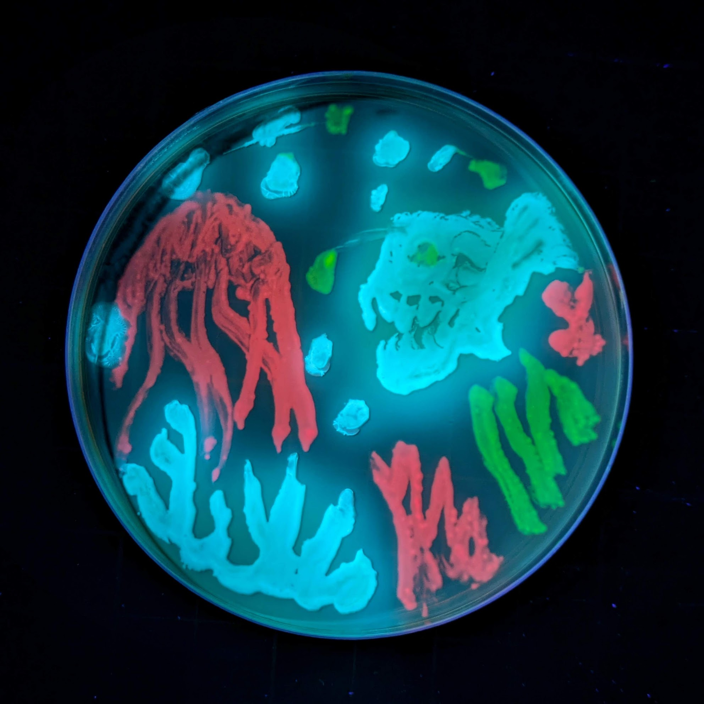
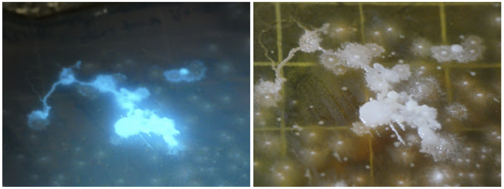
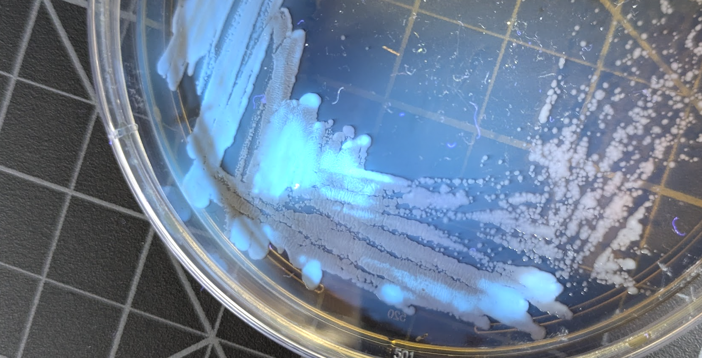
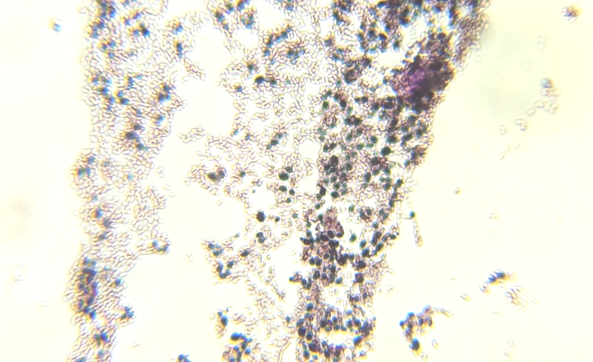
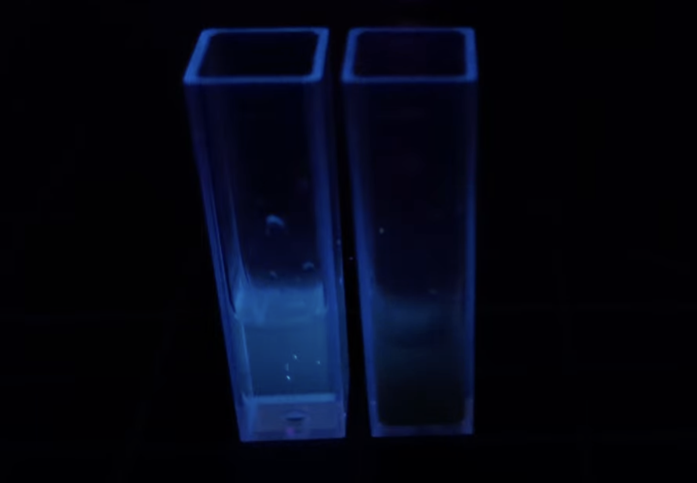

I took a swab of the roots of one of our windowsill plants and streaked it out on some agar media to see what grew. After a day or two of growth, I shone a UV flashlight on the plate and saw that some colonies had a lovely blue glow! Likely candidate: Pseudomonas fluorescens, a common soil bacterium that secretes a blue-fluorescing siderophore called pyoverdine to scavenge iron from the environment.

I tried to isolate the glowing bacteria by re-streaking to a fresh plate, although the first few tries brought along some other non-glowing bacteria as well:

To confirm that this was what was happening, and get some more evidence for this being Pseudomonas, I did something called a gram stain where you smear some of thre bacgteria on a slide, stain it with a series of dyes, and then look at it under a microscope. This is what the result looks like:

Pseudomonas are gram-negative rods, which are the smaller pink shapes in the image above. The larger black/purple shapes are gram-positive cocci, likely another harmless soil dweller. Another smear from the non-glowy part of the plate was ~all these larger dark blobs. It's interesting that the larger bacteria get carried further when streaking, so most of the isolated colonies are just those, making it hard to pick out just the pseudomonas. Eventually I managed it though, and could start to have some fun.

The glow comes from a chemical called pyoverdine. There are actually a bunch of variants made by different related species, I'd have to sequence the genome and do some analysis to figure out exactly which one I have. They all serve the same function - binding iron and making it available to the bacteria. This makes these beneficial to plants, since the pyoverdin is just secreted into the environment and can help the plant get iron too. There's probably some mutualism going on here, with the plant providing nutrients to the bacteria in exchange for iron scavenging.

I put some rusty iron in vinegar + a little citric acid, to see if I could see the quenching happen. Here's two vials, each with the same amount of pyoverdine (filtered to remove the bacteria themselves), with the left getting a few drops of water added and the right getting some of the iron solution:

The effect is hard to capture in a photo, but the drops of iron result in an instant dark cloud effect, as the pyoverdine binds the iron and stops fluorescing. In daylight the resulting solution is yellow-green, and I think I saw some precipitate briefly form as well.

At some point I'll make a video explaining this too, since glowy Rhizobacteria is a great hook to teach people about beneficial microbes and siderophores :) nSee you in the new year,

J