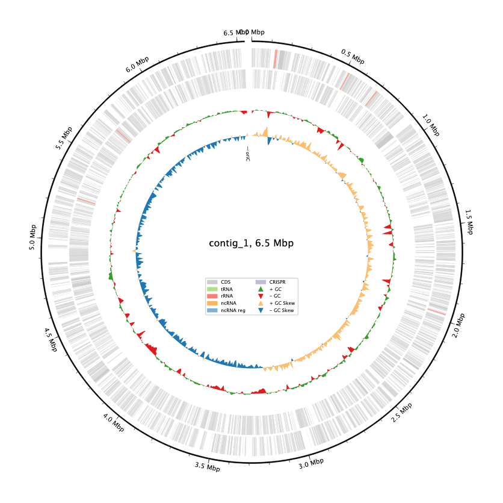
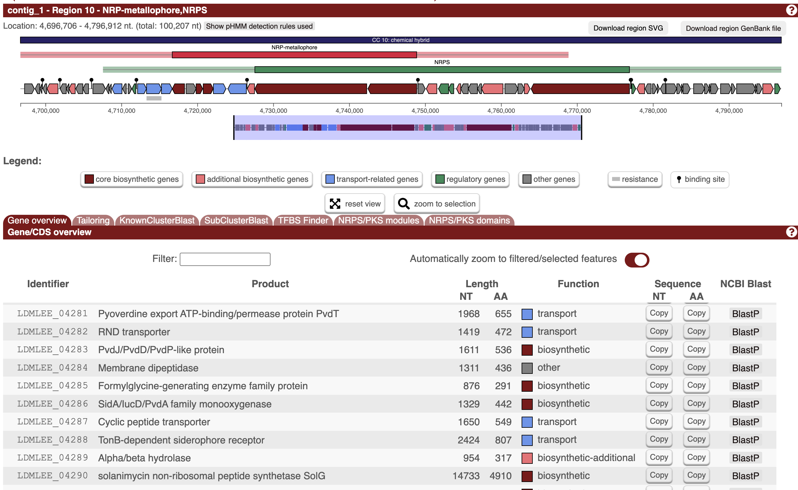
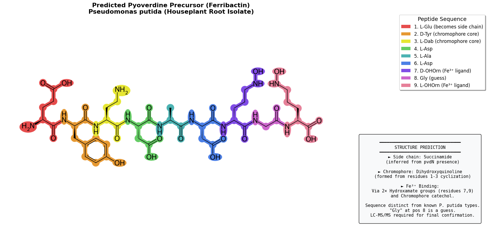

In my [previous post](https://johnowhitaker.dev/posts/pseudomonas.html) I showed a bacteria isolated from the water around the roots of a Jade plant on our windowsill, which secreted something that fluoresced a lovely blue under UV light. My best guess was that it was some species of Pseudomonas, and the blue was from pyoverdine. But how can we know for sure? Well, I put it off because money, but since I like working with this bacteria and want to do more with it, I figured I'd bite the bullet and pay the ~$120 to get my answers :) It turns out that the closest match is P. putida, and that the pyoverdine variant that this makes is probably different to anything documented in the literature. Exciting stuff!

## Sequencing with Plasmidsaurus

I went with Plasmidsaurus' 'Standard Bacterial Genome Sequencing with Extraction' [service](https://plasmidsaurus.com/genome). I sent the sample (~15mg cells suspended in Zymo DNA Shield) off on Tuesday morning and by Wednesday evening the results were ready. 

Species ID (Mash)

- Best match: Pseudomonas putida NBRC 14164
- Identity: 95.6% (1946/5000 shared hashes)

Genome Quality (CheckM)

- Completeness: 99.88% — excellent!
- Contamination: 2.15% — very low
- Lineage marker: Pseudomonas

Assembly Stats

- Genome size: 6.54 Mb (typical for Pseudomonas)
- Total reads: 66,830 (398 Mb total)
- Estimated coverage: ~58x
- Longest read: 88.4 kb
- Read N50: 9.7 kb



They give you [lots of data](https://drive.google.com/drive/folders/1p8dQGtGOjfowySz2ltuYEjhGZroxdjUh?usp=sharing), including annotating the genome for you with [bakta](https://doi.org/10.1099/mgen.0.000685). Great stuff! We can see right away that our guess was right - this is a Pseudomonas species (P. putida is the closest match) and are ready to dig in further to see what we can learn.

## Pyoverdine Investigation

Pyoverdines vary but all come with three key parts: a dihydroxyquinoline core, a peptide chain, and a side chain. The peptide chain especially varies strain-to-strain - see [here](https://en.wikipedia.org/wiki/Pyoverdine#Structure) for some examples.

Step one was looking for the pyoverdine Biosynthetic Gene Cluster (BGC). A [Deep Research](https://chatgpt.com/share/697294ce-6a40-8010-bb23-a7047045b8cb) run gave some promising genes to start the hunt with. Some hits let us narrow in on a key region between 4.71 and 4.76M bp, with a number of promising-looking genes. A tool called antiSMASH likewise identified a region (4,696,705–4,796,912), labeled as 'NRP-metallophore' - this is our BGC alright :)



We also got a predicted structure in SMILES format, and with some wrangling get a final predicted structure (and a pretty picture):



::: {.callout-note collapse="true"}
## AN AI SUMARY OF 

🧠🧠🧠🧠🧠🧠🧠🧠🧠🧠🧠🧠🧠🧠🧠🧠🧠

### From Genome to Siderophore: Characterizing a Novel Pyoverdine from *Pseudomonas putida*

### The Starting Point

We began with a high-quality assembled genome from a *Pseudomonas putida* strain isolated from a houseplant root system (sequenced by Plasmidsaurus). The assembly was excellent: **99.88% complete**, only 2.15% contamination, and a 6.54 Mb genome at ~58× coverage. Species identity was confirmed via Mash (95.6% to *P. putida* NBRC 14164).

### Finding the Pyoverdine Biosynthetic Gene Cluster

We searched the Bakta annotations for pyoverdine-related genes (**pvd** genes, NRPS, siderophore terms) and identified a cluster spanning **~4.7–4.8 Mb** containing:

- **pvdT** — pyoverdine exporter
- **Two large NRPS genes** (~14.7 kb and ~6.4 kb) — the peptide assembly machinery
- **PvdA-like monooxygenase** — hydroxylates ornithine
- **Formylglycine-generating enzyme** (likely **pvdF**) — formyltransferase
- **argD** — makes diaminobutyrate (Dab), essential for the chromophore
- **TonB-dependent receptor** — likely the ferripyoverdine receptor (fpvA)

Notably, **pvdA** was located separately at ~3.99 Mb — this split arrangement is common in pyoverdine BGCs.

### antiSMASH Analysis

Running the genome through antiSMASH confirmed Region 10 as an **NRP-metallophore** cluster (siderophore NRPS). The top KnownClusterBlast hit was **Pf-5 pyoverdine** from *Pseudomonas protegens*, but with only ~49% NRPS identity — indicating a related but distinct peptide.

### Predicting the Peptide Sequence

antiSMASH provided **A-domain substrate predictions** for each NRPS module:

| Module | Substrate | Configuration |
|--------|-----------|---------------|
| 1 | Glu | L |
| 2 | Tyr | D (E-domain present) |
| 3 | Dab | L |
| 4 | Asp | L |
| 5 | Ala | L |
| 6 | Asp | L |
| 7 | OH-Orn | D (E-domain present) |
| 8 | **?** | — |
| 9 | OH-Orn | L |

The mystery at position 8 was annotated as **"NH₂"** by the Minowa predictor — initially puzzling.

### Resolving the Unknown Residue

We explored two hypotheses:

1. **Lysine** — has a terminal -NH₂ on its side chain
2. **Glycine** — essentially just an α-amino group with no real side chain

After deeper analysis (including literature review of other *P. putida* pyoverdines), **glycine emerged as the more likely candidate**:
- The "NH₂" prediction could mean "minimal/no side chain"
- Glycine is common in mid-chain positions of *P. putida* pyoverdines (KT2440, GB-1 both contain Gly)
- Prediction tools are known to have difficulty with Gly vs Ala

### Determining the Side Chain: pvdN vs ptaA

Pyoverdine side chains come in two main types:
- **Succinamide** — produced by strains with **pvdN**
- **α-Ketoglutarate** — produced by strains with **ptaA**

We BLASTed known pvdN (*P. aeruginosa* PAO1, NP_251095.1) and ptaA sequences against the genome:

- **pvdN: 83% identity match** → gene LDMLEE_03614 at ~3.99 Mb (near pvdA)
- **ptaA: No significant match**

**Conclusion: Succinamide side chain**

### The Final Predicted Structure

```
CHROMOPHORE PRECURSORS          VARIABLE PEPTIDE
        ↓                              ↓
┌───────────────────┐  ┌─────────────────────────────────────┐
 L-Glu → D-Tyr → L-Dab → L-Asp → L-Ala → L-Asp → D-OHOrn → Gly → L-OHOrn
                  ↓                                    ↓            ↓
           cyclizes to form                      Fe³⁺ binding  Fe³⁺ binding
        dihydroxyquinoline                       (hydroxamate) (hydroxamate)
           chromophore
```

**Key features:**
- **9-residue peptide** (longer than typical *P. putida* pyoverdines)
- **Two hydroxyornithine residues** — provides two hydroxamate groups for Fe³⁺ chelation
- **Succinamide side chain** on the chromophore
- **Novel sequence** — no match in SIDERITE database (best similarity only 0.35)

### SMILES (with stereochemistry)

```
NN[C@@H](CCC(=O)O)C(=O)N[C@H](Cc1ccc(O)cc1)C(=O)N[C@@H](CCN)C(=O)N[C@@H](CC(=O)O)C(=O)N[C@@H](C)C(=O)N[C@@H](CC(=O)O)C(=O)N[C@H](CCCNO)C(=O)NCC(=O)N[C@@H](CCCNO)C(=O)O
```

### What Still Needs Confirmation

This is a **bioinformatic prediction**. To definitively confirm the structure:

1. **LC-MS/MS** — will reveal the exact mass and fragment pattern, confirming each residue (especially Gly at position 8)
2. **The hydroxamates** — could be N-formylated (if pvdF is active), which would add +28 Da per residue
3. **Cyclization** — the C-terminal OHOrn likely cyclizes with the chromophore, which MS/MS should reveal

### Why This Matters

This appears to be a **genuinely novel pyoverdine variant** — it doesn't match any characterized *P. putida* pyoverdines in the literature or databases. Discovering the diversity of siderophores in environmental isolates helps us understand:

- Microbial competition for iron in the rhizosphere
- The evolution of NRPS systems
- Potential for novel iron chelators with biotechnology applications

## END AI SLOP
:::

Here's [a notebook](https://gist.github.com/johnowhitaker/8659d6f38c799e9d4d8e417e1641e6e0) running over the final steps, with some light annotation.

## Future Plans

It's one thing to poke at a genome and predict a structure, it's another entirely to verify it. I'm hoping to work with a local university to run GC-MS on this to answer a few remaining questions and nail down the final structure exactly. Will require dusting off and improving my organic chemistry and learning a lot more! Stay tuned for that in some future blog post hopefully :)

Also, it's probably obvious but worth stating explicityl: I AM OUT OF MY DEPTH HERE AND EVERYTHING IN THIS POST SHOULD BE TAKEN WITH A GRAIN OF SALT, ESPECIALLY WHILE IT IS MARKED 'DRAFT' :)

For the curious, raw data [is on Google Drive](https://drive.google.com/drive/folders/1p8dQGtGOjfowySz2ltuYEjhGZroxdjUh?usp=sharing), I'm open to questions @johnowhitaker.