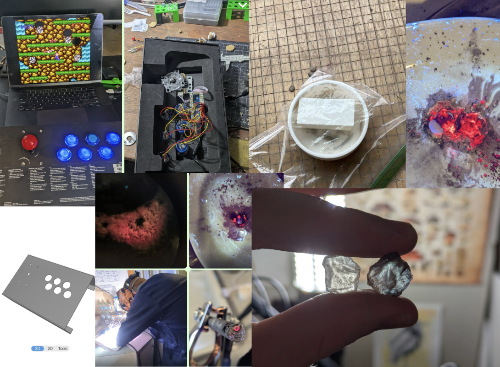
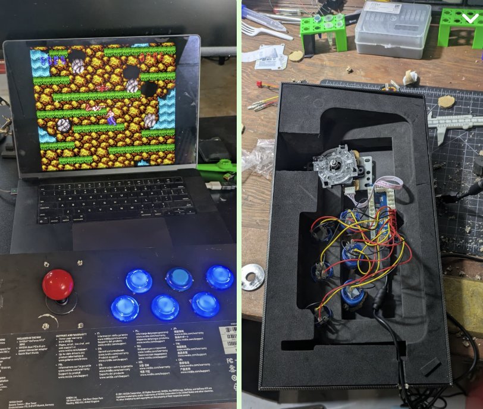
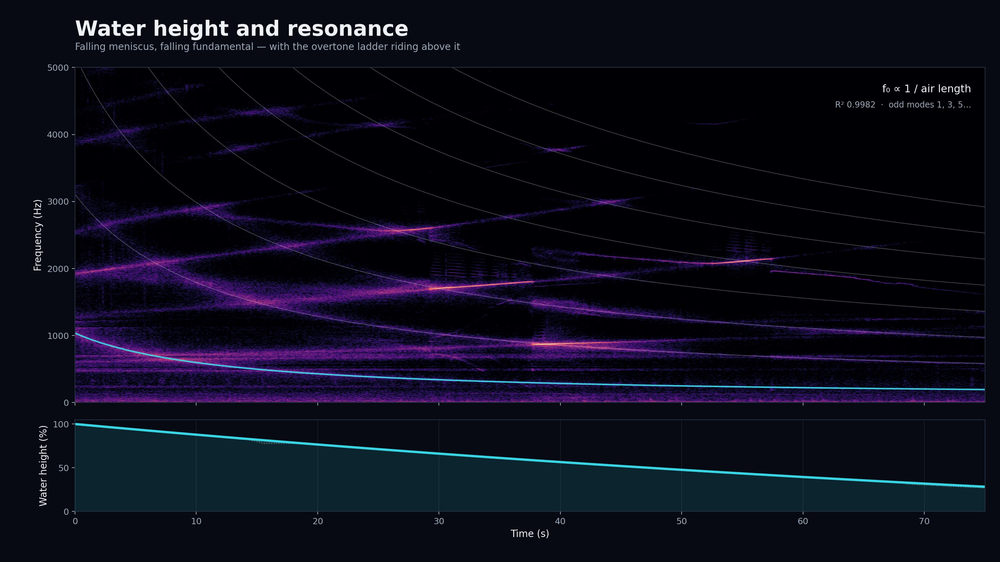
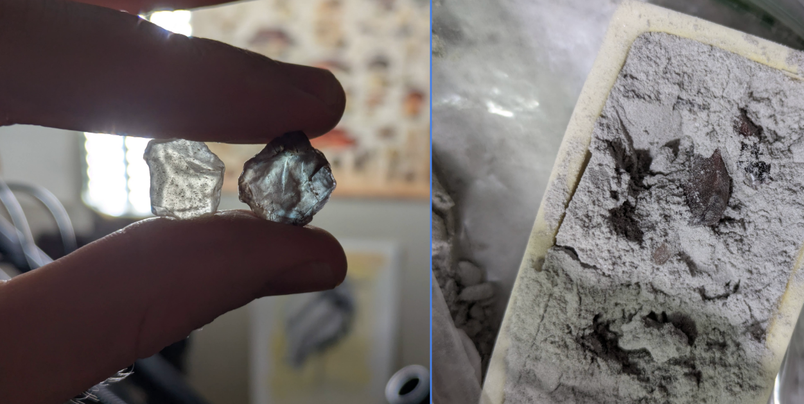
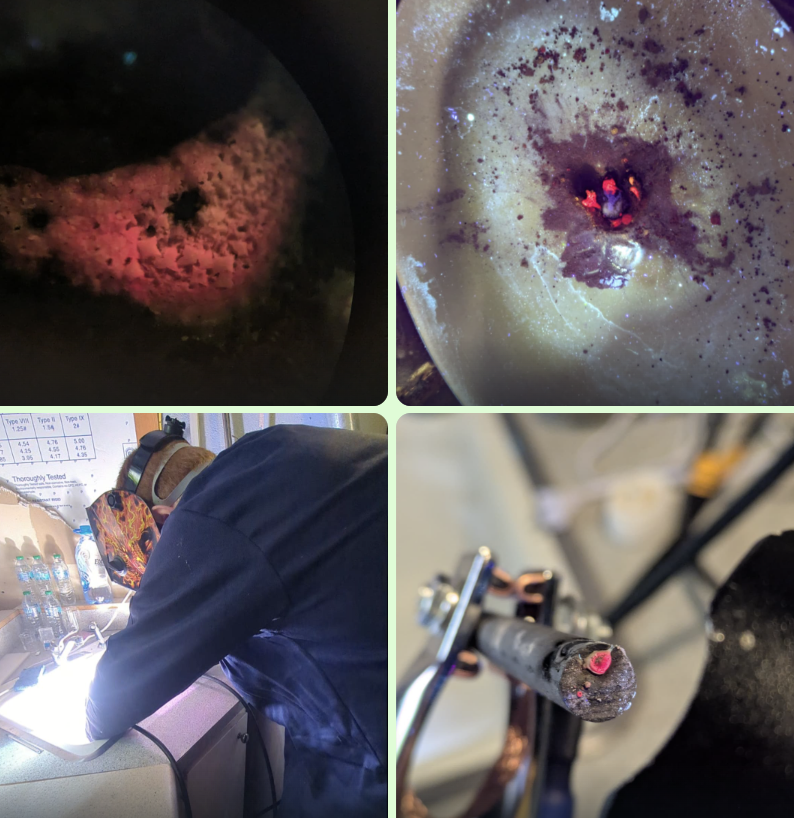
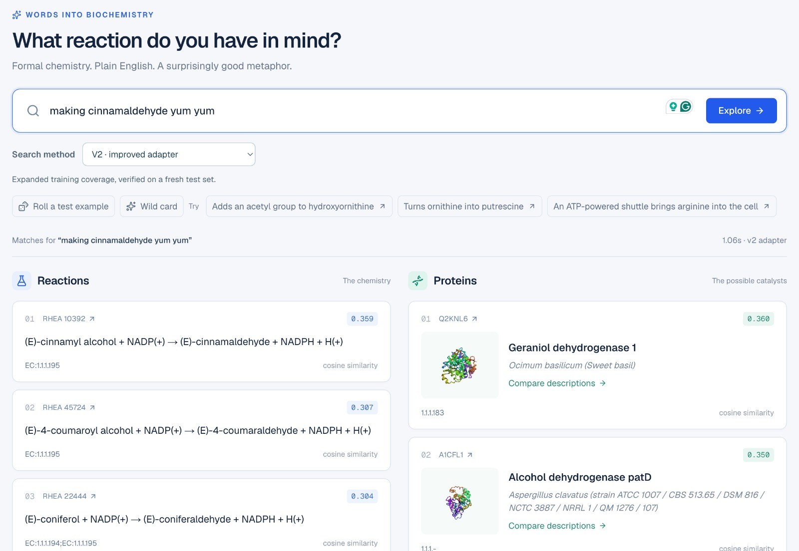
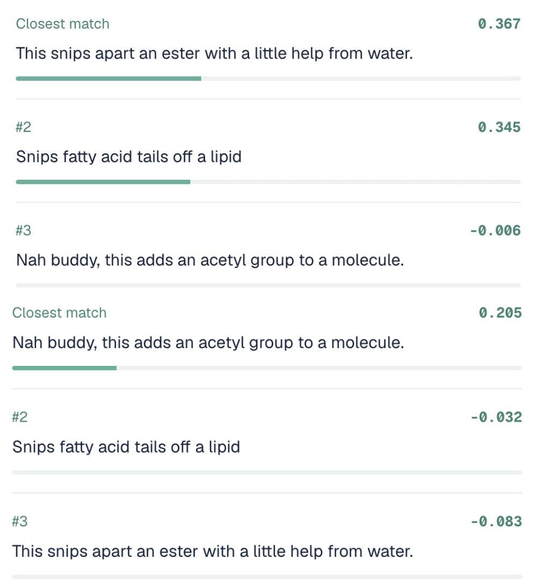
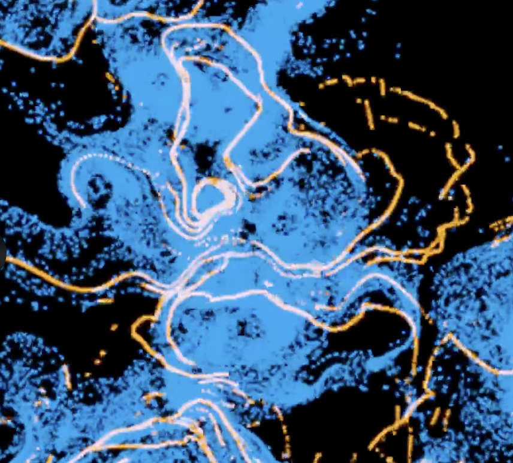
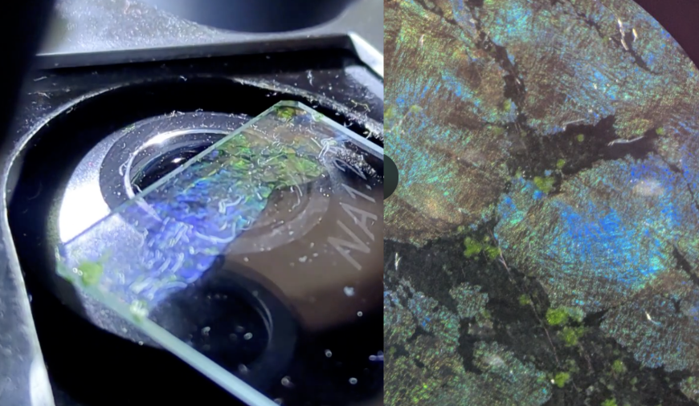
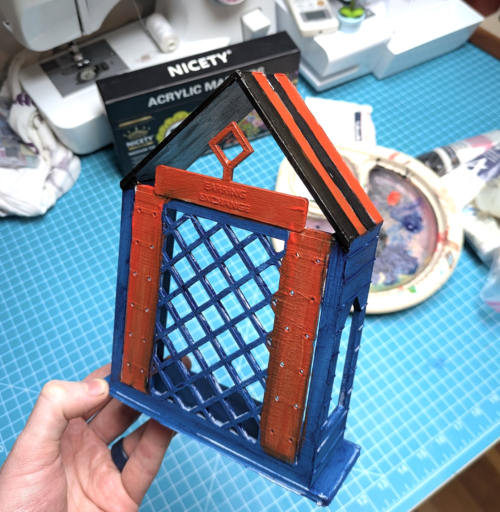

It's been a week full of little projects in between meetings with some very interesting people. Rather than write them up individually, I'm going to keep this to a few pics w/ light commentary. Reach out if you want more info :)

A neighbor unloaded some arcade buttons, and I set up a single controller in an old GPU box to try them out as controls for (nostalgia max) CONTRA. Fun to use! I actually CAD'd up some sheet metal cases to make a pair of arcade control boxes with SendCutSend, but chickened out on spending $100+ on this project just yet. That's "employed" kinda spending territory, for now my box version works great :)

I found [this video](https://www.youtube.com/watch?v=WcBs_K19Q5g) recording the sounds made as water flows from a tube out of a small opening. Some amazing noises! To figure out what was going on, I had codex crop out the tube, plot the height over time, and make a spectrogram. You can see different harmonics of the (lengthening) air culumn above the water ring out, always odd harmonics, triggered when one of the flow frequencies intersects and resonates with a harmonic of the column. Fascinating physics.

 [X post](https://x.com/johnowhitaker/status/2095216481026121968)

I set some clear sunstones going in a kiln, with aluminium oxide doped with a little copper powder surrounding them. The goal is to drive the copper ions into the feldspar, and have them precipitate out to give some nice red coloration. We only did 48 hours at a conservative 1100C this time, so the effects are mostly surface-level, but I love the blue color some stones got when passing light through (red when not looking through). Will try a longer hotter run soon.

With extra Al2O3 on hand, I ordered some chromium oxide to finally try making rubies! I borrowed my neighbor's welder, set the current to ~70A, shaped some carbon rods to fit the electrode holders, and blasted some 0.5wt% Cr doped Al oxide with an arc. Result: lots of messy polychrystalline ruby, that glows a beautiful red under UV light. 

Then a fun project on the AI <=> bio side yesterday, which I'll probably polish and write up properly at some point: I trained an adapter to map text embeddings from Qwen Embed 4B into the same embedding space as used by the Horizyn 1 Protein/Reaction embedding model. This means you can query for matching reactions and proteins based on natural language descriptions of reactions, very fun!

You can also check how well different descriptions match a protein - for example, here's a lipase that also hydrolyses medium-length esters, vs an acetyltransferase, with a set of three vibe descriptions:

Then I got nerd sniped into lots of ALIFE stuff! Met a cool alife researcher, who then added me to a few discords and convinced me to present my neural physarium stuff to some other alife nerds. We had a great chat, cool to see other people messing about with this stuff. It also finally motivated me to try fluoddity, a fantastic "physarium++' sim with tons of cool behaviour. 

Speaking of self-organising systems, I grew a biofilm with some fantastic irridescence! One of the bluest blues I've seen when the light was the right angle. Other rainbow colors too.

I had astra show off its 3D chops by making a better version of our earring exchange that goes with our tiny tiny library. Worked first time, I sent a prompt and woke up to a physical object! What a world we live in...

Oh, and the DVD drive hacking project was stalled on deciding the firmware, but is now unblocked thanks to about 15 minutes with astra, amazing RE model! No pics yet but full hw control seems possible!

Anyway, those are some highlights of the week. I also spent lots of time messing about looking at plant alkaloids but that got its [own post.]. Lots of other little software + alife tests too, but most quick vibe projects that I don't feel need publicity unless I expand on them more. 

PS: A few extras a little older than a week: 

[The gene gun works!](https://x.com/johnowhitaker/status/2093726642875294122?s=20) - video link [here](https://www.youtube.com/watch?v=gRIMH3cx0iw)

I did an hour long talk on 'Open Character Training' paper (giving models personality) with Alexis - stream replay [here](https://x.com/alexisgallagher/status/2093417582187729106?s=20)

OK - this post helps reduce the "things I need to write up pile", although next week promises to fill it again. Until next post - cheers. -Johno