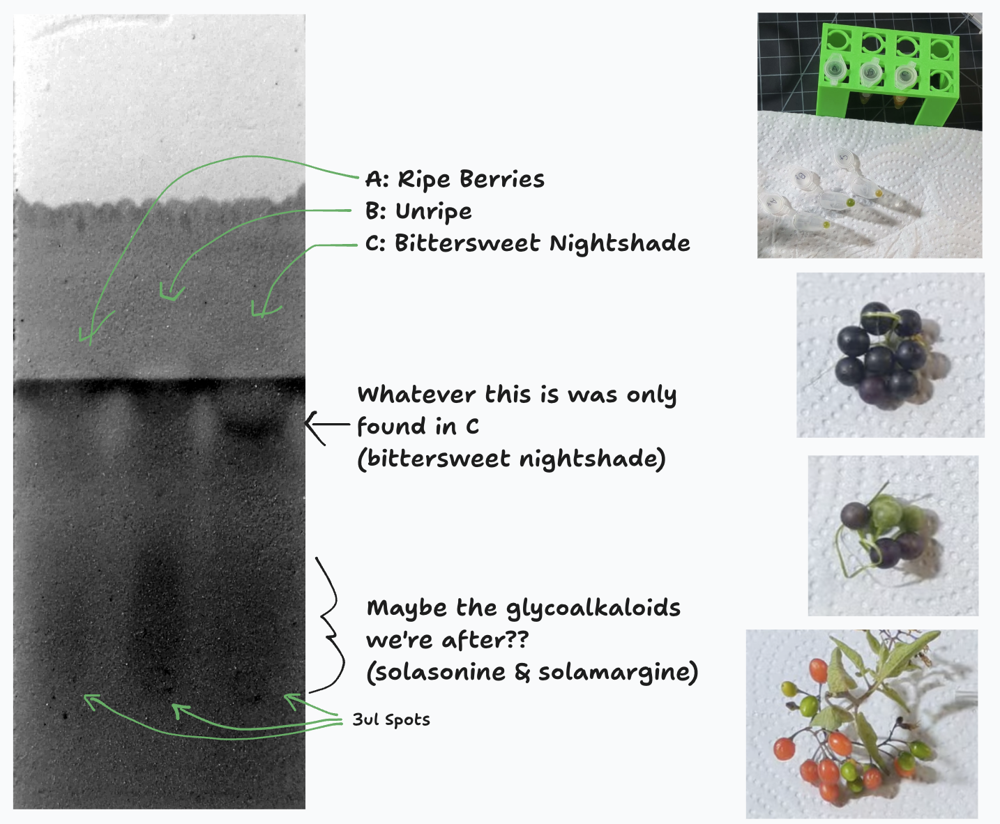
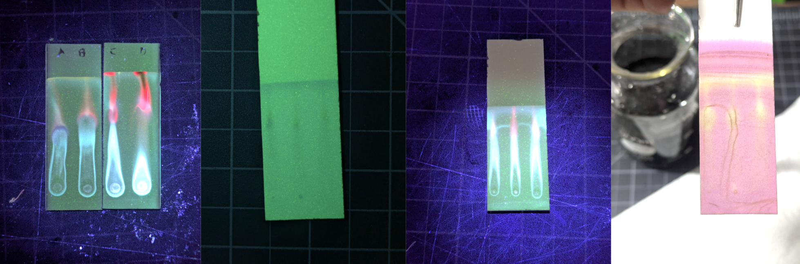
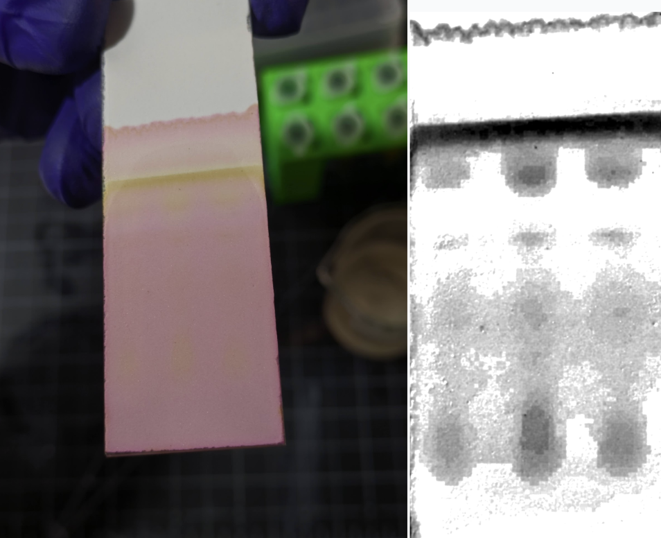
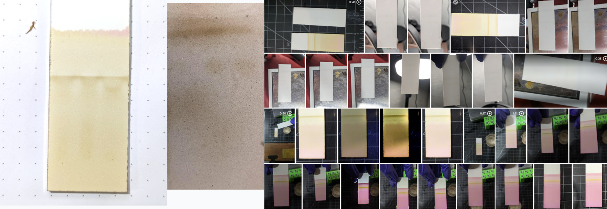
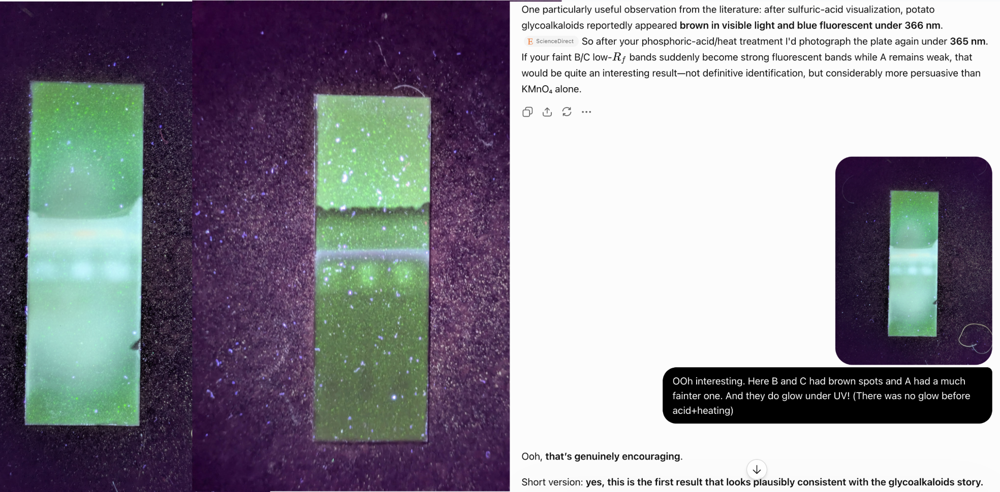

I came across some black nightshade berries (Solanum nigrum) on my morning walk, and thought I'd try to show why you shouldn't eat the unripe fruits. The theory goes that these plants are full of glycoalkaloids like solanine (the same nasties in green potato peels) but that these are mostly gone when the berries are fully ripe. I expected a fairly easy extraction + chromatography experience, but ended up trying a lot more runs than expected and learning lots along the way :) The [video](https://www.youtube.com/watch?v=O3ZzgCSGsEU) has my rambly next-day thoughts and some footage of the experiments, this post will collect the more structured info for future reference.

(Disclaimer: probably don't eat any fruits unless you are sure you aren't eating the similar-looking deadly nightshade, or a [bush with high solanine even when ripe](https://x.com/thebiologistisn/status/2095513782525034819).)

## Attempt #1

For a first attempt, I crushed a few ripe berries (A) in 3:1 ethanol:vinegar, spotted it out on a TLC plate, and ran it with 2:4:4 acetone:ethanol:ethyl acetate. Ditto for partially ripe berries (B), unripe (C) and leaves (D). The first run was way overloaded, and even repeats with smaller drops (just A, B, and C on a single plate to be thrifty) were a bit of a mess. You can see red-fluorescing chlorophyl, bright blue (phenolics, flavinols etc) some lots of other junk. The purple anthocyanins from the ripe berries were also visible, and various things stained yellow after a dip in some KMnO4 (with NaOH and K2CO3) stain. 

The problem is that we've extracted all sorts of things - we need a way of excluding as much of this junk as possible so that we can see the glycoalkaloids we're interested in. Plus, I think the TLC mobile phase needs to be more polar...

## Take 2 (and 3 and 4...)

With some suprisingly helpful advice from Fable 5.1 (hooray for more nuanced bio filters!) I tried again with a more refined extraction protocol:

- Mash up the berries in some vinegar (~4% acetic acid)
- Spin down and push the supernatant through a syringe filter to get it nice and clear
- Bring the pH up to ~11. The vinegar buffers it for a while and then it shoots up, I overshot a few times. What's cool is that you get a color change to watch this - yellow appears then fades as you add the NaOH until suddenly it stays. Fun doing titration at ~1ml scale haha.
- Cool then spin down, leaving a little pellet at the bottom
- Wash with water, spin down
- Dissolve in ethanol (I tried plain and lightly acidified)

The theory here is that we're extracting the alkaloids in acid then crashing them out at high pH in their (mostly insoluble) free-base form, then washing away most of the salts, sugars etc that remain soluble before re-dissolving the target molecules in ethanol. Some proteins and things will crash out too at the high pH, but this way we (hopefully) have waaaay less junk to deal with. 

I then ran spots of these extracts (switching to A=ripe, B=unripe and C=Bittersweet Nightshade, a different species that isn't edible and should have lots of the target compounds) with various mobile phases, e.g. 4:1 ethanol:water, or variants thereof with some ethyl acetate added (and sometimes vinegar) - e.g. 5:3:2:1 EA:ethanol:water:vinegar.

Besides tweaking the mobile phase and extraction, I also experimented with different ways to get the compounds to show up nicely - since they aren't flourescent, staining or charring were our bet bets. There is Dragendorff's reagent, which stains alkaloids specifically, but I don't have it. For the charring, I added some hydroponic pH DOWN (phosphoric acid plus a bunch of buffer salts and such) to ethanol. The salts crashed out. I'd dip the TLC plate in the phosphoric acid+ethanol then place it on a hotplate set to 180C and wait for spots to go brown.

This was one of the more frustrating parts - I'd be able to see faint smudges by eye, but filming them on the pure white background of the plate was extremely challenging! I ended up relying on image manipulation to make the spotches stand out. Worse, the KMnO4 stain fades fast and changes in real time! Still, eventually, with charring or staining or both, I was able to get a few variants with obvious blobs in B and C and fainter smudges in A - possible candidates.

## Lessons Learned

- Nice to learn a little more about acid-base extraction
- I got much better at doing consistent spots on the TLC plates (a micropipette set to 3ul helped a lot)
- I learned that alkaloids get 'smeary' in TLC if they're not fully protonated, or fully de-protonated. So, one usually adds a little ammonia to the mobile phase to keep things basic. I didn't have, but made some with NaOH+NH4NO3 in a vial such that the ammonia vapor hung around in the TLC chamber; mixed results. OR, you can just acidify things, hence the vinegar in some runs :)
- I learned from my [X thread](https://x.com/johnowhitaker/status/2094868882112835836?s=20) discussion that you can just taste solanine, bro - and indeed, with some very careful tasting and the bittersweet nightshade as reference, I think I can pick it out, and not taste it in the ripe fruit
- I learned the ripe fruit are pretty tasty (I only ate one) and some are already pretty well bred for low solanine, hopefully one day we get a nice domesticated variety that is extra safe and tasty to much. 
- I got to practice my (very rusty) chemistry, mixing up stock solutions and adjusting pH and making yellow chemistry E&F references and somehow spilling NONE of the stain or nasty lye or anything!
- Fable 5.1 (which came out that day) was suprisingly helpful - I tested it on this expecting instant bio refusal (we are extracting a toxin after all) but instead it was a great teacher.

## Mixed results

The first image in this post was the one from the day that I thought had the best chance of being what I wanted: some blobs in B and C that weren't in A. But they were streaky and indistinct.

As I wrote this up, I figured I'd give this one more go: more concentrated spots, a fresh batch of phosphoric acid+eth with more acid, EA+eth+vinegar as the mobile phase. This got much better brown spots, further up. And, prompted by codex, I tried something with this and yesterday's ones that I hadn't before: UV **after** the acid+heat stage - and got some glow where there wasn't before! So maybe those higher spots in some of the runs were the compounds after all? Except from the lit I expect them to have low Rf?

Anyway, I end this post as I ended the video: inconclusively. If we wanted to do this properly, we'd get some proper stain, and some ammonia, and some green potatoes as another reference, and run everything a little more carefully... but I'm about ready to be done with these berries for now - after all, this 'quick test' has already taken more than a day! 

I hope you found the journey interesting :) LMK what mistakes I've made, I bet there are plenty. 

until next time,

Johno

PS: Title may be misleading, apparently this (taxonomically complex and messy) group might have more solasonine and solamargine vs solanine, so "hunting for steroidal glycoalkaloids in nightshades" might be better given ambiguity about exact species/accession and target molecules haha.