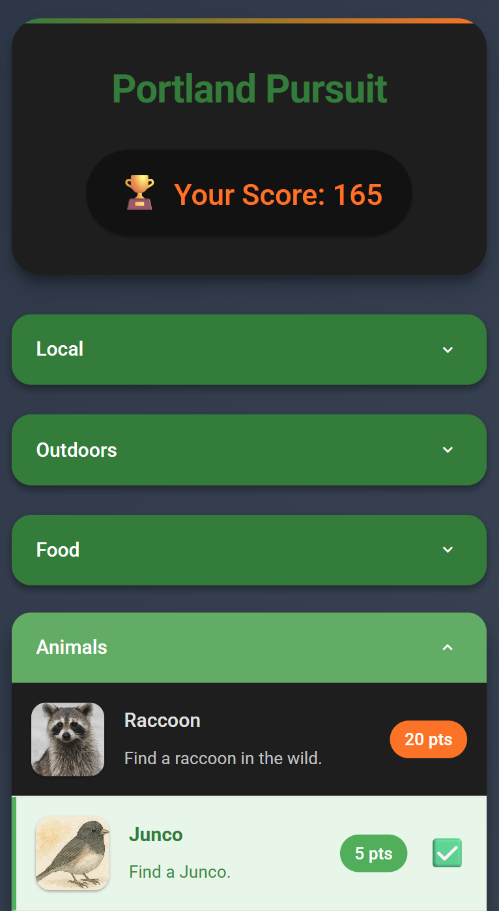
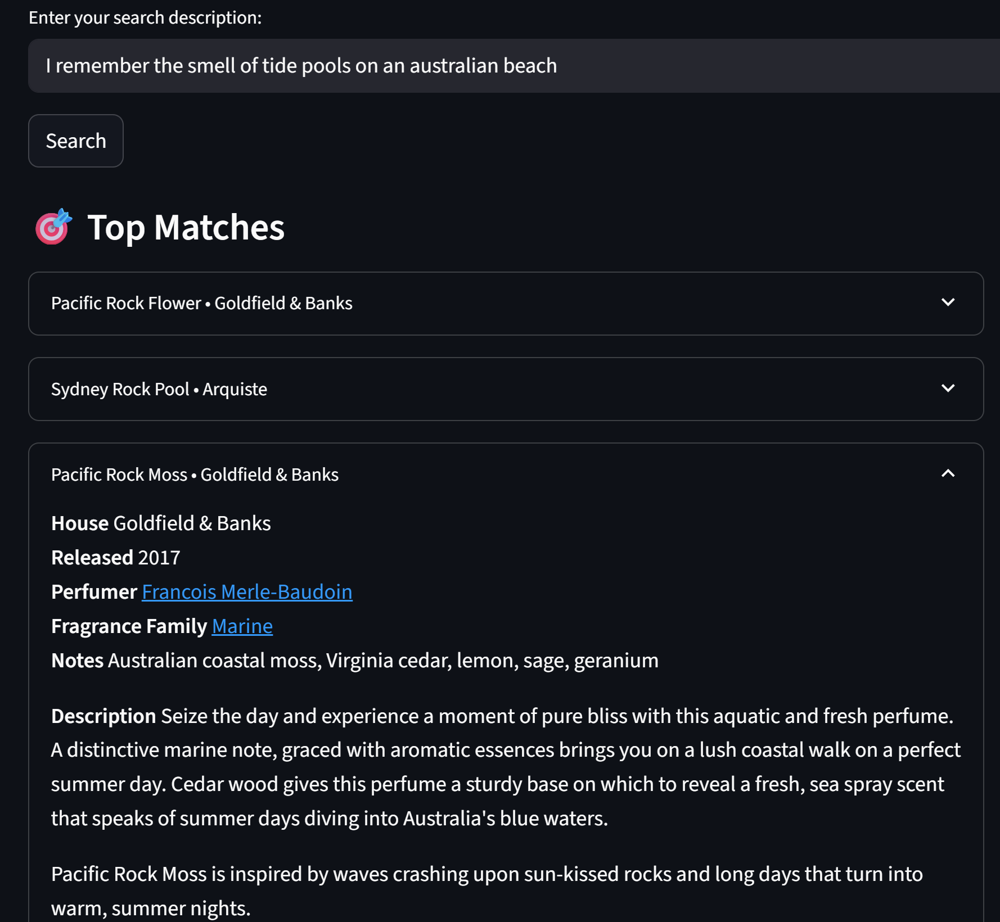
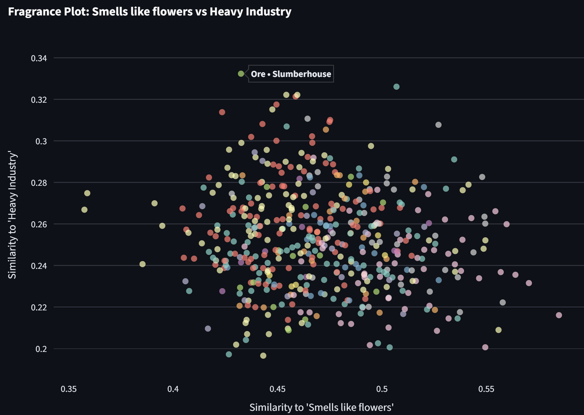
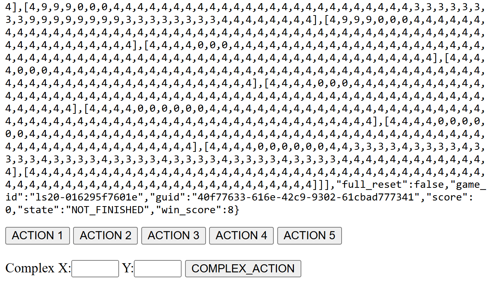

It's still nice to **know** your code. To carefully review anything your AI helpers do. To dig in and learn, and build familiarity with a chosen stack... but with all of that said, the set of 'pieces of software I want to exist' is a lot larger larger than the 'pieces of software I want to carefully code' one! I love that we can now whip up custom software on demand just by speaking our requirements in plan language (and then maybe giving a little guidance along the way). In this post I want to feature a few recent results that I particularly enjoyed making/using, a celebration of the kind of things vibe coding is currently a perfect match for.

### Portland Pursuit

My family visited us in the US for the first time in May/June this year. To help them quest-max on their visits, I made [Portland Pursuit](https://johnowhitaker.github.io/portland_pursuit/) - with lots of achievements for them to tick off while they were here. The app ([code](https://github.com/johnowhitaker/portland_pursuit)) is written in html/javascript, hosted on GitHub pages, and set up as a Progressive Web App (PWA) which let my family 'install' it to their phone home screens - important for non-techy parents. For years this has been my goto approach for making app-like things without having to go through the mobile app store nonsense, and I'm not sure why it's not more popular!

The app was a huge success - they all got most of the available points, and it definitely encouraged a few extra exploratory walks towards the end of the trip as they vied for first place :) Writing it was fun and easy, and it was a nice test-bed for a few different tools I was testing at the time to see how well they did modifying it when I wanted to add new tasks and so on. Perfect vibe-coding story: simple app, human ideas, minimal time wasted fighting config or hosting settings, a few happy customers. 10/10 :)

### Fragrance Explorer

This past weekend I stumbled upon Gwern's [blog post on avant-garde perfumes](https://gwern.net/blog/2025/perfume). And then while out on a walk I stumbled upon [Fumerie](https://fumerie.com/), a Parfumerie close to where I live. The folks behind the counter were incredibly friendly, chatting for ages about their art and showing me some wild smells. (Maybe too many - my wife kept her distance from me for the rest of the day). One thing that came through in our discussion was how personal fragrance is to them, with everyone reacting to specific smells differently. Even mentioning that I'd read about a specific fragrance had them tut-tutting - online marketing descriptions != the experience, it seems!

Still, I did find the online descriptions amusing, and I wanted to get a better sense of the 'map of smells' availalbe, so when I got home I scraped [hundreds of fragrance descriptions](https://gist.github.com/johnowhitaker/6fef140a3a47aa1ea049a8562270b0bf) and had Replit's Agent whip up an embedding explorer. You can search with natural language, but the real fun is making custom scatter plots with silly axes:

I showed this to the smell people who agreed that this is **exactly** why they have a job - the text embedding based rankings/scatter plots were based on the marketing points and fragrance notes and were not at all capturing the true essence of the smells. I agree - but still find this fun :) I did the scraping and embedding carefully in a notebook-like environment, then realized I shouldn't spend >1hr on this, so threw the embeddings and data at replit to make a [streamlit frontent](https://fragrance-similarity.replit.app/). It's janky and glitchy and annoying but it was instantly shareable and took very little effort - vibe coding win, but I think I could do a lot better without spending much more time. If I cared! Which I don't! Vibe coding win :)

### ARC-AGI-3 (Play like an LLM)

I like that the ARC people are coming up with interesting evals - great work! I dislike how much gets read into them, and some of the silly discourse they engender. One aspect is that the way you present the data DOES MATTER! Humans play the games looking at a little pixel grid. AI's get a list of lists of numbers. "But general intelligence should be able to figure it out..." - OK, then try [my version which has you play the game looking at the raw string data](https://play-arc-agi-3.replit.app/). Yeah - no success from any humans so far, maybe we aren't general intelligence after all... Code is simple, quick flask app on replit coded by o3. Forvibe-coding something that uses an API like this, you need API docs, and theirs are a weird custom thing with lots of JS that none of the coding AI's can read! (I told them, they're shifting to something better soon). But in the theme of laziness I was able to get manus to browse and click and extract all the docs with a little help, and then I could paste that markdown into o3 for the implementation. Easy task I can specify well with API docs at hand? Perfect vibe coding starting material, works as intended. Vibe coding win :)

### Commentary and Conclusions

Anthropic said people have made something like ~500 million artifacts with Claude. Lovable just raised $200M. For all that software people like to hate on vibe coding, it's delightful to me that so many people are getting to create ephemeral, quirky pieces of software to fill some need that they have. In all the examples above, the end result is mediocre at best. There's no auth, I have ~no users, none of these are the Next Big Thing... BUT they all made me happy, quickly, for free! And I think I'm not the only one. Snarkily asking why there aren't more  giant breakout apps coming in a wave thanks to vibe coding tools is missing the point: there are now hundreds of millions of new pieces of software, each making ~1 person a little happier. And I think that's great :)