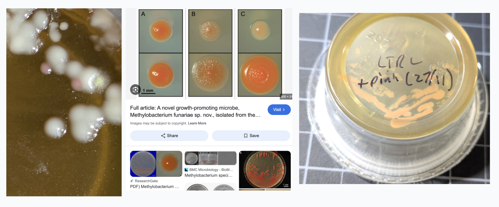
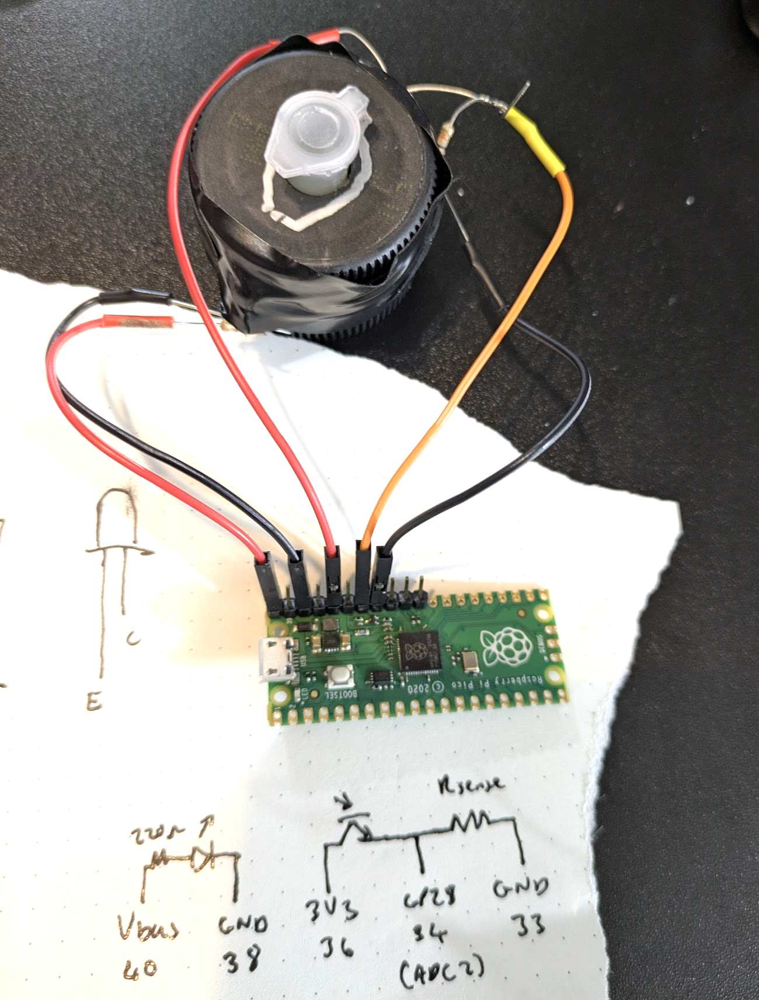

I'm getting back into microbiology, despite my [misgivings from last time I dipped a toe into the field](https://johnowhitaker.dev/mini-hw-projects/2024-03-30-bio.html). I'll be attempting to insert a plasmid of my own design into bacteria - more on that coming soon! In the meantime, I've been practicing my sterile technique and messing about. In this post, while I wait for some cultures to grow for my first transformation attempt, I'll introduce some of the stuff I've been playin with and show how I made a simple machine that logs optical density (OD) over time to plot bacterial growth curves.

## Agar Plates and Yummy Broth

It can be fun to just make some agar plates and see what grows. I've been trying out just DIY-ing the broth. Recipe:

- 250ml distilled water
- 1/2 tsp marmite
- 1/4 tsp 'better than bouillon'
- Add 4g agar agar if wanting solid media

Dissolve the marmite and bouillon in hot water, then add to a glass bottle, add agar if using, and shake. Put the lid on loose, and boil for a while (shake if agar isn't dissolving well). I left it simmering for a while on the stove then popped it into the insulated pot. Goal is to sterilize it all thoroughly.

You then wait for it to cool to ~55C before pouring into petri dishes. I also tried using little sauce tubs from the store - so far I haven't had any contamination with them, I'm carefully opening the bag with gloves that have been sterilized with alcohol, working near a flame on a clean, sterile surface, and pouring then capping without much chance for stuff to float in.

The first batch I made I used tap water, which here in Portland has some treatment that sticks around. Less grew on those than on the second batch where I used distilled water. 

I did a test comparing some supplements a friend had that she *hoped* were sterile (they were not) with some probiotics I had that had one species alive and present (as the selling point) vs a control plate or two with nothing added. I also swabbed some of the flocs that I still have sitting around (they have algae growing there too now!) and got a much more diverse plate as a result :D

There were a few pink colonies in the plate that I swabbed with a floc. Since I'd previously [sequenced](https://johnowhitaker.dev/posts/plasmidsaurus.html) these flocs to see what was in em, I have a good candidate for who this could be: methylobacterium. Known to form pink colonies (see column C, screenshot from [here](https://www.tandfonline.com/doi/full/10.4161/psb.6.4.14335) compared to the colonies I saw (left) and the results from streaking those out (right). Mine are faintly pink, but are also young and should develop more color over time. I want to extract and see what carotenoids my strain makes. And definitely make some art with it. Nobody told me methylobacterium are pink!

## DIY Optical Density Logger

The idea with this machine is to log how much light gets through a tube with some broth and bacteria in it. As the bacteria grow, they block more light, so the amount of light that gets through decreases. By measuring this over time, we can plot a growth curve. This comes in useful later when, for example, you're wanting to know when your bacteria are in the right phase of growth for transformation. On one side of the tube I have a white LED with a 220 ohm resistor. On the other, there's a TEPT4400 phototransistor with a 10k ohm pull-down resistor. The phototransistor's output is connected to an analog input on the raspberry pi pico which reads the voltage and sends it over serial. I store a reading (averaged across a bunch of samples) every 10 seconds. I hooked it up to my raspberry pi 5 so I could set it logging and leave it for many hours. The tube slots in and a cap goes down over it, with the gaps taped up, to keep ambient light from interfearing too much. Here's what the curve looks like when I pop in some E. coli (strain MM294) into some marmite broth:

TODO plot curve

## The bigger plan

I've been reading textbooks and having fun learning about palsmid design. [Here](https://github.com/johnowhitaker/BLY) is my current attempt at designing something fun - the resulting plasmids should show up in a week or so! As for the 'larger plan', I'm mostly just messing about and seeing where my interests take me. Here's a rough attempt to map out the trajectory I'm picturing for now (I expect plenty more side quests will spawn along the way):

Base progression

- Make some plates (DONE)
- Culture some things, practice streaking, colony picking, sterile technique (DONE)
- Grow e. coli from carolina kit (DONE)
- Transform with glowy plasmid, from kit (WIP)
- Attempt a transform with [my own plasmid](https://github.com/johnowhitaker/BLY)
- Agar art with my own transformed bug
- Make new agar stabs of mine and sebs strains
- Do a mini-prep
- Run some gels (with a friend's kit)
- Follow interests from there
- Teach - e.g. agar art kits, videos
- Attempt a more complex genetic engineering project.
- At some point: monitor turbidity in liquid culture for growth curves (This post!)
- At some point, make a centrifuge + heat block type thing

Methylobacterium side quest

- Swab flocs (DONE)
- Pick and streak pink colonies (DONE)
- Scrape a bunch up and extract pigment with acetone
- Run chromatography (inc. on TLC plates - new kit/skill)
- Agar art with them
- Try some liquid culture maybe?
- Test different: plates (diff nutrients, some methanol source, low nutrient options, sucrose vs glycerine vs …), light vs dark, different temperatures. Explore how this affects pigment.
- Test exposure to UV and how that affects pigment production.
- Write up - would be a cool exploration! Especially if can be consistent extracting + photographing
- (Recent (2023) paper identifying the gene poathways around carotenoid prod in mb:L vhttps://pmc.ncbi.nlm.nih.gov/articles/PMC10448405/) also this one https://pmc.ncbi.nlm.nih.gov/articles/PMC10448405/
- (Note: “Some C30 carotenoids possess better antioxidant activity in both the physical and chemical quenching of reactive oxygen species” - these bacteria are common in plants promoting growth and hanging out on leaves, antioxidants are important to helo counteract UV irradiation)

Read:

- Popsci (how life works (lame), song of the cell (better))
- Bioprocess engineering (summaries only for later chapters),
- Molecular biology of the cell (skim, research deeper for interesting bits). Ditto ‘Essential Cell Biology’, although I am enjoying giving some chapters more serious study.
- Watch: Thought emporium, everymanbio, some lab technique videos.

https://kevinhunter.opened.ca/ has great agar art info. TIL it [started with flemming](https://www.smithsonianmag.com/science-nature/painting-with-penicillin-alexander-flemings-germ-art-1761496/)