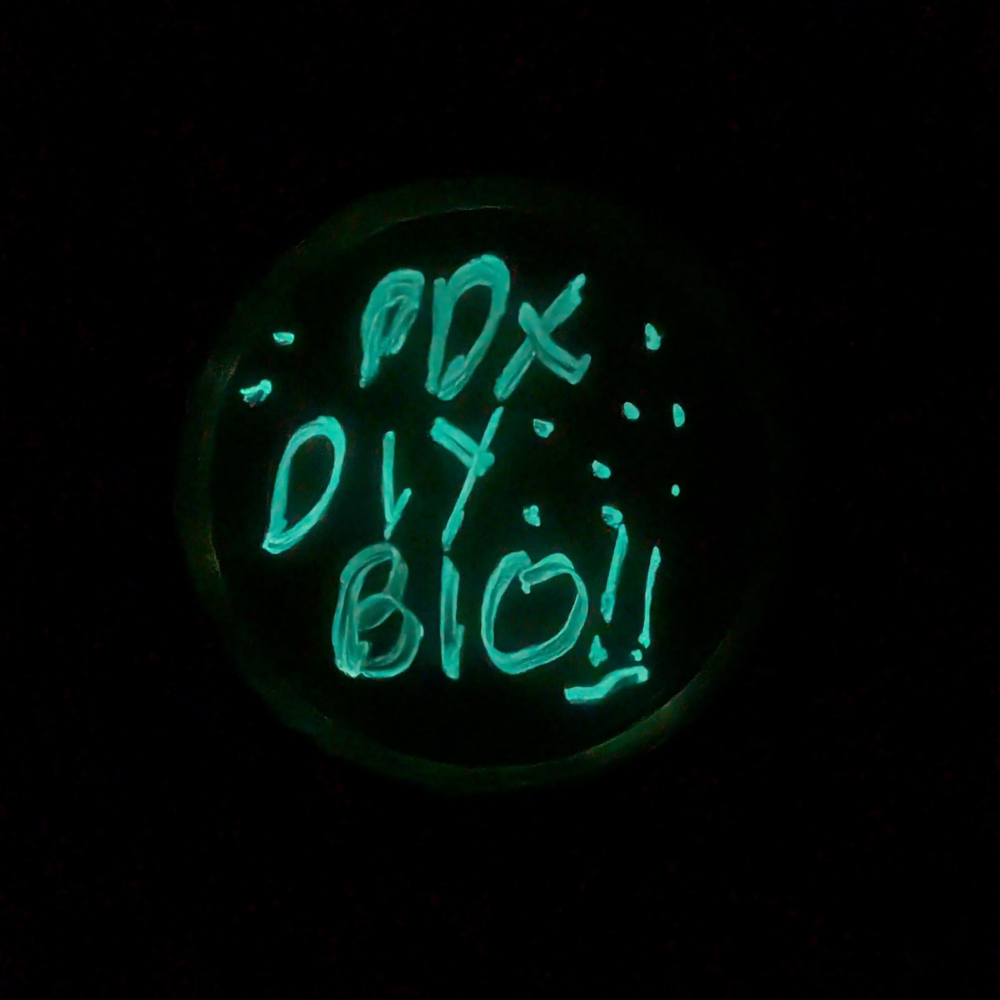
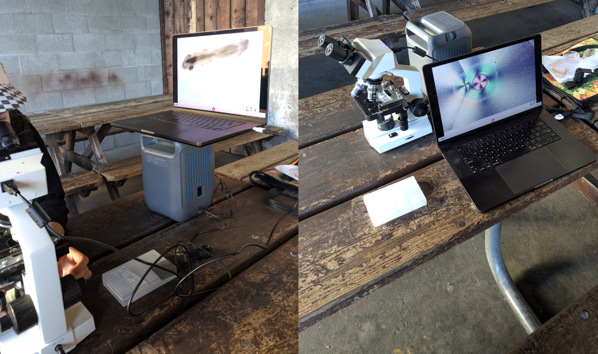
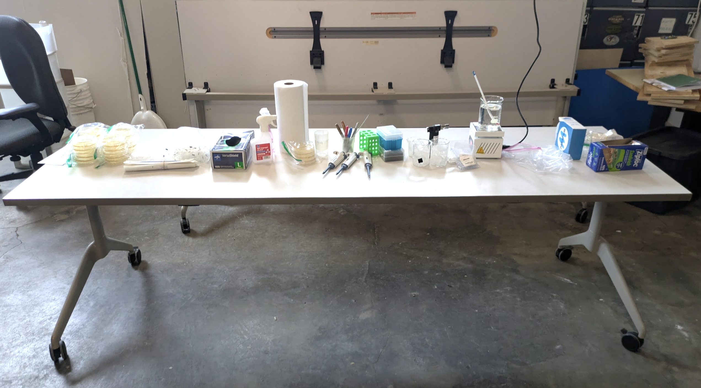
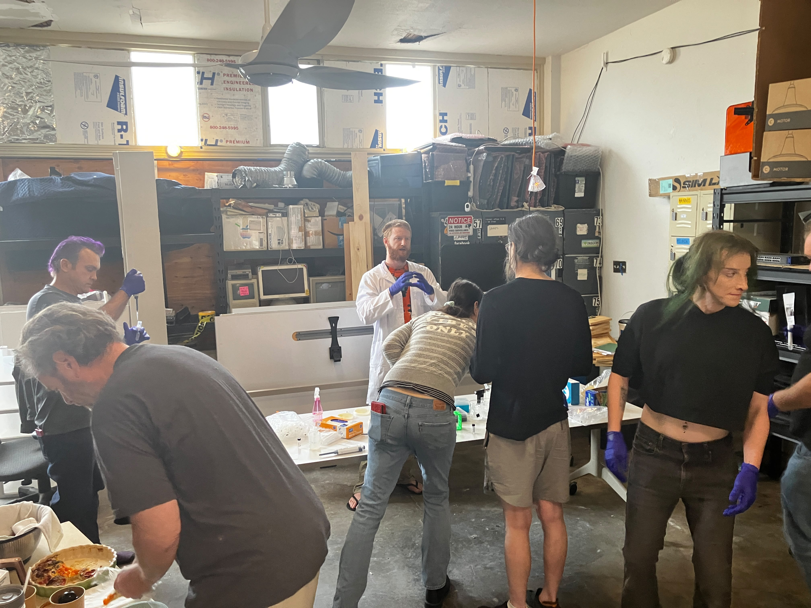
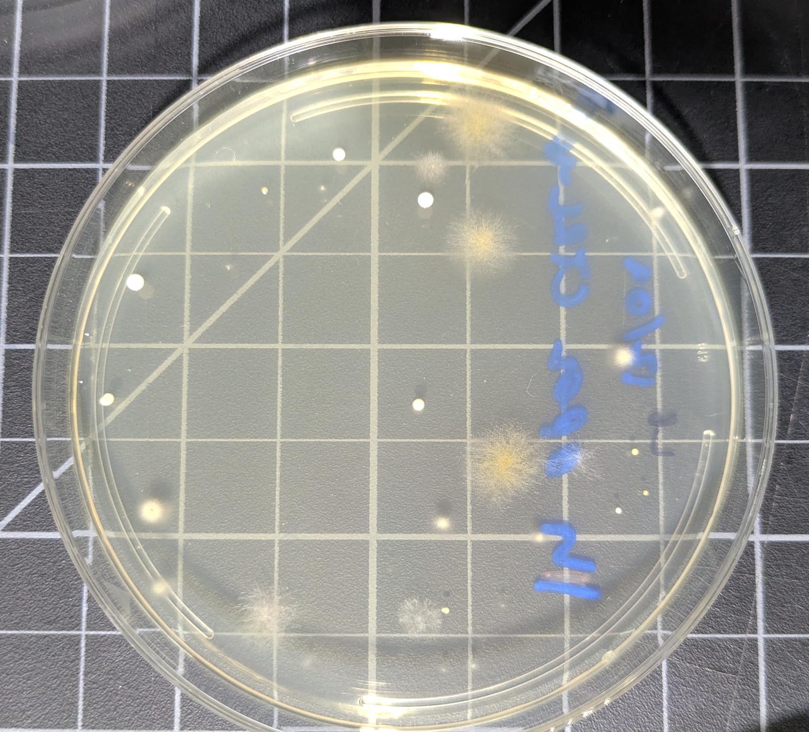

I met a few fellow diybio nerds at Teardown PDX, and we decided to start a signal chat and monthly meetup. 2nd Tuesday of each month we hang out at the Lucky Labrador and talk bio. It's a small but enthusiastic crew. Our latest meetup was microscope-based, with one member bringing in some aquarium dwellers for us to inspect:

The group were all keen for some practical hands-on experience, so I arranged to run a workshop inserting genes into bacteria, build around the same glow-in-the-dark kit [I got started with](https://johnowhitaker.dev/posts/bacterial_transformation.html). I made up the agar plates beforehand, grew out some e. coli as our subject, and then set up a table full of kit in the (delightfully accomodating) CTRL-H hackerspace ready for the day:

The workshop went well I think! I find even doing things like this myself requires pretty intense focus, rehearsing steps in the protocol mentally and trying not to miss anything. Multiply that across six participants asking interesting questions and it's a lot of focus! It looks like whatever we did worked, with pics of glowy colonies starting to trickle in from participants, and whatever the outcome we also had a great time hanging out, practicing techniques for pipetting and streaking etc, and (separately from the bio!) tasting some great food that John brought :)

I'll update with result pics once they all come in, but for now notes on safety and some thoughts on what I'd try to improve for next time. This workshop was run on a table in a hackerspace, with no laminar flow hoods in site. Some natural questions: is it sterile? is it safe? No and Yes :) It's not sterile, so while I wiped down surfaces with alcohol and had participants gloved and trying to practice some sterile technique, I expect a little bit of contamination. As a point of comparison, we left one LB plate open for a bit as we worked, and you can see the result here:

Still, e.c. grows quick enough to show results even if a mold spore or something sneaks into anyone's plate, and the ampicillin should help keep other bacterial contamination down a little. Now, is this a safe thing to run? Here's points on our favour

- The strain of e.c. used (MM294) is a safe, 'defanged' lab strain, unlikely to cause trouble (or even survive) if it did get spread somewhere. There's a reason they let schoolchildren experiment with this stuff
- We all did our best to work carefully, with anything that contacted the bacteria going in a special bag that I took home to deal with. People kept sanitizing hands and surfaces with 70% alcohol, and nobody (as far as I saw) tried to eat anything - the joys of teaching motivated grown-ups :)
- The genes we're adding are costly: making glow is metabolically taxing. So, although in general you'd definitely want to be careful to avoid leaking bacteria with added antibiotic genes, the plasmid here is definitely a huge fitness penalty and would be selected out quickly without the antibiotic selection mechanism.
- BUT we're still going to be careful. All plates of transformed e.c. were sealed with parafilm then in ziplocs for participants to take home and incubate, with instructions to carefully crack open and bleach the dishes then seal them up once 'done' with the experiment.

Now, things to improve:

- I had summarized protocols printed out, but turning them into a checklist and talking through it more at the start would be good
- It would be easier if we'd stayed more in sync - I could have been smarter with designating 'checkpoints' where tubes/bacteria are on ice and we could get everyone at the same stage before starting the next step. As it was, we moved through but frequently had someone finishing up step N while others tried N+1 or N+2. 
- It would be great to document so that those who missed it could watch a replay, but I had no spare bandwidth for filming. I might rope someone in as a dedicated cameraperson next time :)

All in all, great fun to work on some bio together! We're already plotting what a 'next level' group project would be :) If you're someone who's into this, have a think about ways you could rope others in! BSL1 and safe still leaves plenty of room for fun, and I hope this example inspires a few more events to share this super-niche world with more people. 

Until next time,

J