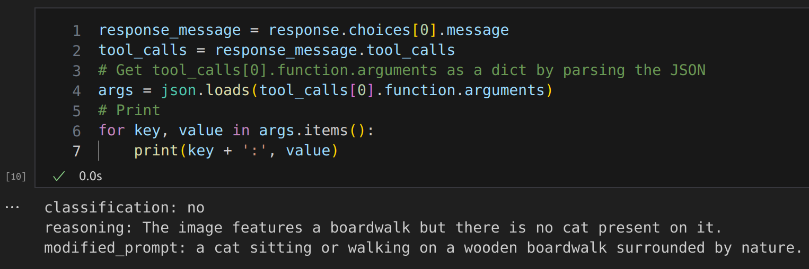

# TIL: GPT4-V Doesn't Support Function Calling, but We Can Hack Around That

I want to use GPT4-V to evaluate images generated by a diffusion model and optionally modify the prompt based on the result. The problem is that GPT4-V doesn't support function calling. This is a common problem - many models don't support producing structured output directly. You could beg and plead for it to follow a set format for responses, but an easier solution is just to use GPT3.5-Turbo to re-format a free-form response into a function call. So, for example, step one might be:

```python
s1_prompt = f"""Your task is to evaluate whether the following image accurately follows the prompt.
Prompt: {image_prompt}
If the image follows the prompt well, respond with 'yes'. If not, respond with 'no', give reasons, and then create a new prompt
that might better elicit an image in the spirit of the original prompt. For example, if an object is missing, repeated references in the
prompt may help.
"""
s1_response = client.chat.completions.create(
    model="gpt-4-vision-preview",
    messages=[
        {
            "role": "user",
            "content": [
                {
                    "type": "text", 
                    "text": s1_prompt,
                },
                {
                    "type": "image_url",
                    "image_url": {
                        "url": "https://upload.wikimedia.org/wikipedia/commons/thumb/d/dd/Gfp-wisconsin-madison-the-nature-boardwalk.jpg/2560px-Gfp-wisconsin-madison-the-nature-boardwalk.jpg",
                    },
                },
            ],
        }
    ],
    max_tokens=300,
)
```

And then we can take the output of that and turn it into structured data with:

```python
messages = [
    {
        "role": "user",
        "content": [
            {
                "type": "text", 
                "text": "Call the rate_image function with correct values based on the following text from a user:\n" + s1_response.choices[0].message.content,
            },
        ],
    }
]
tools = [
    {
        "type": "function",
        "function": {
            "name": "rate_image",
            "description": "Rate the image as acceptable or not, with reasoning as to why and a modified prompt if necessary (optional).",
            "parameters": {
                "type": "object",
                "properties": {
                    "classification": {
                        "type": "string",
                        "description": "The classification of the image, either 'yes' or 'no'",
                    },
                    "reasoning": ...
                    "modified_prompt": ...
                },
                "required": ["classification", "reasoning", "modified_prompt"],
            },
        },
    }
]
response = client.chat.completions.create(
    model="gpt-3.5-turbo-1106",
    messages=messages,
    max_tokens=300,
    tools=tools,
)
```

The result is a structured response that we can use to evaluate the image and modify the prompt:

