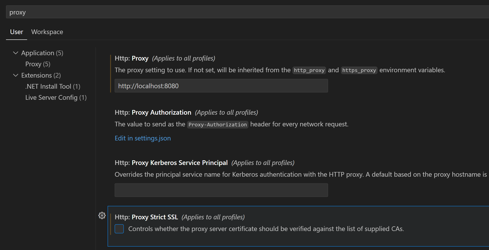

# TIL: Intercepting Github Copilot with MITMProxy

We've been messing with integrating AI into notebook coding, and got curious about how Github Copilot structures the context it uses to generate code when called from a notebook.

To see what it's sending, I set up mitmproxy (https://docs.mitmproxy.org/stable/overview-getting-started/) and had to set the proxy and uncheck  Proxy Strict SSL in VSC to start capturing things:



Now any time you trigger Copilot, you can see the request in mitmproxy. There's a few ways Copilot can be triggered. One is the 'completions' mode that provides inline suggestions as you type. The requests for this have the immediate context: the prefix and the suffix (in this case the suffix is empty). Here's an example:

```
{"prompt":"#!/usr/bin/env python3\n# generated with chatgpt\n\nimport googlemaps\nimport math\nfrom random import uniform\n\ndef generate_random_coordinates(lat, lon, max_distance_km):\n    \"\"\"Generate a random point within a circular area defined by max_distance_km.\"\"\"\n    # Random angle\n    theta = uniform(0, 2 * math.pi)\n    # Random radius, weighted by area\n    r = max_distance_km * math.sqrt(uniform(0, 1))\n    # Convert polar to cartesian\n    dx = r * math.cos(theta)\n    dy = r * math.sin(theta)\n\n    # Earth's radius in kilometers\n    earth_radius = 6371\n    # New latitude in degrees\n    new_lat = lat + (dy / earth_radius) * (180 / math.pi)\n    # New longitude in degrees, taking into account the latitude compression\n    new_lon = lon + (dx / earth_radius) * (180 / math.pi) / math.cos(lat * math.pi/180)\n    return new_lat, new_lon\n\ndef create_route_link(start_location, distance_km, api_key):\n    gmaps = googlemaps.Client(key=api_key)\n    initial_location = gmaps.geocode(start_location)[0]['geometry']['location']\n    lat, lon = initial_location['lat'], initial_location['lng']\n\n    # Determine the number of segments; aiming to use about 10 waypoints\n    num_segments = 10\n    segment_length = (distance_km / 2) / num_segments  # Half the route outwards\n    waypoints = []\n    current_lat, current_lon = lat, lon\n\n    # Generate waypoints\n    for _ in range(num_segments):\n        new_lat, new_lon = generate_random_coordinates(current_lat, current_lon, segment_length)\n        waypoints.append((new_lat, new_lon))\n        current_lat, current_lon = new_lat, new_lon\n\n    # Generate the return route directly without additional waypoints to avoid the limit\n    directions_result = gmaps.directions((lat, lon),\n                                         (lat, lon),\n                                         mode=\"walking\",\n                                         waypoints=[(lat, lon) for lat, lon in waypoints],\n                                         optimize_waypoints=True)\n\n    # Construct Google Maps link for the route\n    start = f\"{lat},{lon}\"\n    waypoints_param = '|'.join(f\"{lat},{lon}\" for lat, lon in waypoints)\n    return f\"https://www.google.com/maps/dir/?api=1&origin={start}&destination={start}&waypoints={waypoints_param}&travelmode=walking\"\n\n### Solara code - not AI generated\nimport os\nimport solara\nimport solara.lab\n\nGOOGLE_MAPS_API_KEY = os.environ.get(\"GOOGLE_MAPS_API_KEY\", \"AIzaSyBC-xxx\")\nassert GOOGLE_MAPS_API_KEY, \"Please set a key\"\n\nstart_location = solara.reactive(\"Groningen, Netherlands\")\ndesired_distance_km = solara.reactive(10.0)\n\n\n@solara.lab.task\ndef generate_route():\n    return create_route_link(start_location.value, desired_distance_km.value, GOOGLE_MAPS_API_KEY)\n\n\n@solara.component\ndef TrailGeneratorApp():\n    solara.InputText(\"Start location\", start_location)\n    solara.InputFloat(\"Desired distance (km)\", desired_distance_km)\n    solara.Button(\"Generate route\", on_click=generate_route, icon_name=\"mdi-google-maps\", color=\"primary\")\n    solara.ProgressLinear(generate_route.pending)\n    if generate_route.error:\n        solara.Error(repr(generate_route.exception))\n    if generate_route.value:\n        solara.Button(label=\"View route\", href=generate_route.value, target=\"_blank\", icon_name=\"mdi-walk\",\n                      outlined=True, color=\"primary\")\nTrailGeneratorApp()        \n\n# COmment triggering a completion","suffix":"","max_tokens":500,"temperature":0,"top_p":1,"n":1,"stop":["\n"],"nwo":"AnswerDotAI/johno_research","stream":true,"extra":{"language":"python","next_indent":0,"trim_by_indentation":true,"prompt_tokens":782,"suffix_tokens":0}}
```

You can also explicitly invoke the assistant with Ctrl-I, which opens up a dedicated prompt UI. This sends a much larger request. Here's an example:

```
{"messages":[{"role":"system","content":"You are an AI programming assistant.\nWhen asked for your name, you must respond with \"GitHub Copilot\".\nFollow the user's requirements carefully & to the letter.\nThe user has a python file opened in a code editor.\nThe user includes some code snippets from the file.\nEach code block starts with ``` and # FILEPATH.\nAnswer with a single python code block.\nIf you modify existing code, you will use the # BEGIN: and # END: markers.\nWhen dealing with Jupyter Notebook, if a module is already imported in a cell, it can be used in other cells directly without importing it again. For the same reason, if a variable is defined in a cell, it can be used in other cells as well\nWhen dealing with Jupyter Notebook, cells below the current cell can be executed before the current cell, you must use the variables defined in the cells below, unless you want to overwrite them.\nWhen dealing with Jupyter Notebook, do not generate CELL INDEX in the code blocks in your answer, it is only used to help you understand the context.\nIf the Jupyter Notebook already contains variables, you should respect the name and value of the variables, and use them in your code when necessary.\nYour expertise is strictly limited to software development topics.\nFollow Microsoft content policies.\nAvoid content that violates copyrights.\nFor questions not related to software development, simply give a reminder that you are an AI programming assistant.\nKeep your answers short and impersonal."},{"role":"user","content":"I am working on a Jupyter notebook.\nThis Jupyter Notebook already contains multiple cells.\nThe content of cells are listed below, each cell starts with CELL INDEX and a code block started with ```python\nEach cell is a block of code that can be executed independently.\nSince it is Jupyter Notebook, if a module is already imported in a cell, it can be used in other cells as well.\nFor the same reason, if a variable is defined in a cell, it can be used in other cells as well.\nWe should not repeat the same import or variable definition in multiple cells, unless we want to overwrite the previous definition.\nDo not generate CELL INDEX in your answer, it is only used to help you understand the context.\n\nBelow you will find a set of examples of what you should respond with. Please follow the exmaples on how to avoid repeating code.\n## Examples starts here\nHere are the cells in this Jupyter Notebook:\n`CELL INDEX: 0\n```python\nimport pandas as pd\n\n# create a dataframe with sample data\ndf = pd.DataFrame({'Name': ['Alice', 'Bob', 'Charlie'], 'Age': [25, 30, 35], 'Gender': ['F', 'M', 'M']})\nprint(df)\n```\n---------------------------------\nUSER:\nNow I create a new cell in this Jupyter Notebook document at index 1.\nIn this new cell, I am working with the following code:\n```python\n```\n---------------------------------\nUSER:\nplot the data frame\n\n---------------------------------\nChatGPT Answer\n---------------------------------\nTo plot the dataframe, we can use the `plot()` method of pandas dataframe. Here's the code:\n\n```python\ndf.plot(x='Name', y='Age', kind='bar')\n```\n## Example ends here\nHere are the cells in this Jupyter Notebook:\n\nCELL INDEX: 0\n```python\n# generated with chatgpt\n\nimport googlemaps\nimport math\nfrom random import uniform\n\ndef generate_random_coordinates(lat, lon, max_distance_km):\n    \"\"\"Generate a random point within a circular area defined by max_distance_km.\"\"\"\n    # Random angle\n    theta = uniform(0, 2 * math.pi)\n    # Random radius, weighted by area\n    r = max_distance_km * math.sqrt(uniform(0, 1))\n    # Convert polar to cartesian\n    dx = r * math.cos(theta)\n    dy = r * math.sin(theta)\n\n    # Earth's radius in kilometers\n    earth_radius = 6371\n    # New latitude in degrees\n    new_lat = lat + (dy / earth_radius) * (180 / math.pi)\n    # New longitude in degrees, taking into account the latitude compression\n    new_lon = lon + (dx / earth_radius) * (180 / math.pi) / math.cos(lat * math.pi/180)\n    return new_lat, new_lon\n\ndef create_route_link(start_location, distance_km, api_key):\n    gmaps = googlemaps.Client(key=api_key)\n    initial_location = gmaps.geocode(start_location)[0]['geometry']['location']\n    lat, lon = initial_location['lat'], initial_location['lng']\n\n    # Determine the number of segments; aiming to use about 10 waypoints\n    num_segments = 10\n    segment_length = (distance_km / 2) / num_segments  # Half the route outwards\n    waypoints = []\n    current_lat, current_lon = lat, lon\n\n    # Generate waypoints\n    for _ in range(num_segments):\n        new_lat, new_lon = generate_random_coordinates(current_lat, current_lon, segment_length)\n        waypoints.append((new_lat, new_lon))\n        current_lat, current_lon = new_lat, new_lon\n\n    # Generate the return route directly without additional waypoints to avoid the limit\n    directions_result = gmaps.directions((lat, lon),\n                                         (lat, lon),\n                                         mode=\"walking\",\n                                         waypoints=[(lat, lon) for lat, lon in waypoints],\n                                         optimize_waypoints=True)\n\n    # Construct Google Maps link for the route\n    start = f\"{lat},{lon}\"\n    waypoints_param = '|'.join(f\"{lat},{lon}\" for lat, lon in waypoints)\n    return f\"https://www.google.com/maps/dir/?api=1&origin={start}&destination={start}&waypoints={waypoints_param}&travelmode=walking\"\n```\nCELL INDEX: 1\n```python\n### Solara code - not AI generated\nimport os\nimport solara\nimport solara.lab\n\nGOOGLE_MAPS_API_KEY = os.environ.get(\"GOOGLE_MAPS_API_KEY\", \"AIzaSyBC-xxx\")\nassert GOOGLE_MAPS_API_KEY, \"Please set a key\"\n\nstart_location = solara.reactive(\"Groningen, Netherlands\")\ndesired_distance_km = solara.reactive(10.0)\n\n\n@solara.lab.task\ndef generate_route():\n    return create_route_link(start_location.value, desired_distance_km.value, GOOGLE_MAPS_API_KEY)\n\n\n@solara.component\ndef TrailGeneratorApp():\n    solara.InputText(\"Start location\", start_location)\n    solara.InputFloat(\"Desired distance (km)\", desired_distance_km)\n    solara.Button(\"Generate route\", on_click=generate_route, icon_name=\"mdi-google-maps\", color=\"primary\")\n    solara.ProgressLinear(generate_route.pending)\n    if generate_route.error:\n        solara.Error(repr(generate_route.exception))\n    if generate_route.value:\n        solara.Button(label=\"View route\", href=generate_route.value, target=\"_blank\", icon_name=\"mdi-walk\",\n                      outlined=True, color=\"primary\")\nTrailGeneratorApp()        \n```"},{"role":"user","content":"Now I create a new cell in this Jupyter Notebook document at index 2.\nIn this new cell, I am working with the following code:\n```python\n```"},{"role":"user","content":"The following pip packages are available in this Jupyter Notebook:\nPackage Name: aiofiles, Version: 23.2.1\nPackage Name: aiohttp, Version: 3.9.3\nPackage Name: aioprocessing, Version: 2.0.1\nPackage Name: aiosignal, Version: 1.3.1\nPackage Name: alabaster, Version: 0.7.16\nPackage Name: alembic, Version: 1.13.1\nPackage Name: analytics-python, Version: 1.2.9\nPackage Name: annotated-types, Version: 0.6.0\nPackage Name: anthropic, Version: 0.25.1\nPackage Name: anyio, Version: 4.2.0\nPackage Name: appdirs, Version: 1.4.4\nPackage Name: argon2-cffi, Version: 23.1.0\nPackage Name: argon2-cffi-bindings, Version: 21.2.0\nPackage Name: arrow, Version: 1.3.0\nPackage Name: asttokens, Version: 2.4.1\nPackage Name: async-lru, Version: 2.0.4\nPackage Name: attrs, Version: 23.2.0\nPackage Name: Authlib,  [lots ommited for brevity] Version: 1.16.0\nPackage Name: wsproto, Version: 1.2.0\nPackage Name: xxhash, Version: 3.4.1\nPackage Name: yarl, Version: 1.9.4\nPackage Name: youtube-dl, Version: 2021.12.17\n"},{"role":"user","content":"Generate another UI that let's the user add their google maps API key"}],"model":"gpt-3.5-turbo","max_tokens":3949,"temperature":0.1,"top_p":1,"n":1,"stream":true,"intent":true}
```

It's including all the packages I have installed! Quite a mess. I noticed that this only happens when there isn't much code in the current file - in a more complex notebook the package list isn't included, so they're probably using various heuristics to decide what to include. There's another writeup on this [here](https://thakkarparth007.github.io/copilot-explorer/posts/copilot-internals) with more info. 


I tried this same approach using Cursor. Unlike copilot it doesn't send a single request with all the context, instead sending frequent updates, re-ranking available bits of context, and letting you explicitly tag in files, functions, docs (which can be added as retrieval sources). Very fancy, a lot harder to make sense of from the requests alone, and opaque in terms of what the final prompt etc looks like. 